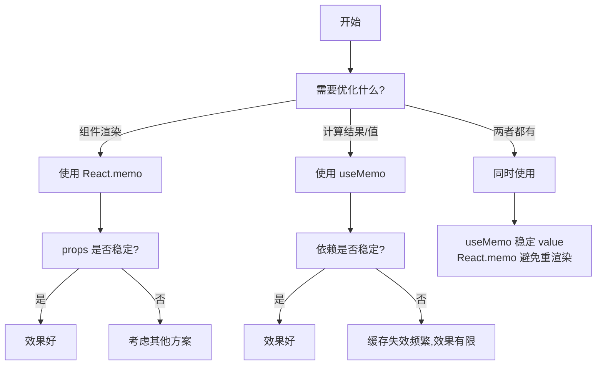

## React.memo vs useMemo

### 一句话对比

React.memo 是**组件级别**的记忆化，useMemo 是**值级别**的记忆化——前者优化渲染，后者优化计算

---

### 核心对比

| 维度 | **[[React.memo]]** | **[[useMemo]]** |
|:---|:---|:---|
| **定义** | 高阶组件包装器，对组件进行 props 记忆化 | Hook，对计算结果进行记忆化 |
| **核心本质** | 跳过整个组件的渲染（当 props 未变） | 跳过昂贵计算的重复执行 |
| **适用场景** | 组件接收相同 props 不需重渲染 | 复杂计算结果需要缓存 |

---

### 差异点

- **作用对象**：
	- React.memo：作用于整个组件（包装组件）
	- useMemo：作用于变量（记忆化值）
- **比较内容**：
	- React.memo：比较 props（浅比较）
	- useMemo：比较依赖数组
- **触发条件**：
	- React.memo：props 变化时重渲染（除非自定义比较函数）
	- useMemo：依赖变化时重新计算
- **使用方式**：
	- React.memo：`const MyComponent = React.memo(Component)` 或 `React.memo(Component, compareFn)`
	- useMemo：`const value = useMemo(() => compute(), [deps])`

---

### 场景选择

- **选 [[React.memo]] 当**：
	- 组件接收相同 props 不需要重新渲染
	- 组件渲染成本高，且 props 相对稳定
	- 需要避免子组件因父组件更新而连锁重渲染
- **选 [[useMemo]] 当**：
	- 有昂贵的计算逻辑需要缓存结果
	- 需要保持对象/数组引用的稳定（避免子组件不必要渲染）
	- 配合 React.memo 使用，稳定 Provider value 引用

---

### 决策树

---

### 示例

### 知识图谱

- **父级概念**：[[Hooks (React)|React Hooks]] — 两者都是 React 性能优化相关的 API
- **相关对比**：
	- [[React Context 可搭配 React.memo 使用]] — 结合使用的最佳实践
- **相关概念**：
	- [[React.memo]] — 组件记忆化高阶组件
	- [[useMemo]] — 值记忆化 Hook
	- [[React 性能优化]] — 性能优化的完整策略
