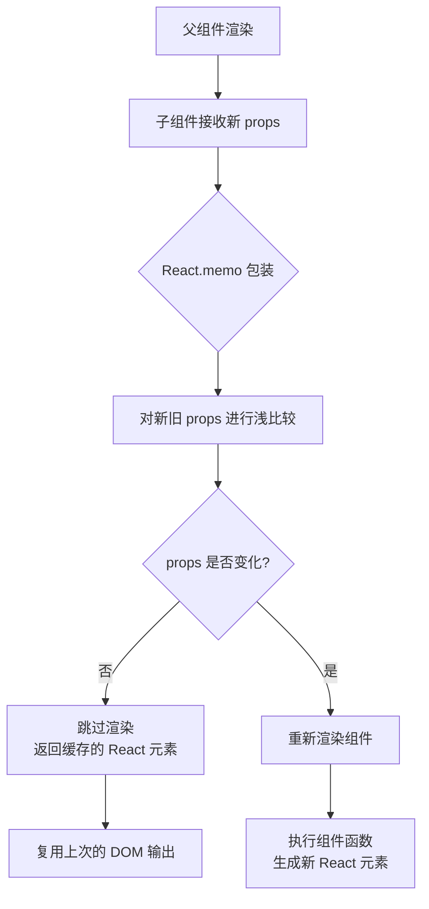

## 概念：React.memo

> React 提供的高阶组件，用于缓存函数组件，避免 props 未变化时的不必要重新渲染。

**解决的核心痛点**：父组件重新渲染时，默认情况下所有子组件都会重新渲染，即使子组件的 props 没有变化。React.memo 通过对 props 进行浅比较，在 props 没变时跳过渲染，提升性能。

---

### 核心命题

- [[React.memo通过浅比较props决定是否重新渲染]]
	- **原理**：React.memo 对新旧 props 进行浅比较（Object.is），只有当 props 变化时才重新渲染
- [[React.memo只对props进行浅比较]]
	- **原理**：对于对象、数组、函数等引用类型，浅比较只比较引用，不比较内容
- [[React.memo不会阻止子组件因父组件渲染而渲染]]
	- **原理**：memo 只比较传入的 props，不关心父组件的渲染状态

---

### 运行机制



#### 自定义比较函数

```tsx
// React.memo 第二个参数：自定义比较函数
const MyComponent = React.memo(
  MyComponentImpl,
  (prevProps, nextProps) => {
    // 返回 true 表示 props 没变，不重新渲染
    // 返回 false 表示 props 变了，需要重新渲染
    return prevProps.id === nextProps.id;
  }
);
```

---

### 关键区别

| 维度 | `React.memo` | `PureComponent` | `useMemo` |
|:---|:---|:---|:---|
| **适用对象** | 函数组件 | Class 组件 | 值/计算结果 |
| **比较内容** | props | state + props | 依赖数组中的值 |
| **是否缓存组件** | ✓ | ✓ | ✗（只缓存值） |
| **自定义比较** | ✓（第二参数） | ✗ | ✗ |
| **适用场景** | 组件渲染优化 | 组件渲染优化 | 值计算优化 |

---

### 应用场景

- ✅ **适用场景**
	- **纯展示组件**：接收 props，返回 UI，不涉及副作用
	- **频繁渲染的父组件下的子组件**：如列表项、大表格单元格
	- **组件渲染成本高**：复杂计算、嵌套深 DOM 结构
	- **组件稳定 props**：大部分 props 不经常变化
- ⛔ **误用**
	- **过度使用**：简单组件使用 React.memo 反而增加比较开销
	- **组件内有动态 props**：如传入回调函数，每次都是新引用
	- **组件依赖内部状态**：memo 不关注组件内部 state 变化

---

### SOP

> React.memo 的标准使用流程

- [[SOP-使用React.memo优化组件渲染]] — 何时使用及注意事项

---

### FAQ

- [[Q-React.memo和useMemo有什么区别]] — 两者适用场景对比
- [[Q-React.memo为什么有时候不生效]] — 常见失效原因分析

---

### 知识图谱

- **父级概念**：[[React]] — React 生态的核心特性
- **并列概念**：
	- [[useMemo]] — 值缓存，与 React.memo 互补
	- [[useCallback]] — 函数缓存，常与 React.memo 配合使用
	- [[React重新渲染]] — React.memo 解决的核心问题
- **相关概念**：
	- [[虚拟DOM(React)]] — React.memo 基于 Virtual DOM 的比较机制
	- [[Fiber架构(React)]] — React 的协调渲染架构

---

### 参考延伸

- [React 官方文档 - React.memo](https://react.dev/reference/react/memo)
- [React 官方文档 - Advanced Guides - Perf](https://react.dev/reference/react/PureComponent)
