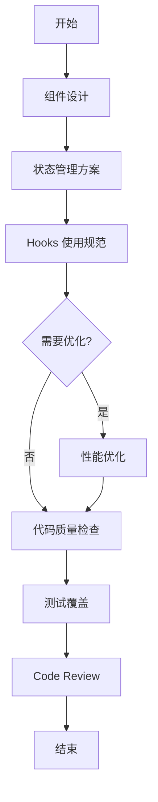

## SOP：React 最佳实践

> 一句话描述这个 SOP 的目标和适用场景

目标：建立一套可执行的 React 开发最佳实践，确保代码可维护、性能优良、团队协作顺畅
实现：通过组件设计→状态管理→性能优化三个阶段的标准化流程，实现高质量 React 应用

---

### 适用场景

- 场景 1：新项目启动时的技术选型和架构设计
- 场景 2：重构现有 React 组件以提升可维护性
- 场景 3：性能问题排查和优化
- 场景 4：团队代码评审和最佳实践落地

---

### 流程图解



---

### 核心步骤

#### 一、组件设计原则

1. **单一职责**：每个组件只做一件事，优先使用函数组件 + Hooks
	 - 注意：组件超过 200 行考虑拆分
2. **Props 接口清晰**：使用 TypeScript 定义 Props 类型，避免使用 `any`
	 - 注意：必选 props 不设置默认值，可选 props 使用 `?` 标记
3. **组合优于继承**：使用 `children` prop 或 render props 模式复用 UI
	 - 注意：优先使用组合模式而非 HOC（Higher Order Components）

#### 二、状态管理规范

1. **状态定义原则**：
	 - 组件内部状态用 `useState`/`useReducer`
	 - 跨组件共享状态用 Context 或状态管理库（Zustand/Redux）
	 - 服务端状态用 React Query/SWR
2. **不可变更新原则**：状态更新必须创建新对象/数组，不直接修改

 ```typescript
// 错误
state.push(newItem)
// 正确
setState([...state, newItem])
 ```

3. **状态初始化**：复杂计算用 useState 回调形式避免重复计算

```typescript
const [data] = useState(() => computeExpensiveData(props))
```

#### 三、Hooks 使用规范

1. **遵循 Hooks 规则**：只在顶层调用 Hook，不在条件/循环/嵌套函数中调用
2. **依赖数组完整**：所有 useEffect/useCallback/useMemo 的依赖必须完整
	 - 注意：ESLint `exhaustive-deps` 规则必须启用
3. **自定义 Hooks 封装**：重复逻辑超过 2 处应提取为自定义 Hook

#### 四、性能优化

1. **React.memo 优化**：纯函数组件在相同 props 下不需重渲染时使用

```typescript
const MyComponent = React.memo(function MyComponent({ name }: Props) {
	return <div>{name}</div>
})
```

2. **useCallback/useMemo 合理使用**：
	 - 仅在计算昂贵或需要稳定函数引用时使用
	 - 避免过早优化
3. **列表渲染加 Key**：使用唯一 ID 而非索引作为 key

#### 五、代码质量

1. **命名规范**：组件名用 PascalCase，hooks 用 camelCase 且以 `use` 开头
2. **目录结构**：按 Feature/域划分，而非按文件类型划分

```bash
src/
 features/
	 auth/
		 components/
		 hooks/
		 utils/
```

3. **测试覆盖**：关键业务组件单元测试覆盖率 > 80%

---

### 实践示例

```tsx
// 好的组件设计示例
interface ButtonProps {
  variant: 'primary' | 'secondary'
  size: 'sm' | 'md' | 'lg'
  children: React.ReactNode
  onClick?: () => void
  disabled?: boolean
}

const Button = React.memo(function Button({
  variant = 'primary',
  size = 'md',
  children,
  onClick,
  disabled = false,
}: ButtonProps) {
  return (
    <button
      className={`btn btn-${variant} btn-${size}`}
      onClick={onClick}
      disabled={disabled}
    >
      {children}
    </button>
  )
})

// 好的状态管理示例（使用 Zustand）
interface Store {
  count: number
  increment: () => void
}

const useStore = create<Store>((set) => ({
  count: 0,
  increment: () => set((state) => ({ count: state.count + 1 })),
}))
```

---

### 常见坑点

- ⛔ **反模式**：在组件内部声明函数并传递给子组件（每次渲染创建新引用）
	- 解决：使用 `useCallback` 包裹或提取到组件外
- ⛔ **反模式**：在 `useEffect` 中直接修改 state 而非通过 setter
	- 解决：使用函数式更新 `setState(prev => prev + 1)`
- ⛔ **反模式**：使用索引作为列表 key（导致渲染错误和性能问题）
	- 解决：使用唯一 ID 作为 key
- 🔧 **排查**：如果页面卡顿，检查是否有不必要的重渲染（React DevTools Profiler）
- 🔧 **排查**：如果状态不更新，检查是否正确使用了不可变更新模式
- 🔧 **排查**：如果内存泄漏，检查 useEffect 清理函数是否正确实现

---

### 知识图谱

- [[React Hooks]]
- [[React 状态管理]]
- [[SOP-创建自定义Hooks]]
- [[useState 与 useReducer]]
- [[useEffect 最佳实践]]
