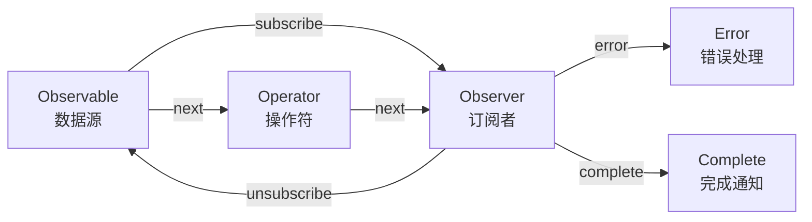
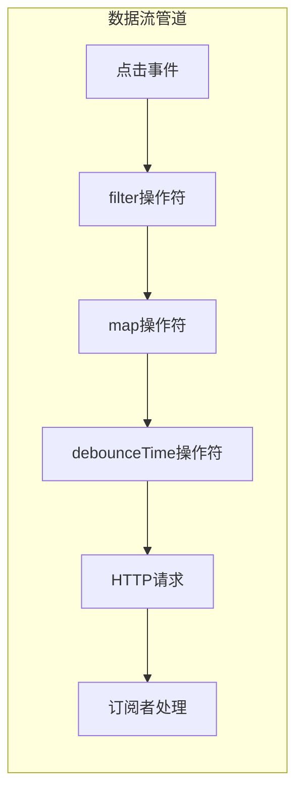

## 概念：RxJS

> RxJS 是 JavaScript 的响应式编程库，通过 Observable 序列处理异步事件流

**解决的核心痛点**：处理多异步事件时，避免回调地狱（Callback Hell）和状态管理混乱，提供统一的数据流处理抽象

---

### 核心命题

> 核心命题引用 atomic 笔记（陈述句观点），每个命题是一句话洞见 

- [[RxJS中一切皆为流]]
	- **原理**：在 RxJS 世界里，一切数据都是 Observable 序列，包括用户点击、HTTP 请求、定时器等
- [[RxJS中操作符即为数据转换]]
	- **原理**：通过管道（pipe）组合操作符，实现声明式的数据流转换

---

### 运行机制

RxJS 的核心是 **Observable-Observer** 模式，通过订阅关系连接数据源和消费者。

**关键角色**：

| 角色 | 职责 |
|:---|:---|
| Observable | 可观察的数据源，发出值流 |
| Observer | 订阅者，接收 Observable 发出的值 |
| Subscription | 订阅关系，用于取消订阅 |
| Operator | 操作符，转换数据流 |
| Subject | 特殊 Observable，既是 Observable 也是 Observer |
| Scheduler | 控制何时何地执行订阅和通知 |

---

### 关键区别

| 维度 | RxJS Observable | Promise |
|:--- |:--- |:--- |
| **核心逻辑** | 可取消、可组合的异步数据流 | 单次异步操作 |
| **返回值** | 多个值（流） | 单个值 |
| **取消方式** | unsubscribe() | 无法取消 |
| **操作符** | 丰富（map, filter, merge 等） | then/catch |
| **错误处理** | 在流中传播，可捕获 | try/catch |

| 维度 | RxJS | JavaScript EventEmitter |
|:--- |:--- |:--- |
| **核心逻辑** | 可取消的订阅，数据流可组合 | 广播事件到多个监听器 |
| **生命周期** | 有结束（complete/error） | 通常无结束状态 |
| **操作符** | 强大的操作符链 | 无操作符概念 |

---

### 应用场景

- ✅ **适用场景**
	- **前端表单验证**：监听输入变化，经过 debounce、distinctUntilChanged、validate 操作符链
	- **实时数据更新**：WebSocket 消息流处理，自动重连
	- **用户交互处理**：连续点击检测、拖拽序列、键盘快捷键
	- **HTTP 请求取消**：取消正在进行的请求，防止竞态条件
- ⛔ **误用**
	- **简单单次请求**：用 Promise 即可，无须引入 RxJS
	- **状态管理**：Redux/Zustand 更适合全局状态，RxJS 适合局部异步流

---

### SOP

> 与本概念相关的标准操作流程，通过实践辅助理解

- [[SOP-RxJS-请求取消]] — 使用 takeUntil 取消 HTTP 请求
- [[SOP-RxJS-错误重试]] — 使用 retry/retryWhen 实现重试逻辑
- [[SOP-RxJS-竞态处理]] — 使用 switchMap 处理竞态条件
- [[SOP-RxJS-前端表单验证]]
- [[SOP-RxJS-实时数据更新]]
- [[SOP-RxJS-用户交互处理]]

---

### FAQ

> 与本概念相关的开放性问题，待进一步探索

- [[Q-RxJS与Promise的区别]]
- [[Q-RxJS与Generator的区别]]
- [[Q-何时该用Subject而不是Observable]]
- [[Q-switchMap与mergeMap的选择]]

---

### 知识图谱

> 知识图谱链接 term（术语定义）和相关 concept，建立概念关系网络

- **父级概念**：[[响应式编程]] — RxJS 所属的编程范式
- **子级概念**：
	- [[RxJS-Observable]] — 被观察数据源
	- [[RxJS-Observer]] — 观察者
	- [[RxJS-Subscription]] — 用于终止观察者观察的执行过程
	- [[RxJS-Operator]] — RxJS 数据流的转换工具（map,filter,reduce）
	- [[RxJS-Subject]] — 特殊的多播 Observable
	- [[RxJS-Schedulers]] — 调度器
- **并列概念**：
	- [[Bacon.js]] — 类似的响应式编程库
	- [[lodash-flow]] — 同步场景的函数组合
- **相关概念**：
	- [[异步编程]] — RxJS 解决的核心问题域
	- [[前端状态管理]] — RxJS 可辅助但不替代
- **参考文章**
	- [RxJS 官方文档](https://rxjs.dev/)
	- [RxJS 核心概念图解](https://rxjs-visualizer.com/)
