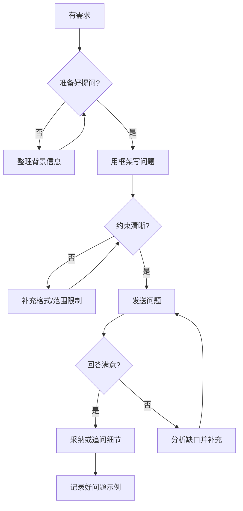

## SOP：AI 提问技巧

> 一套结构化方法，用于提高向 AI 提问的质量，减少反复沟通成本

目标：每次提问都能让 AI 准确理解需求，输出可用的结果
实现：遵循「背景 → 目标 → 约束 → 示例 → 迭代」提问框架

---

### 适用场景

- **技术咨询**：框架对比、方案选型、接口设计
- **代码调试**：解释报错、排查性能问题、理解他人代码
- **概念理解**：术语解释、原理分析、深层机制
- **方案设计**：架构设计、代码评审、测试方案
- **内容创作**：文章润色、提纲生成、翻译改写

---

### 流程图解



---

### 核心步骤

1. **提供完整上下文（背景）**
	 - 项目/领域是什么？目前在做什么？
	 - 已经尝试过什么？结果如何？
	 - 避免孤立问题：「如何优化这段代码」→「这个 React 组件在渲染长列表时卡顿，如何优化？」

2. **明确期望输出（目标）**
	 - 要什么格式？代码片段、思路方向、对比表格、完整方案？
	 - 设定标准：「给我 3 个方案，分别标注优缺点」
	 - 避免模糊：「帮我看这段代码」→「检查这段代码的性能瓶颈，列出前 3 个问题并给出修复建议」

3. **指定约束条件（约束）**
	 - 技术栈版本、性能要求、兼容性边界
	 - 不需要的部分：「不需要考虑 IE 兼容」
	 - 量化标准：「响应时间 < 200ms」

4. **提供参考示例（示例）**
	 - 期望的输入输出对
	 - 类似问题的优秀历史对话
	 - 「类似这样：输入 X 应该返回 Y」

5. **迭代追问而非一次问完（迭代）**
	 - 先问方向，再问细节
	 - 不满意时，指出具体哪里不对
	 - 「第一部分没问题，但第二部分我想要的是 X 而不是 Y」

---

### 提问检查清单

提问前快速过一遍：

- [ ] 背景交代清楚了吗？（项目/上下文/已尝试的方案）
- [ ] 目标明确了吗？（要什么输出/什么格式）
- [ ] 约束写全了吗？（技术栈/性能/排除项）
- [ ] 有参考示例吗？（期望的输入输出）
- [ ] 问题是一个还是多个？（优先拆分单次提问）

---

### 示例

**❌ 低质量提问：**

> 这段代码为什么慢？
> （只贴了代码，没有上下文、没有预期性能指标、没有已经尝试的优化手段）

**✅ 高质量提问：**

> 下面这个 React 组件在渲染 1000 行表格时首屏耗时 3s，目标是 < 500ms。
> 已尝试 React.memo 但没有明显改善。
> 请分析瓶颈并给出 2～3 个优化方案，标注各自的难度和预期效果。
>
> ```tsx
> // 代码贴在这里
> ```

---

### 常见坑点

- ⛔ **反模式 1 — 语境缺失**：只给问题不给上下文，AI 只能猜
	- 🔧 排查：检查问题有没有包含「我是什么角色、在什么场景、要解决什么问题」
- ⛔ **反模式 2 — 万金油问题**：问得太宽泛，「怎么学 React」
	- 🔧 排查：加具体限制 —「有 Vue 基础，2 周内要上手 React 做项目，学哪些核心概念就够了？」
- ⛔ **反模式 3 — 一次问太多**：一个问题里塞 5 个关联但不相同的子问题
	- 🔧 排查：按独立程度拆成多次提问
- ⛔ **反模式 4 — 不反馈纠偏**：AI 答偏了直接放弃，不告诉 AI 哪里不对
	- 🔧 排查：明确指出「这个方向不对，我想要的是 X」

---

### 知识图谱

- **相关概念**：
	- [[提示词工程]] — 提示词编写方法论
	- [[SOP-CODE知识全生命周期工作流]] — 知识管理整体流程
	- [[A-知识管理]] — 知识管理领域
- **相关 MOC**：
	- [[MOC-人工智能问题集]] — AI 相关问题索引
