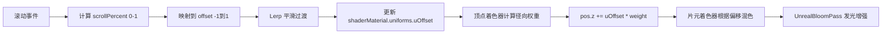

## SOP：Three.js 实现滚动驱动的平面凹凸效果

> 使用 `ShaderMaterial` 自定义顶点/片元着色器，结合页面滚动事件，实现平面随滚动产生凸起或凹陷变形的视觉效果。

目标效果：[Hisami Kurita Portfolio | ARCHIVE](https://hsmkrt1996.com/archive/)
实现效果：[[平面凹凸效果.html]]

---

### 适用场景

- 场景 1：Landing Page 的沉浸式滚动交互效果
- 场景 2：3D 官网的视差变形体验
- 场景 3：数据可视化中需要按维度变形的图表（如热力图凸起）

---

### 流程图解



---

### 核心步骤

#### 1. 初始化场景、相机、后期处理

固定 Canvas 在页面底层，配合页面滚动产生视差：

```javascript
const scene = new THREE.Scene()
scene.background = new THREE.Color(0x050b1a)
scene.fog = new THREE.FogExp2(0x050b1a, 0.008)

const camera = new THREE.PerspectiveCamera(45, innerWidth / innerHeight, 0.1, 1000)
camera.position.set(0, 0, 5)
camera.lookAt(0, 0, 0)

const renderer = new THREE.WebGLRenderer({ antialias: true })
renderer.setSize(innerWidth, innerHeight)
renderer.domElement.style.position = 'fixed'
renderer.domElement.style.top = '0'
renderer.domElement.style.left = '0'
renderer.domElement.style.zIndex = '1'
document.body.appendChild(renderer.domElement)

// 后期处理：UnrealBloomPass 增强凹凸的视觉感
const composer = new EffectComposer(renderer)
composer.addPass(new RenderPass(scene, camera))
const bloomPass = new UnrealBloomPass(
  new Vector2(innerWidth, innerHeight),
  0.5,   // strength
  0.3,   // radius
  0.2    // threshold
)
composer.addPass(bloomPass)
```

#### 2. 创建高细分平面几何体

凹凸平滑的关键：分段数越高变形越平滑：

```javascript
const width = 6
const height = 4
const segments = 128  // 128x128 分段，平滑变形的关键

const geometry = new THREE.PlaneGeometry(width, height, segments, segments)

// 添加顶点颜色（可选，用于调试或增强视觉效果）
const colors = []
for (let i = 0; i < positionAttribute.count; i++) {
  const x = positionAttribute.getX(i)
  const y = positionAttribute.getY(i)
  colors.push(x / width + 0.5, y / height + 0.5, 0.8)
}
geometry.setAttribute('color', new THREE.BufferAttribute(new Float32Array(colors), 3))
```

#### 3. 定义顶点着色器（核心变形逻辑）

使用径向基函数计算每个顶点受滚动影响的权重：

```javascript
const vertexShader = `
  varying vec2 vUv;
  varying vec3 vColor;
  attribute vec3 color;
  uniform float uOffset;  // 滚动偏移量，范围 [-1, 1]
  uniform float uTime;

  void main() {
    vUv = uv;
    vColor = color;

    vec3 pos = position;

    // 计算顶点到平面中心的距离
    float dist = length(pos.xy);
    float maxRadius = 3.6;  // 对角线一半

    // 径向权重：边缘处为 0，中心处最大
    float t = clamp(1.0 - pow(dist / maxRadius, 2.0), 0.0, 1.0);
    float weight = pow(t, 1.5);  // 形状调整

    // 微小明暗波纹效果
    float ripple = sin(pos.x * 2.0 + uTime) * cos(pos.y * 2.0 + uTime) * 0.05;

    // Z 轴偏移：凸起/凹陷
    float deltaZ = uOffset * 2.0 * weight + ripple * 0.03;
    pos.z += deltaZ;

    gl_Position = projectionMatrix * modelViewMatrix * vec4(pos, 1.0);
  }
`
```

**径向权重公式解析**：

| 距离 | t = 1 - (d/r)² | weight = t^1.5 | 效果 |
|:---|:---|:---|:---|
| 中心 (d=0) | 1 | 1 | 最大偏移 |
| 中间 (d=r/2) | 0.75 | ~0.65 | 中等偏移 |
| 边缘 (d=r) | 0 | 0 | 无偏移 |

#### 4. 定义片元着色器（颜色变化）

```javascript
const fragmentShader = `
  uniform float uOffset;
  uniform float uTime;
  varying vec2 vUv;
  varying vec3 vColor;

  void main() {
    // 偏移量映射到 [0, 1]
    float mixFactor = (uOffset + 1.0) / 2.0;

    // 颜色混合：正偏移偏暖色，负偏移偏冷色
    vec3 color1 = vec3(0.2, 0.3, 0.8);  // 蓝色
    vec3 color2 = vec3(0.8, 0.2, 0.5);  // 粉紫色
    vec3 baseColor = mix(color1, color2, mixFactor);

    // 动态光晕效果
    float glow = sin(vUv.x * 20.0 - uTime * 3.0) * cos(vUv.y * 20.0 + uTime * 2.0);
    glow = clamp(glow * 0.3 + 0.7, 0.5, 1.2);

    vec3 finalColor = baseColor * (0.8 + vec3(vUv.x, vUv.y, 1.0 - vUv.x) * 0.3) * glow;

    // 高光：凸起时增加高光
    float highlight = max(0.0, uOffset) * 0.5;
    finalColor += vec3(highlight, highlight * 0.6, highlight * 0.3);

    gl_FragColor = vec4(finalColor, 1.0);
  }
`
```

#### 5. 创建 ShaderMaterial 并挂载

```javascript
const shaderMaterial = new THREE.ShaderMaterial({
  uniforms: {
    uOffset: { value: 0.0 },
    uTime: { value: 0.0 },
  },
  vertexShader,
  fragmentShader,
  side: THREE.DoubleSide,  // 双面渲染，凹陷时可见背面
  wireframe: false,
})
```

#### 6. 滚动交互逻辑

将滚动百分比映射到 `[-1, 1]`，并用 Lerp 平滑过渡：

```javascript
let targetOffset = 0
let currentOffset = 0

function getScrollPercent() {
  const scrollTop = window.pageYOffset || document.documentElement.scrollTop
  const scrollHeight = document.documentElement.scrollHeight - window.innerHeight
  return scrollHeight > 0 ? scrollTop / scrollHeight : 0
}

window.addEventListener('scroll', () => {
  const percent = getScrollPercent()
  // 0% -> -1 (凹陷), 50% -> 0 (平面), 100% -> 1 (凸起)
  targetOffset = percent * 2 - 1
})
```

#### 7. 动画循环中更新 uniform

```javascript
function animate() {
  requestAnimationFrame(animate)

  // Lerp 平滑过渡（0.15 系数决定响应速度）
  currentOffset += (targetOffset - currentOffset) * 0.15

  // 更新 uniform
  shaderMaterial.uniforms.uOffset.value = currentOffset
  shaderMaterial.uniforms.uTime.value = performance.now() / 1000

  // 相机轻微跟随偏移，增强沉浸感
  camera.position.z += (5 - currentOffset * 0.3 - camera.position.z) * 0.05

  composer.render()
}
```

#### 8. 添加辅助视觉元素（可选）

背景粒子增强深度感：

```javascript
const particleCount = 800
const particlesGeometry = new THREE.BufferGeometry()
const particlePositions = new Float32Array(particleCount * 3)
for (let i = 0; i < particleCount; i++) {
  particlePositions[i * 3]     = (Math.random() - 0.5) * 30
  particlePositions[i * 3 + 1] = (Math.random() - 0.5) * 15
  particlePositions[i * 3 + 2] = (Math.random() - 0.5) * 15 - 10
}
particlesGeometry.setAttribute('position', new THREE.BufferAttribute(particlePositions, 3))

const particlesMaterial = new THREE.PointsMaterial({
  color: 0x88aaff,
  size: 0.05,
  transparent: true,
  opacity: 0.4,
  blending: THREE.AdditiveBlending,  // 加法混合产生发光效果
})
scene.add(new THREE.Points(particlesGeometry, particlesMaterial))
```

---

### 常见坑点

- ⛔ **凹凸变形不平滑，有棱角感**
	- **原因**：`PlaneGeometry` 的分段数过低（默认 1x1）
	- **排查**：设置 `segments = 128`（或更高），确保顶点数足够支撑平滑变形
- ⛔ **滚动方向和凹凸方向不匹配**
	- **原因**：`targetOffset = percent * 2 - 1` 的映射逻辑与预期相反
	- **排查**：检查 `uOffset` 的正负是否对应正确的凸起/凹陷方向；可交换公式或调整 `uOffset` 的符号
- ⛔ **凹陷时平面背面看不见颜色**
	- **原因**：`side` 默认是 `THREE.FrontSide`，只渲染正面
	- **排查**：`new THREE.ShaderMaterial({ side: THREE.DoubleSide, … })`
- ⛔ **Canvas 遮挡了页面滚动内容**
	- **原因**：`renderer.domElement.style.zIndex = '1'` 且 `position: fixed`
	- **排查**：确保 HTML 结构中 Canvas 在底层，内容 div 在上层，用 `z-index` 区分层级
- ⛔ **Lerp 过渡太慢或太快**
	- **原因**：`0.15` 系数不适配交互节奏
	- **排查**：增大系数（如 `0.3`）响应更快，减小（如 `0.05`）更平滑但有滞后感
- 🔧 **性能优化**：分段数 128 是平衡点，256+ 仅在近景特写时需要；移动端建议降到 64

---

### 知识图谱

- **父级概念**：[[ThreeJS]]
- **关联概念**：
	- [[SOP-ThreeJS实现气泡粒子]] — ShaderMaterial 进阶用法
	- [[SOP-ThreeJS实现光影滤镜]] — 后期处理与 EffectComposer
	- [[SOP-ThreeJS实现3D视差滚动]] — 滚动驱动的场景变化
