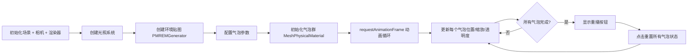

## SOP：Three.js 实现气泡粒子动画

> 使用 Three.js 的 `MeshPhysicalMaterial`（透射材质）和粒子系统，实现水下气泡从底部上升、膨胀、摆动并最终消失的标准流程。

---

### 适用场景

- 场景 1：水下环境、气泡、喷泉等流体质感效果
- 场景 2：3D 场景中的粒子特效（不是 Canvas 2D 粒子）
- 场景 3：需要物理材质（透射、折射、清漆层）的光泽表面效果

---

### 流程图解



---

### 核心步骤

#### 1. 初始化场景、相机、渲染器

```javascript
const scene = new THREE.Scene()

const camera = new THREE.PerspectiveCamera(
  60, window.innerWidth / window.innerHeight, 0.1, 1000
)
camera.position.set(0, 0, 25)

const renderer = new THREE.WebGLRenderer({ antialias: true, alpha: true })
renderer.setSize(window.innerWidth, window.innerHeight)
renderer.setPixelRatio(Math.min(window.devicePixelRatio, 2))
renderer.toneMapping = THREE.ACESFilmicToneMapping
renderer.toneMappingExposure = 1.5
document.body.appendChild(renderer.domElement)
```

**关键参数**：
- `ACESFilmicToneMapping`：让色彩更自然的色调映射
- `setPixelRatio(2)`：限制像素比，避免高性能设备上渲染过载

#### 2. 创建光照系统

气泡材质依赖光照呈现立体感，没有光照则无法显示反射/透射效果：

```javascript
// 环境光：微弱蓝色调，照亮暗部避免死黑
scene.add(new THREE.AmbientLight(0x1a3a5c, 0.3))

// 主光源：从上方水面试图照射，模拟水面透射的光
const mainLight = new THREE.DirectionalLight(0x88ddff, 2)
mainLight.position.set(0, 50, 30)
scene.add(mainLight)

// 点光源：模拟水面透射的光斑
const causticLight = new THREE.PointLight(0x4499ff, 3, 100)
causticLight.position.set(0, 40, 10)
scene.add(causticLight)
```

#### 3. 创建环境贴图（气泡反射的关键）

为 `MeshPhysicalMaterial` 提供环境反射参考，让气泡表面能反射出周围环境：

```javascript
const envScene = new THREE.Scene()
const envGeometry = new THREE.SphereGeometry(500, 32, 32)
const envMaterial = new THREE.MeshBasicMaterial({
  color: 0x050a12,
  side: THREE.BackSide
})
envScene.add(new THREE.Mesh(envGeometry, envMaterial))

// 使用 PMREMGenerator 生成预过滤环境贴图
const pmremGenerator = new THREE.PMREMGenerator(renderer)
pmremGenerator.compileEquirectangularShader()
const envTexture = pmremGenerator.fromScene(envScene).texture
```

> 环境贴图是气泡看起来真实的核心——它让透明气泡有了 " 存在感 "。

#### 4. 配置气泡参数

所有参数集中管理，便于调优：

```javascript
const config = {
  bubbleCount: 250,          // 气泡总数
  minRadius: 0.05,          // 最小半径
  maxRadius: 0.25,          // 最大半径
  maxScaleFactor: 3.5,       // 膨胀倍数（水下压力减小，气泡变大）
  minSpeed: 2,               // 最小上升速度
  maxSpeed: 4.5,             // 最大上升速度
  wobbleAmplitude: 0.4,      // 水平摆动幅度
  wobbleFrequency: 3,         // 摆动频率
  spawnY: -28,               // 生成位置（底部）
  despawnY: 32,              // 消失位置（顶部）
  spreadX: 5,                // X轴分布范围
  spreadZ: 4,                // Z轴分布范围
}
```

#### 5. 创建气泡（MeshPhysicalMaterial 透射材质）

这是气泡真实感的核心——使用透射材质而非普通透明材质：

```javascript
function createBubble() {
  const radius = THREE.MathUtils.randFloat(config.minRadius, config.maxRadius)
  const speed = THREE.MathUtils.randFloat(config.minSpeed, config.maxSpeed)
  const startX = THREE.MathUtils.randFloatSpread(config.spreadX)
  const phaseOffset = Math.random() * Math.PI * 2

  const geometry = new THREE.SphereGeometry(radius, 32, 32)

  const material = new THREE.MeshPhysicalMaterial({
    color: 0xffffff,
    transparent: true,
    opacity: 0.15,          // 极低透明度，几乎透明
    roughness: 0.0,          // 完全光滑
    metalness: 0.0,         // 非金属
    transmission: 0.95,       // 透射率，几乎完全透光
    thickness: 0.1,          // 薄壁
    envMap: envTexture,      // 环境贴图
    envMapIntensity: 2,      // 环境反射强度
    ior: 1.33,               // 水的折射率
    clearcoat: 1,            // 清漆层增强光泽
    clearcoatRoughness: 0,
    attenuationColor: 0x88ccff,  // 水下蓝色衰减
    attenuationDistance: 50,
  })

  const bubble = new THREE.Mesh(geometry, material)
  bubble.position.set(startX, config.spawnY, THREE.MathUtils.randFloatSpread(config.spreadZ))

  bubble.userData = {
    radius, speed, startX, phaseOffset,
    scaleFactor: 1,
    progress: 0,
    delay: Math.random() * 1.5,
    completed: false,
  }

  scene.add(bubble)
  return bubble
}
```

**MeshPhysicalMaterial 关键参数解析**：

| 参数 | 值 | 作用 |
|:---|:---|:---|
| `transmission` | 0.95 | 透射率，产生玻璃/水质感 |
| `ior` | 1.33 | 水的折射率 |
| `clearcoat` | 1 | 清漆层，表面光滑光泽 |
| `attenuationColor` | 0x88ccff | 水下光的蓝色衰减 |
| `envMap` | envTexture | 环境反射 |

#### 6. 定义缓动函数

让动画变化更自然，非线性变化：

```javascript
// 平方缓出：初始快后慢，适合上升动画（底部压力大，上升快）
function easeOutQuad(t) {
  return t * (2 - t)
}

// 正弦缓入缓出：平滑的 S 曲线，适合缩放动画
function easeInOutSine(t) {
  return -(Math.cos(Math.PI * t) - 1) / 2
}
```

#### 7. 动画循环与气泡更新

```javascript
let lastTime = 0

function animate(currentTime) {
  requestAnimationFrame(animate)

  // deltaTime：帧间隔，用于标准化动画速度
  const deltaTime = Math.min((currentTime - lastTime) / 1000, 0.1)
  lastTime = currentTime

  bubbles.forEach(bubble => updateBubble(bubble, deltaTime))

  renderer.render(scene, camera)
}
```

#### 8. 单个气泡更新逻辑

```javascript
function updateBubble(bubble, deltaTime) {
  const userData = bubble.userData
  if (isAnimationComplete || userData.completed) return

  // 延迟处理：初始延迟让气泡错开出现
  if (userData.delay > 0) {
    userData.delay -= deltaTime
    return
  }

  // 更新进度
  const normalizedSpeed = (userData.speed - config.minSpeed) / (config.maxSpeed - config.minSpeed)
  userData.progress += deltaTime * (0.5 + normalizedSpeed * 0.5)
  const t = easeOutQuad(Math.min(userData.progress, 1))

  // Y轴上升（线性插值 + 缓动）
  bubble.position.y = config.spawnY + (config.despawnY - config.spawnY) * t

  // X轴摆动（正弦波）
  const wobbleTime = userData.progress * config.wobbleFrequency
  const wobbleOffset = Math.sin(wobbleTime + userData.phaseOffset) * config.wobbleAmplitude
  bubble.position.x = userData.startX + wobbleOffset

  // 气泡膨胀（压力减小体积变大）
  const scaleT = easeInOutSine(t)
  const targetScale = 1 + (config.maxScaleFactor - 1) * scaleT
  userData.scaleFactor = THREE.MathUtils.lerp(userData.scaleFactor, targetScale, 0.08)
  bubble.scale.setScalar(userData.scaleFactor)

  // 透明度变化（接近水面更透明）
  bubble.material.opacity = THREE.MathUtils.lerp(0.2, 0.05, t)

  // 完成检测
  if (userData.progress >= 1) {
    userData.completed = true
  }
}
```

#### 9. 添加高光粒子（增强真实感）

为每个气泡添加高光点，模拟气泡表面的反光：

```javascript
const highlightGeometry = new THREE.BufferGeometry()
const highlightCount = 50
const highlightPositions = new Float32Array(highlightCount * 3)

for (let i = 0; i < highlightCount; i++) {
  highlightPositions[i * 3]     = THREE.MathUtils.randFloatSpread(0.3)
  highlightPositions[i * 3 + 1] = THREE.MathUtils.randFloatSpread(0.3)
  highlightPositions[i * 3 + 2] = THREE.MathUtils.randFloatSpread(0.3)
}
highlightGeometry.setAttribute('position', new THREE.BufferAttribute(highlightPositions, 3))

const highlightMaterial = new THREE.PointsMaterial({
  color: 0xffffff,
  size: 0.05,
  transparent: true,
  opacity: 0.5,
  blending: THREE.AdditiveBlending, // 加法混合，产生发光效果
})

bubbles.forEach(bubble => {
  const highlight = new THREE.Points(highlightGeometry.clone(), highlightMaterial.clone())
  bubble.add(highlight) // 作为气泡子对象，继承变换
})
```

#### 10. 重播功能

```javascript
let isAnimationComplete = false

function resetAnimation() {
  isAnimationComplete = false
  replayBtn.classList.add('hidden')
  bubbles.forEach(bubble => {
    resetBubble(bubble)
    bubble.userData.completed = false
  })
  lastTime = 0
}

function resetBubble(bubble) {
  const ud = bubble.userData
  ud.radius = THREE.MathUtils.randFloat(config.minRadius, config.maxRadius)
  ud.speed = THREE.MathUtils.randFloat(config.minSpeed, config.maxSpeed)
  ud.startX = THREE.MathUtils.randFloatSpread(config.spreadX)
  ud.phaseOffset = Math.random() * Math.PI * 2
  ud.scaleFactor = 1
  ud.progress = 0
  ud.delay = Math.random() * 1.0
  bubble.position.set(ud.startX, config.spawnY, THREE.MathUtils.randFloatSpread(config.spreadZ))
  bubble.scale.setScalar(1)
}

replayBtn.addEventListener('click', resetAnimation)
```

---

### 常见坑点

- ⛔ **气泡看起来像普通透明球体，没有 " 空洞 " 感**
	- **原因**：`transmission` 未设置或值过低（需要 0.9+），或缺少 `envMap` 环境贴图
	- **排查**：确认材质使用了 `MeshPhysicalMaterial` 而非 `MeshBasicMaterial`，且 `transmission: 0.95` + `envMap` 已设置
- ⛔ **气泡边缘锯齿感明显**
	- **原因**：`SphereGeometry` 分段数过低（默认 8），或渲染器未开启 `antialias`
	- **排查**：`new THREE.SphereGeometry(radius, 32, 32)` 使用 32 分段；`new THREE.WebGLRenderer({ antialias: true })`
- ⛔ **气泡没有光泽，像塑料薄膜**
	- **原因**：`clearcoat` 未设置或值过低，缺少清漆层
	- **排查**：添加 `clearcoat: 1, clearcoatRoughness: 0`
- ⛔ **动画速度不一致（有的快有的慢但看起来不自然）**
	- **原因**：`deltaTime` 未做上限限制，标签页失焦恢复时 `currentTime - lastTime` 过大
	- **排查**：`Math.min((currentTime - lastTime) / 1000, 0.1)` 限制最大帧间隔
- ⛔ **气泡分布太均匀，像机器排队**
	- **原因**：所有气泡 `delay` 相同，或 `progress` 初始化相同
	- **排查**：每个气泡使用 `Math.random()` 分配独立的 `delay`（如 `Math.random() * 1.5`）和初始 `progress`
- 🔧 **性能优化**：气泡数量过多时（250+），每个气泡的高光粒子会增加 draw call；可用 `InstancedMesh` 合并几何体

---

### 知识图谱

- **父级概念**：[[ThreeJS]]
- **关联概念**：
	- [[SOP-ThreeJS实现光影滤镜]] — 光照与材质的进阶应用
	- [[SOP-ThreeJS实现3D视差滚动]] — Three.js 的动态场景应用
