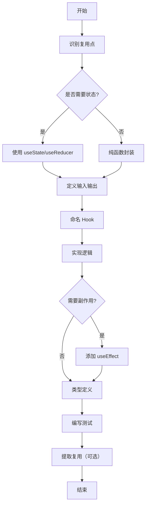

## SOP：创建自定义 Hooks

> 一句话描述这个 SOP 的目标和适用场景

目标：建立一套标准化的自定义 Hooks 创建流程，确保 Hooks 可复用、可测试、符合 [[React最佳实践]]
实现：`useLocalStorage` 示例展示了从需求分析到完整实现的标准化流程

---

### 适用场景

- 场景 1：多个组件需要共享相同的状态逻辑
- 场景 2：需要封装重复的业务逻辑以减少组件复杂度
- 场景 3：需要创建可复用的工具型 Hooks（如表单处理、数据获取、本地存储等）
- 场景 4：需要在多个项目间共享通用逻辑

---

### 流程图解



---

### 核心步骤

1. **识别复用点**：分析组件间重复的状态逻辑或副作用代码
	 - 注意：确保该逻辑确实需要在多处使用，避免过度抽象
2. **确定 Hook 签名**：明确输入参数和返回值类型
	 - 注意：优先使用 TypeScript 泛型确保类型安全
3. **实现核心逻辑**：编写 Hook 函数体，处理状态和副作用
	 - 注意：遵循 Hooks 规则（只在顶层调用、不条件调用）
4. **处理边界情况**：添加加载状态、错误处理、清理函数
	 - 注意：确保 Hook 在各种场景下都能正常工作
5. **编写测试用例**：覆盖主要场景和边界情况
	 - 注意：使用 `renderHook` 测试工具确保测试可靠性

---

### 实践示例

```typescript
// 1. 识别复用点：多个组件需要读写 localStorage
// 2. 确定 Hook 签名
function useLocalStorage<T>(key: string, initialValue: T): [T, (value: T) => void]

// 3. 实现核心逻辑
function useLocalStorage<T>(key: string, initialValue: T): [T, (value: T) => void] {
  // 状态初始化
  const [storedValue, setStoredValue] = useState<T>(() => {
    try {
      const item = window.localStorage.getItem(key)
      return item ? JSON.parse(item) : initialValue
    } catch (error) {
      console.warn(`Error reading localStorage key "${key}":`, error)
      return initialValue
    }
  })

  // 4. 处理边界情况：添加错误处理和同步逻辑
  const setValue = (value: T) => {
    try {
      setStoredValue(value)
      window.localStorage.setItem(key, JSON.stringify(value))
    } catch (error) {
      console.warn(`Error setting localStorage key "${key}":`, error)
    }
  }

  // 5. 同步多个标签页间的状态
  useEffect(() => {
    const handleStorageChange = (e: StorageEvent) => {
      if (e.key === key && e.newValue !== null) {
        setStoredValue(JSON.parse(e.newValue))
      }
    }
    window.addEventListener('storage', handleStorageChange)
    return () => window.removeEventListener('storage', handleStorageChange)
  }, [key])

  return [storedValue, setValue]
}
```

---

### 常见坑点

- ⛔ **反模式**：不要在 Hook 内部修改 props 或直接使用外部变量作为状态初始值（可能导致闭包陷阱）
- ⛔ **反模式**：不要在条件语句或循环中调用 Hook（违反 Hooks 调用规则）
- 🔧 **排查**：如果 Hook 返回的值不更新，检查是否正确使用了状态 setter 或依赖数组
- 🔧 **排查**：如果出现内存泄漏，检查 useEffect 的清理函数是否正确返回

---

### 知识图谱

- **父级概念**：[[React Hooks]]
- **关联概念**：[[useState 与 useReducer]]
- **关联概念**：[[useEffect 最佳实践]]
- **关联概念**：[[自定义 Hooks 模式]]
