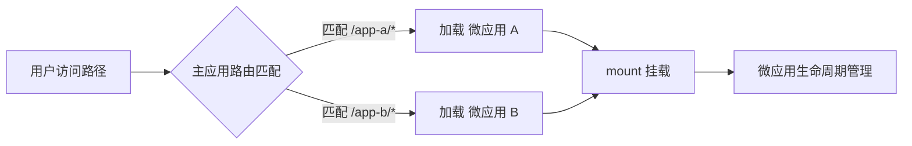

## SOP：微前端路由分发模式

> 使用主应用路由配置根据路径按需加载微应用的标准流程，适用于多团队独立部署场景。

---

### 适用场景

- 场景 1：多团队并行开发，需要独立部署流水线
- 场景 2：渐进式技术升级（Vue → React 存量业务）
- 场景 3：多品牌 SaaS 共享主应用框架

---

### 流程图解



---

### 核心步骤

#### 1. 主应用路由配置

主应用维护路由配置，根据路径按需加载微应用：

```javascript
const routes = [
  { path: '/app-a/*',  entry: 'http://localhost:3001', component: MicroApp },
  { path: '/app-b/*',  entry: 'http://localhost:3002', component: MicroApp },
]
```

#### 2. 微应用生命周期钩子

每个微应用暴露三个标准生命周期钩子：

```javascript
// 微应用 bootstrap：首次加载时调用一次
export async function bootstrap() {}

// 微应用 mount：每次挂载时调用
export async function mount(props) {
  renderApp(props)
}

// 微应用 unmount：每次卸载时调用
export async function unmount() {
  destroyApp()
}
```

---

### 常见坑点

- ⛔ **微应用白屏**
	- **排查**：确认微应用的 `mount` 和 `unmount` 正确导出，且 `entry` URL 可访问
- ⛔ **路由冲突**
	- **排查**：检查主应用路由顺序，微应用子路由需要使用通配符 `/*`

---

### 知识图谱

- **父级概念**：[[微前端]]
- **关联概念**：
	- [[SOP-微前端ModuleFederation方案]]
	- [[SOP-微前端沙箱隔离]]
