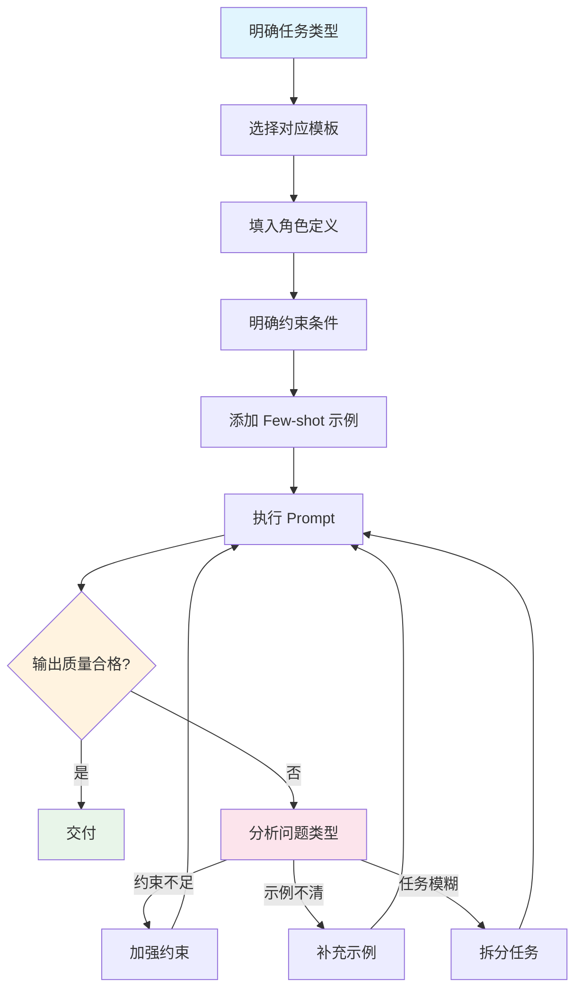

## SOP：提示词工程最佳实践

> 在前端开发场景中编写稳定、可复用 Prompt 的标准流程，适用于组件生成、代码审查、bug 修复等常见任务。

**目标**：提升 AI 输出质量稳定性，减少迭代次数
**实现**：通过「角色 + 约束 + 示例」三要素构建可靠 Prompt

---

### 适用场景

- ✅ **组件生成**：创建 React 组件、样式编写、Props 定义
- ✅ **代码审查**：AI 辅助 Code Review、提出优化建议
- ✅ **Bug 修复**：描述错误现象，AI 分析可能原因
- ✅ **文档撰写**：生成 JSDoc、README、技术文档
- ⛔ **复杂架构设计**：涉及多系统交互的架构决策（建议用 Agent 编排）

---

### 流程图解



---

### 核心步骤

#### 步骤 1：明确任务类型

| 任务类型 | Prompt 策略 | 示例模板 |
|:---|:---|:---|
| **组件生成** | 角色 + 技术栈 + 约束 | "你是 React 专家，帮我创建一个 Button 组件..." |
| **代码审查** | 约束 + 关注点 | "审查以下代码，关注性能和安全..." |
| **Bug 修复** | 现象 + 上下文 + 约束 | "这个组件报错：{错误信息}，在 {场景} 下..." |
| **文档生成** | 格式 + 内容范围 | "生成 JSDoc，格式如下..." |

#### 步骤 2：选择对应模板

**组件生成模板**：

```
你是 {{角色}}，帮我创建一个 {{组件名}} 组件：

技术要求：
- 框架：{{React/Vue/其他}}
- 语言：{{TypeScript/JavaScript}}
- 样式：{{Tailwind/CSS Modules/styled-components}}
- 约束：{{设计规范/响应式要求/可访问性}}

功能需求：
1. {{功能1}}
2. {{功能2}}

输出要求：
- 提供完整的组件代码
- Props 类型定义
- 包含必要的注释
```

**代码审查模板**：

```
审查以下代码，专注于：

关注点：
- {{关注点1，如：性能优化}}
- {{关注点2，如：安全漏洞}}
- {{关注点3，如：可维护性}}

代码：
{{粘贴代码}}

输出格式：
- 问题描述
- 严重程度（高/中/低）
- 建议修复方案
```

#### 步骤 3：填入角色定义

**角色选择原则**：

| 场景 | 推荐角色 | 原因 |
|:---|:---|:---|
| 组件开发 | React / Vue 专家 | 给出符合框架惯例的代码 |
| 架构审查 | 高级前端工程师 | 关注架构可扩展性 |
| Bug 分析 | 调试专家 | 逻辑严密、系统化分析 |
| 文档撰写 | 技术文档专家 | 结构清晰、表达准确 |

**角色定义示例**：

```
你是资深 React 专家：
- 5 年以上 React 开发经验
- 熟悉 React 18 新特性（Suspense、Server Components）
- 遵循 Hooks 最佳实践
- 代码风格符合 ESLint + Prettier 规范
```

#### 步骤 4：明确约束条件

**必要约束**：

- **输出格式约束**：JSON / Markdown / 代码块
- **技术栈约束**：版本号、包管理器
- **风格约束**：命名规范、代码风格
- **边界约束**：不支持的功能、不推荐的做法

**约束表达示例**：

```
约束：
- 不使用 any 类型
- 组件必须支持 Tree-shaking
- 图片使用 lazy loading
- 支持 SSR（如果适用）
- 遵循 aria-label 规范
```

#### 步骤 5：添加 Few-shot 示例

**什么时候需要示例**：

- 输出格式复杂（特定 JSON 结构）
- 边界情况需要明确说明
- 领域特定术语需要统一理解

**示例格式**：

```
示例：

输入：Button 组件需要支持 5 种变体（primary, secondary, ghost, danger, link）
输出：
```tsx
type Variant = 'primary' | 'secondary' | 'ghost' | 'danger' | 'link';
```
```

#### 步骤 6：执行与迭代

**迭代决策树**：

```
输出质量不合格？
├── 约束不足 → 加强约束（明确禁止项）
├── 示例不清 → 补充典型示例
├── 任务模糊 → 拆分为多个子任务
└── 模型限制 → 尝试换模型或调整 Temperature
```

---

### 实践/示例

**示例 1：React 组件生成**

```
你是资深 React 专家，帮我创建一个 Modal 组件：

技术要求：
- React 18 + TypeScript
- 使用 Tailwind CSS
- 支持暗色模式

功能需求：
1. 支持自定义标题、内容、操作按钮
2. 支持 ESC 键关闭
3. 支持点击遮罩关闭
4. 支持动画（fade + scale）

约束：
- 不使用 any
- 遵循 aria-modal 规范
- 支持 React 18 Strict Mode
```

**示例 2：Bug 修复**

```
帮我分析这个错误：

错误现象：
TypeError: Cannot read properties of undefined (reading 'map')

上下文：
- 在 ProductList 组件的 {{第23行}} 触发
- 只在数据为空时出现（API 返回 null）
- 本地开发正常，生产环境偶发

代码片段：
{{粘贴相关代码}}

请：
1. 分析可能原因
2. 给出修复方案
3. 提供预防建议
```

---

### 常见坑点

- ⛔ **约束不足导致输出不稳定**
  - **排查**：检查是否明确定义了技术栈、版本、输出格式
  - **修复**：添加「禁止使用 xxx」类型的负面约束

- ⛔ **任务过于宽泛**
  - **排查**：Prompt 超过 3 句话还没明确核心任务
  - **修复**：拆分为「先做 X，再做 Y」的分步 Prompt

- ⛔ **缺少边界条件说明**
  - **排查**：AI 生成代码在边界情况下出错
  - **修复**：添加「如果 X 情况，输出 Y」的条件约束

- ⛔ **角色定义过于模糊**
  - **排查**：AI 给出的建议与团队规范不符
  - **修复**：在角色定义中加入具体规范名称和链接

- 🔧 **上下文丢失**
  - **排查**：长对话后 AI 忘记早期约束
  - **修复**：在后续 Prompt 中复述关键约束（如「继续实现，注意不支持 any 类型」）

---

### 知识图谱

- **父级概念**：[[人工智能]] — 本 SOP 是 AI 应用层的基础技能
- **关联概念**：
  - [[提示词工程]] — Prompt Engineering 理论支撑
  - [[LLM]] — 理解 LLM 能力边界有助于写出更好约束
  - [[Claude Code]] — Claude Code 内置了优化过的 Prompt 模板
- **相关 SOP**：
  - [[SOP-使用Claude-Code开发React组件]] — 组件开发的完整 SOP
  - [[SOP-AI 输出质量评估]] — 评估 AI 生成结果的标准流程（待创建）