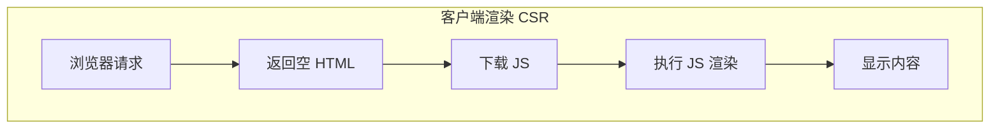
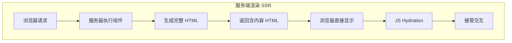

## 概念：SSR

> SSR（Server-Side Rendering，服务端渲染）是一种在**服务器端**执行页面组件逻辑，生成包含实际数据的完整 HTML 内容后返回给客户端的渲染模式。

**解决的核心痛点**：CSR 模式下，浏览器需要等待 JavaScript 下载执行才能看到内容，导致首屏慢、SEO 差。SSR 让服务器提前完成渲染工作，浏览器直接显示内容。

---

### 核心命题

- SSR 的本质是「计算前置」——把页面渲染的计算任务从客户端移到服务器端执行
- SSR 的代价是「服务器负载」——每次请求都需要服务器执行渲染逻辑
- SSR 解决了首屏问题，但「注水」（[[Hydration]]）过程仍然需要 JavaScript 执行

---

### 运行机制

#### SSR vs CSR 流程对比

#### SSR 完整生命周期

| 阶段 | CSR | SSR |
|:---|:---|:---|
| **请求** | 浏览器发送请求 | 浏览器发送请求 |
| **HTML** | 空 HTML + JS 链接 | 完整 HTML（含内容） |
| **首屏显示** | 需等 JS 执行 | 立即显示 |
| **交互就绪** | HTML 内容 + JS | HTML 内容 + JS Hydration |
| **后续交互** | JS 处理 | JS 处理 |

---

### 关键区别

| 维度 | SSR | [[CSR]] | [[SSG]] |
|:---|:---|:---|:---|
| **渲染位置** | 服务器 | 客户端 | 构建时 |
| **首屏速度** | 快 | 慢 | 最快 |
| **服务器负载** | 高 | 低 | 零 |
| **动态内容** | 支持 | 支持 | 不支持（需重建） |
| **SEO** | 友好 | 不友好 | 友好 |

---

### 应用场景

- ✅ **适用场景**
	- **内容密集型网站**：新闻、博客、电商产品页（依赖 SEO）
	- **首屏速度敏感**：营销落地页、移动端首页
	- **社交分享**：需要正确渲染 Open Graph 元数据
	- **低性能设备**：减少客户端 JavaScript 执行负担
- ⛔ **误用**
	- **高度交互应用**：后台管理系统、实时仪表盘（CSR 更适合）
	- **纯静态内容**：文档网站（[[SSG]] 更高效）
	- **服务器资源有限**：SSR 增加服务器成本，需权衡

---

### 知识图谱

- **父级概念**：[[前端开发]] — SSR 是一种渲染模式
- **子级概念**：
	- [[Hydration]] — 客户端 JavaScript 接管 SSR 输出的过程
	- 流式 SSR — 利用 HTTP 流式传输加速渲染
	- React Server Components — 服务端组件化方案
- **并列概念**：
	- [[CSR]] — 客户端渲染
	- [[SSG]] — 静态站点生成
	- ISR — 增量静态再生成
- **相关概念**：
	- [[NextJS]] — SSR 框架的代表
	- [[Nuxt]] — Vue 生态的 SSR 框架

---

### FAQ

- [[Q-Hydration 为什么会增加交互延迟]]
- [[Q-SSR 和 SSG 应该怎么选择]]

---

### 参考延伸

- [Next.js Rendering Docs](https://nextjs.org/docs/app/building-your-application/rendering)
- [Web.dev - Rendering on the Web](https://web.dev/articles/rendering-on-the-web)
