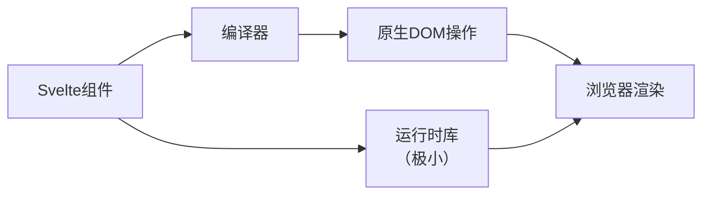

## 概念：Svelte

> Svelte 是编译时优化框架，代码在编译阶段转换为高效的命令式 DOM 操作，无需虚拟 DOM 运行时

**解决的核心痛点**：传统框架（React/Vue）在运行时通过虚拟 DOM 进行 Diff 计算，带来额外的性能开销和 bundle 体积

---

### 核心命题

- [[Svelte 无需虚拟 DOM，编译时直接生成 DOM 操作代码]]
	- **原理**：Svelte 编译器在构建时分析模板，生成精确的 DOM 操作指令，无须运行时库
- [[Svelte 的响应式基于编译器重写，响应式语句直接转换为赋值语句]]
	- **原理**：Svelte 编译器将 `$:` 响应式声明转换为赋值语句，无需依赖收集或代理拦截

---

### 运行机制

**编译流程**：
1. 解析.svelte 文件，生成 AST
2. 分析模板中的响应式声明和事件绑定
3. 生成高效的原生 JavaScript 代码
4. 输出体积极小的运行时辅助代码

---

### 关键区别

| 维度 | Svelte | React | Vue |
|:---|:---|:---|:---|
| **核心思路** | 编译时优化 | 运行时虚拟 DOM | 编译时 + 运行时混合 |
| **DOM 更新** | 直接操作 DOM | 虚拟 DOM Diff | 响应式追踪 + DOM patch |
| **运行时体积** | ~0KB（无运行时） | ~40KB | ~30KB |
| **上手难度** | 平缓 | 中等 | 平缓 |
| **适用场景** | 高性能应用、小型项目 | 大型复杂应用 | 中小型项目 |

---

### 应用场景

- ✅ **适用场景**
	- **高性能要求场景**：编译器生成最优 DOM 操作，无中间层开销
	- **小型/微型应用**：打包体积最小，加载速度快
	- **嵌入式 Widget**：运行时依赖少，适合嵌入第三方页面
- ⛔ **误用**
	- **大型复杂应用**：缺少 React/Angular 级别的工程化生态
	- **需要大量第三方库**：生态相比 React 较弱

---

### FAQ

- [[Q-Svelte 和传统框架的核心区别是什么？]]
- [[Q-Svelte 的编译器具体做了什么优化？]]  

---

### 知识图谱

- **父级概念**：[[前端框架]] — UI 框架的上位概念
- **并列概念**：
	- [[Vue]] — 渐进式框架，编译时 + 运行时混合
	- [[React]] — 虚拟 DOM 框架，函数式组件
- **相关概念**：
	- [[Virtual DOM]] — React/Vue 的中间层
	- [[Svelte vs React]] — 编译时 vs 运行时优化

---

### 参考延伸

- [Svelte 官方文档](https://svelte.js.cn/docs)
- [[新兴前端框架 Svelte 从入门到原理]]
