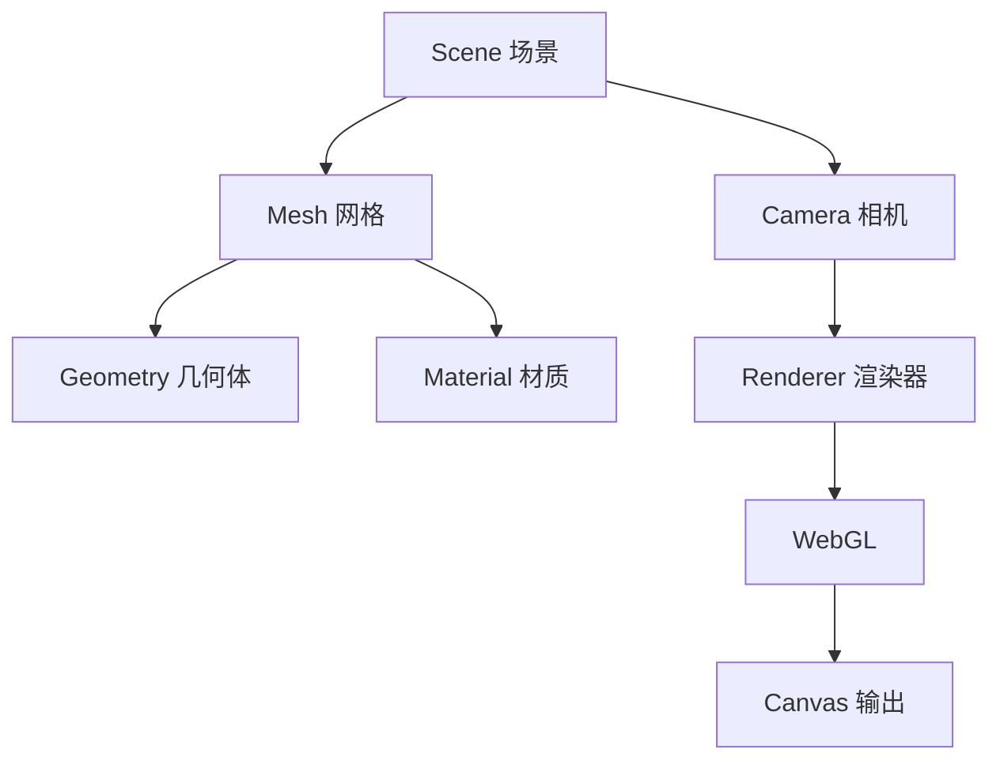

## 概念：ThreeJS

> Three.js 是一个基于 WebGL 的 JavaScript 3D 图形库，简化了浏览器中的 3D 图形开发。

**解决的核心痛点**：解决原生 WebGL API 复杂、难以上手的问题，提供简洁的 3D 场景构建接口

---

### 核心命题

- [[Three.js 抽象了 WebGL 的复杂性]]
	- **原理**：封装了着色器、缓冲区、渲染管线等底层细节，提供场景、相机、渲染器等高级对象
- [[Three.js 采用场景图结构组织 3D 对象]]
	- **原理**：Scene 包含 Mesh（网格）、Light（光源）、Camera（相机）等对象，支持层级嵌套
- [[Three.js 支持多种材质和渲染效果]]
	- **原理**：内置 MeshBasicMaterial、MeshStandardMaterial、ShaderMaterial 等，支持阴影、环境贴图、后处理

---

### 运行机制

---

### 关键区别

| 维度 | Three.js | WebGL |
|:--- |:--- |:--- |
| **抽象层级** | 高级 API | 底层 API |
| **学习曲线** | 平缓 | 陡峭 |
| **灵活性** | 受限于库的设计 | 完全控制 |
| **适用场景** | 快速开发 | 极致性能/特殊效果 |

---

### 应用场景

- ✅ **适用场景**
	- **3D 可视化**：数据可视化、产品展示
	- **Web 游戏**：3D 游戏开发
	- **AR/VR**：WebXR 应用
	- **交互体验**：3D 官网、 Landing Page
- ⛔ **误用**
	- **2D 场景**：使用 Canvas 2D 即可
	- **极致性能需求**：可能需要原生 WebGLL

#### SOP

- [[SOP-使用ThreeJS实现3D视差滚动]]
- [[SOP-ThreeJS实现气泡粒子]]
- [[SOP-ThreeJS实现光影滤镜]]
- [[SOP-ThreeJS实现平面凹凸效果]]
- [[SOP-ThreeJS实现液体交汇]]

#### FAQ

- **Q：Three.js 和 Babylon.js 怎么选？**
	- Three.js 更广泛、社区活跃、示例丰富；Babylon.js 更完整、文档更好、内置功能更多。快速原型选 Three.js，企业级应用可考虑 Babylon.js
- **Q：Three.js 能做移动端吗？**
	- 可以，但需要注意性能。移动端 WebGL 性能有限，建议减少多边形数量、压缩纹理、限制 draw call，必要时使用低功耗渲染模式
- **Q：Three.js 的性能瓶颈在哪里？**
	- 主要是 draw call 数量（ meshes 数量）、纹理内存、以及复杂着色器的 GPU 计算。使用 InstancedMesh、合并几何体、延迟渲染等技术优化

---

### 知识图谱

- **父级概念**：[[WebGL]]
- **并列概念**：
	- [[Babylon.js]]
	- [[WebGPU]]
- **相关概念**：
	- [[GSAP]]（3D 动画）
	- [[SVG]]（2D 矢量）
	- [[Canvas]]

---

### 参考延伸

- 官网：[threejs.org](https://threejs.org/)
- 学习资源：Three.js Journey（付费课程）
