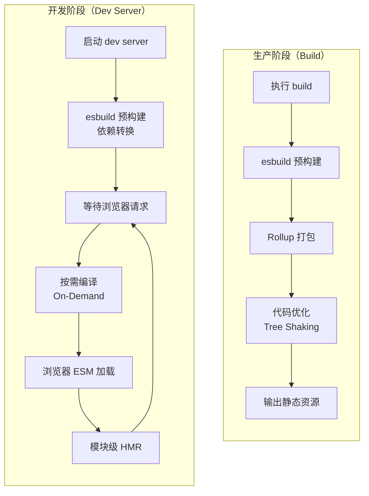

## 概念：Vite

> Vite 是由尤雨溪开发的现代化前端构建工具，利用浏览器原生 ESM 实现快速冷启动和即时 HMR。

**解决的核心痛点**：解决传统构建工具（如 Webpack）开发阶段启动慢、HMR 延迟高的问题——大型项目冷启动可能需要数十秒，而 Vite 借助 ESM 可实现亚秒级启动。

---

### 核心命题

> 核心命题引用 atomic 笔记（陈述句观点），每个命题是一句话洞见

- [[Vite急速冷启动的本质是延迟编译]]
	- **原理**：浏览器直接请求 ESM 模块，服务器按需编译（On-Demand Compilation），无需预打包整个应用
- [[Vite 使用 esbuild 进行预构建]]
	- **原理**：esbuild（Go 编写）将 CJS 依赖转为 ESM、规范化导入路径、合并小模块，解决浏览器 ESM 兼容性问题
- [[Vite在生产阶段使用Rollup进行优化打包]]
	- **原理**：Rollup 提供精确的 Tree Shaking 和代码分割，输出干净的生产构建产物
- [[Vite HMR 的本质是基于浏览器原生 ESM 的按需编译机制]]

---

### 运行机制

Vite 分为开发阶段和生产阶段两套构建策略：

**关键阶段说明**：

| 阶段 | 核心操作 | 技术选型 |
|:---:|:---|:---|
| **开发预构建** | CJS → ESM、路径规范化、合并小模块 | esbuild（Go） |
| **开发请求处理** | 按需编译，延迟到浏览器请求时 | native ESM + dev server |
| **生产构建** | 打包、优化、Tree Shaking | Rollup（JS） |

---

### 关键区别

| 维度 | Vite | [[Webpack]] | [[Rollup]] |
|:--- |:--- |:--- |:--- |
| **开发体验** | 亚秒级冷启动，按需编译 | 冷启动慢（全量打包） | 不适合开发 |
| **HMR** | 模块级精准更新 | 依赖图级更新 | 无 dev server |
| **生产构建** | Rollup 优化 | Webpack 打包 | 专注库输出 |
| **插件生态** | 兼容 Rollup 插件 | 自有生态 | 专注库/框架 |
| **适用场景** | 中小型项目快速开发 | 大型复杂项目 | 库/框架打包 |

详细对比：[[Webpack vs Vite]]

---

### 应用场景

- ✅ **新项目首选**：开发体验好，配置简洁
- ✅ **中小型项目**：构建速度快，热更新即时
- ✅ **Vue/React 项目**：官方推荐（Vue 3 官方脚手架使用 Vite）
- ✅ **库开发**：生产阶段使用 Rollup，输出纯净 ESM/CJS/UMD
- ⛔ **超大型项目**：万级模块项目可能面临预构建性能瓶颈
- ⛔ **旧项目迁移**：部分 Webpack 特有插件需要适配

---

### SOP

- [[SOP-Vite配置流程]] — Vite 标准配置流程
- [[SOP-如何在Vite中配置环境变量？]]

---

### FAQ

- [[Webpack vs Vite]]
- [[MOC-Vite相关问题]]

---

### 知识图谱

> 知识图谱链接 term（术语定义）和相关 concept，建立概念关系网络

- **父级概念**：[[前端工程]] — 构建工具的上游领域
- **并列概念**：
	- [[Webpack]] — 传统构建工具对比
	- [[Rollup]] — 专注于库打包
- **深入主题**：
	- [[Webpack vs Vite]] — 核心差异对比
	- HMR（热模块替换）
	- 预构建机制
	- 环境变量配置
- **参考文章**：
	- 官网：https://vite.dev
	- 作者：尤雨溪（Evan You）
