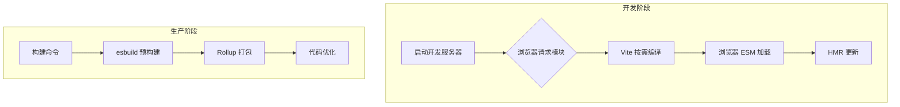

## 概念：Vite

> Vite 是由尤雨溪开发的现代化前端构建工具，利用浏览器原生 ESM 实现快速冷启动和即时 HMR。

**解决的核心痛点**：解决传统构建工具（如 Webpack）开发阶段启动慢、HMR 延迟高的问题

---

### 核心命题

- [[Vite 开发阶段利用浏览器 ESM 实现极速冷启动]]
	- **原理**：浏览器直接加载 ESM 模块，无需打包，服务器按需编译
- [[Vite 使用 esbuild 进行预构建]]
	- **原理**：esbuild 是 Go 编写的构建工具，速度极快，将 CJS 依赖转为 ESM、规范化导入路径、合并小模块、解决多版本依赖
- [[Vite 生产阶段使用 Rollup 进行优化打包]]
	- **原理**：Rollup 提供精确的代码分割和 Tree-shaking

---

### 运行机制

---

### 关键区别

| 维度 | Vite | Webpack |
|:--- |:--- |:--- |
| **冷启动** | 亚秒级（无需打包） | 慢（需打包整个应用） |
| **HMR** | 精准更新（模块级） | 较慢（依赖图重构） |
| **构建速度** | 快（esbuild） | 较慢（JS 实现） |
| **配置** | 简洁 | 复杂 |
| **生态** | 快速增长 | 成熟稳定 |

---

### 应用场景

- ✅ **适用场景**
	- **新项目首选**：开发体验好
	- **中小型项目**：构建速度快
	- **Vue/React 项目**：官方推荐
- ⛔ **误用**
	- **超大型项目**：可能面临性能问题
	- **旧项目迁移**：可能需要额外配置

---

### 知识图谱

- **父级概念**：[[前端工程化]]
- **子集概念**：[[HMR原理（Vite）]] [[预构建机制（Vite）]] [[环境变量（Vite）]]
- **并列概念**：[[Webpack]] [[Rollup]]
- **相关概念**：[[ESM]]

---

### 参考延伸

- 官网：https://vite.dev
- 作者：尤雨溪（Evan You）
- 预构建：使用 esbuild（Go 编写的极快构建工具）
