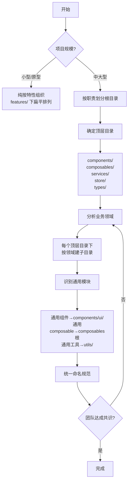

## SOP：搭建 Vue3 混合文件夹结构

> 为中大型 Vue 3 应用搭建兼顾职责分离与领域聚合的项目结构

目标：创建一个根目录按**技术职责**（responsibility）、内部按**业务领域**（domain/feature）分组的 Vue 3 项目结构。

---

### 适用场景

- **新建 Vue 3 中大型项目**：从一开始就采用混合结构，避免后续重构
- **现有项目重构**：将纯按职责或纯按特性的项目转型为混合结构
- **多领域产品**：涉及 billing、pricing、sessions 等多个独立业务模块

---

### 流程图解



---

### 核心步骤

1. **评估项目规模，确认采用混合结构**
 - ✅ 团队分工按业务领域划分 → 混合结构适用
 - ✅ 项目涉及 3+ 个独立业务模块 → 混合结构适用
 - ⛔ 单页面/小型应用 → 纯按特性更简单，无需混合结构

2. **按技术职责确定顶层目录**

 ```bash
 src/
 ├── components/    # UI 组件
 ├── composables/   # 响应式逻辑
 ├── services/      # 业务操作
 ├── store/         # 全局状态
 ├── types/         # TypeScript 类型
 ```

 - 可选扩展：pages/、router/、layouts/、config/、constants/、utils/、styles/

3. **分析业务领域，在每个目录下建子目录**

 ```bash
 services/
 ├── billing/       # 计费服务
 ├── pricing/       # 定价服务
 └── sessions/      # 会话服务
 ```

 - 命名规则：`YYYY.pinia.ts`（功能.种类.ts）— 文件按领域前缀分组
 - 通用模块（如主题、核心类型）直接放在父目录下

4. **识别通用模块，决定存放位置**
 - **跨领域共享的 UI** → `components/ui/`（如 Button、Modal）
 - **布局组件** → `components/layout/`（如 Header、Sidebar）
 - **通用 composable** → `composables/` 根下（如 `useClock.ts`）
 - **通用工具函数** → `utils/` 根下
 - **通用类型** → `types/` 根下（如 `navigation.types.ts`）

5. **统一命名规范**
 - 文件名以 feature 开头：`user.service.ts`、`user.pinia.ts`、`useUsers.ts`
 - 类型后缀区分职责：`.service.ts`（业务逻辑）、`.pinia.ts`（状态管理）、`use*.ts`（composable）
 - 优势：搜索 feature 名即可定位所有相关文件

---

### 实践/示例

**搜索结果对比**：搜索 "user" 时，混合结构将所有相关文件集中在一个目录下，一目了然。

```bash
src/features/user/
├── user.service.ts         # 业务逻辑和 API 调用
├── user-cache.service.ts   # 缓存和离线策略
├── user.pinia.ts           # 全局状态
├── useUsers.ts             # 可复用组合逻辑
└── useUserValidation.ts    # 验证规则
```

**完整目录结构示例**：

```bash
src/
├── components/
│   ├── features/           # 按领域
│   │   ├── billing/
│   │   └── sessions/
│   ├── ui/                 # 通用组件
│   ├── layout/             # 布局组件
│   └── ...
├── composables/
│   ├── features/           # 按领域
│   ├── useClock.ts         # 通用
│   └── ...
├── services/
│   ├── billing/
│   ├── pricing/
│   ├── sessions/
│   └── ...
├── store/
│   ├── billing.pinia.ts
│   ├── theme.pinia.ts
│   └── ...
├── types/
│   ├── pricing/
│   ├── licensing/
│   ├── navigation.types.ts  # 通用
│   └── ...
├── pages/
├── router/
├── layouts/
├── config/
├── constants/
├── utils/
└── styles/
```

---

### 常见坑点

- ⛔ **反模式：两层结构退化为大杂烩** — `features/` 和 `ui/` 目录膨胀后边界模糊。**排查**：定期审计 `ui/` 下的组件是否仍被多个领域使用，单向依赖的应移回 `features/`
- ⛔ **反模式：规则不一致** — 部分文件放 `features/` 子目录，部分直接放根目录，没有明确规则。**排查**：制定团队约定——「如果只被单个领域使用，就放在该领域的 `features/` 目录下」
- ⛔ **反模式：跨领域硬依赖** — `features/billing/` 下的组件直接引用 `features/sessions/` 的内部文件。**排查**：跨领域引用应通过通用层（`components/ui/`、`services/`）间接访问
- ⛔ **反模式：中小型项目过度工程** — 3 个页面就用混合结构，增加不必要的复杂度。**排查**：项目初期纯按特性组织，随规模增长逐步引入职责层

---

### 知识图谱

- **相关概念**：
	- [[Vue]] — Vue 3 应用架构的父级框架
	- [[Monorepo]] — 更大的组织单元，一个仓库管理多个应用/包
- **对比方案**：
	- 纯按特性组织 — 仅按业务领域组织（无技术职责层），适合小型项目
	- 纯按职责组织 — 仅按技术职责组织（无领域聚合），适合有复用需求但不按领域分工的项目
- **参考来源**：
	- _resources/How I Build Vue 3 Applications (Part 1) Why I Use a Hybrid Folder Structure/
