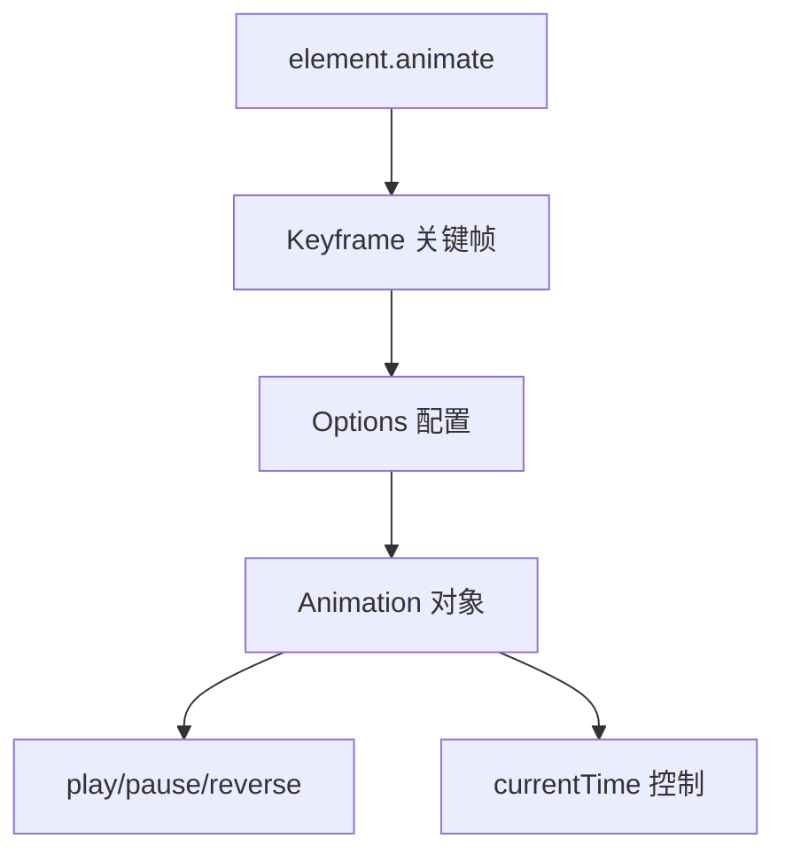

> Web Animations API（WAAPI）是浏览器原生的动画接口，通过 JavaScript 提供可编程的动画控制

**解决的核心痛点**：CSS 动画难以获取动画状态、控制播放、动态创建；传统 JS 动画库过于庞大。

---

## 核心命题

> 核心命题引用 atomic 笔记（陈述句观点）

- （待补充 atomic 洞见）

---

## 运行机制

**WAAPI 工作原理**：



**核心 API**：

```javascript
// 基础用法
element.animate(keyframes, options)

// 返回 Animation 对象
const animation = element.animate([
  { transform: 'translateX(0)', opacity: 1 },
  { transform: 'translateX(100px)', opacity: 0 }
], {
  duration: 300,
  easing: 'ease-out',
  fill: 'forwards'
})

// 控制动画
animation.play()    // 播放
animation.pause()   // 暂停
animation.reverse()  // 反向
animation.finish()  // 完成
animation.cancel()  // 取消

// 时间控制
animation.currentTime = 500
animation.playbackRate = 2  // 2倍速
```

---

## 关键区别

| 维度 | CSS Animation | Web Animations API |
|:--- |:--- |:--- |
| **编程方式** | 声明式（CSS） | 命令式（JavaScript） |
| **状态获取** | 困难（需事件监听） | 容易（Animation 对象属性） |
| **动态创建** | 需操作 DOM/切换 class | 运行时动态创建 |
| **复用性** | 通过 class 复用 | 创建 Animation 实例复用 |
| **浏览器支持** | 全部支持 | 现代浏览器支持 |
| **性能** | 相当 | 相当 |

---

## 应用场景

- ✅ **适用场景**
	- **动态动画**：根据用户交互实时创建动画
	- **复杂序列**：需要精确控制时序的动画
	- **状态同步**：需要读取动画状态（如进度）时
	- **性能敏感**：需要利用合成层但不想用 CSS
- ⛔ **误用**
	- **简单循环动画**：CSS Animation 更简洁
	- **旧版浏览器兼容**：需 polyfill

---

## SOP

> 与本概念相关的标准操作流程

- （暂无相关 SOP，待补充）

---

## FAQ

> 与本概念相关的开放性问题

- （暂无相关 Question，待补充）

---

## 知识图谱

> 知识图谱链接相关概念

- **父级概念**：
	- [[Web动画]] — WAAPI 是 Web 动画技术之一
- **并列概念**：
	- [[CSS Animation]] — CSS 动画方案
	- [[GSAP]] — 第三方高性能动画库
- **相关概念**：
	- [[requestAnimationFrame]] — 动画帧同步基础
	- [[合成层]] — 动画性能优化相关

---

## 参考延伸

- MDN: [Web Animations API](https://developer.mozilla.org/zh-CN/docs/Web/API/Web_Animations_API)
- CSS Tricks: [Using the Web Animations API](https://web.dev/lessons/webanimations/)
- 兼容表：[Can I Use WAAPI](https://caniuse.com/mdn-api_element_animate)
