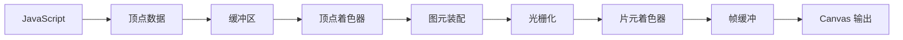

## 概念：WebGL

> 在浏览器中实现高性能 2D 和 3D 图形渲染的 JavaScript API，基于 OpenGL ES。

**解决的核心痛点**：浏览器原生缺乏硬件加速的图形渲染能力，WebGL 通过对接 GPU 实现实时高性能图形。

---

### 核心命题

- WebGL 是浏览器与 GPU 之间的桥梁，让 Web 支持硬件加速的 2D/3D 渲染
- WebGL 基于 OpenGL ES，使用 GLSL 编写着色器程序
- 一切皆三角形——复杂 3D 模型最终都由三角形图元组成

---

### 运行机制

#### 渲染管线

#### 核心概念

| 概念                | 说明                                          |
|:---------------- |:------------------------------------------ |
| **上下文 (Context)** | `canvas.getContext('webgl')` 获取 WebGL 渲染上下文 |
| **着色器 (Shader)**  | GPU 程序，分为顶点着色器和片元着色器                        |
| **程序 (Program)**  | 顶点着色器 + 片元着色器的完整程序                          |
| **缓冲区 (Buffer)**  | 存储顶点坐标、颜色、纹理坐标等                             |
| **纹理 (Texture)**  | 映射到表面的图像数据                                  |
| **uniform**       | 从 CPU 传递给 GPU 的全局变量                         |

---

### 关键区别

| 维度 | WebGL | Canvas 2D |
|:---|:---|:---|
| **渲染方式** | 即时模式 (Immediate Mode) | 保留模式 (Retained Mode) |
| **硬件加速** | GPU 加速 | CPU 渲染 |
| **适用场景** | 3D 游戏、数据可视化 | UI 图形、简单图表 |
| **编程难度** | 高（需要图形学知识） | 低（2D 绘图 API） |
| **性能** | 高性能复杂渲染 | 简单渲染足够 |

详见：[[Canvas]] vs [[WebGL]]

---

### 应用场景

- ✅ **3D 游戏**：Web 游戏、虚拟现实
- ✅ **数据可视化**：3D 图表、地图（Three.js、D3.gl）
- ✅ **图形编辑工具**：在线图片/模型编辑器
- ✅ **科学可视化**：医学成像、CAD 查看器
- ✅ **粒子/特效系统**：高性能粒子动画
- ⛔ **简单 UI**：用 CSS/SVG 即可，无需 WebGL

---

### 知识图谱

- **父级概念**：[[前端交互]] — WebGL 是前端交互的重要技术基础
- **并列概念**：
	- [[Canvas]] — 2D 渲染（WebGL 的简化替代）
	- [[SVG]] — 矢量图形（适合 UI，不适合高性能渲染）
- **子级概念**：
	- [[着色器]] — GPU 编程核心
	- 顶点着色器 — 处理几何
	- 片元着色器 — 处理颜色
- **相关工具**：
	- [[ThreeJS]] — 封装 WebGL 的高级 3D 库
	- [[Babylon.js]] —另一个 WebGL 3D 引擎
- **技术基础**：
	- [[OpenGL]] — WebGL 基于 OpenGL ES
	- GLSL — 着色器语言

---

### 常见问题

- ⛔ **Canvas 获取 WebGL 失败**：检查浏览器支持、`webgl` vs `webgl2` 上下文
- ⛔ **着色器编译错误**：检查 GLSL 语法（精度限定符、变量类型）
- ⛔ **性能问题**：减少 draw call、使用索引绘制、纹理压缩

---

### FAQ

- [[Q-WebGL vs Canvas 2D 如何选择]]
- [[Q-GLSL 如何入门]]
- [[Q-ThreeJS vs 原生 WebGL 如何选择]]

---

### 参考延伸

- [MDN Web Docs - WebGL](https://developer.mozilla.org/zh-CN/docs/Web/API/WebGL_API)
- [WebGL Fundamentals](https://webglfundamentals.org/)
- [Khronos WebGL 规范](https://www.khronos.org/webgl/)
