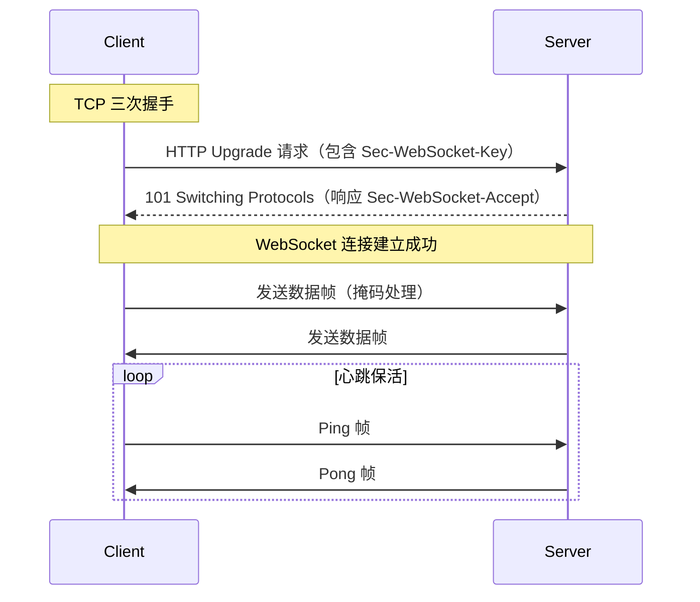

## 概念：WebSocket

> WebSocket 是一种全双工通信协议，允许服务器主动向客户端推送数据

**解决的核心痛点**：HTTP 轮询的实时性低、资源浪费问题；WebSocket 通过一次握手建立持久连接，服务器可随时推送消息

---

### 核心命题

- **全双工优于半双工**：WebSocket 建立后，客户端和服务器可以互相主动发送消息，无需轮询
	- **原理**：HTTP 是请求 - 响应模型，只有客户端能主动发起请求；WebSocket 握手后升级为 TCP 连接，双方平等
- **连接建立成本低**：WebSocket 只需一次握手，后续消息无需重复建立连接
	- **原理**：HTTP 每次请求都需要 TCP 握手，而 WebSocket 握手后保持 TCP 连接
- **协议头开销小**：WebSocket 数据帧使用掩码传输，头部仅 2-14 字节
	- **原理**：相比 HTTP 的 Header 重复传输，WebSocket 使用帧格式大幅减少开销

---

### 运行机制

**连接建立流程**：

1. 客户端发送 HTTP 请求，包含 `Upgrade: websocket` 头和 `Sec-WebSocket-Key`
2. 服务器返回 101 状态码，响应 `Sec-WebSocket-Accept`
3. 协议从 HTTP 升级为 WebSocket，建立持久 TCP 连接
4. 双方可随时发送数据帧，支持文本和二进制

---

### 关键区别

| 维度 | WebSocket | HTTP 轮询 | SSE |
|:--- |:--- |:--- |:--- |
| **通信方向** | 全双工 | 半双工（客户端主动） | 单向（服务器→客户端） |
| **连接方式** | 持久连接 | 每次请求新建 | 持久连接 |
| **实时性** | 毫秒级 | 取决于轮询间隔 | 秒级 |
| **资源消耗** | 低 | 高（频繁建连） | 低 |
| **浏览器支持** | 需降级处理 | 完全支持 | IE 不支持 |

---

### 应用场景

- ✅ **适用场景**
	- **即时通讯**：聊天应用、客服系统、游戏同步
	- **实时数据**：股票行情、在线协作、监控面板
	- **推送通知**：订单状态、活动提醒、系统告警
- ⛔ **误用**
	- **低频数据场景**：数据更新间隔大（小时级），用 HTTP 即可，无需 WebSocket
	- **REST 场景**：资源操作更适合 HTTP，WebSocket 难以表达语义

---

### SOP

> 与本概念相关的标准操作流程，通过实践辅助理解

- [[优惠券发放、领取、核销的前端实现逻辑|SOP-优惠券发放领取核销]] — 优惠券领取通知使用 WebSocket 实现

---

### FAQ

> 与本概念相关的开放性问题，待进一步探索

- [[Q-WebSocket与Socket.io的区别]] — 如何选择
- [[Q-WebSocket连接断开如何处理]] — 重连策略

---

### 知识图谱

> 知识图谱链接 term（术语定义）和相关 concept，建立概念关系网络

- **父级概念**：网络协议
- **并列概念**：
	- [[SSE]] — 服务器推送的另一种方案
	- [[HTTP]] — 请求 - 响应模型
- **相关概念**：
	- [[WebSocket心跳机制]] — 保活策略
	- [[WebSocket断线重连]] — 容错处理

---

### 参考资料

- [RFC 6455 - The WebSocket Protocol](https://datatracker.ietf.org/doc/html/rfc6455)
- [MDN Web Docs: WebSocket API](https://developer.mozilla.org/en-US/docs/Web/API/WebSocket)
