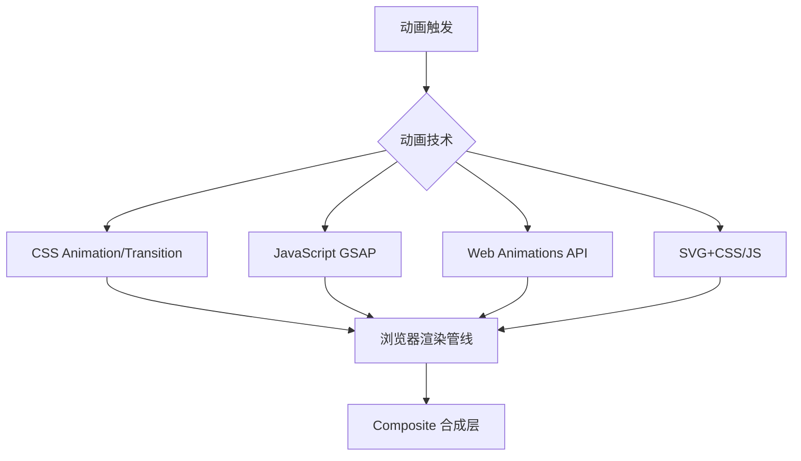

## 概念：Web 动画

> Web 动画是指在网页浏览器中创建动态视觉效果的技术，涵盖 CSS 动画、JavaScript 动画、SVG 动画等多种实现方式。

**解决的核心痛点**：解决静态网页无法传达动态信息、用户体验单调的问题

---

### 核心命题

- [[Web 动画通过改变元素的视觉属性创造运动效果]]
	- **原理**：浏览器渲染管线解析属性变化，触发重排、重绘或合成
- [[不同动画技术适用于不同场景]]
	- **原理**：CSS 适合简单动画，JS 适合复杂交互，SVG 适合矢量图形
- [[性能是 Web 动画的核心考量]]
	- **原理**：动画性能直接影响页面流畅度和用户体验

---

### 运行机制

---

### 关键区别

| 维度 | CSS 动画 | JavaScript 动画 | Web Animations API |
|:--- |:--- |:--- |:--- |
| **控制力** | 有限 | 精细 | 中等 |
| **性能** | 较好 | 依赖实现 | 较好 |
| **复杂序列** | 困难 | 容易 | 中等 |
| **适用场景** | 简单循环动画 | 复杂交互动画 | 需语义化动画 |

---

### 应用场景

- ✅ **适用场景**
	- **UI 反馈**：按钮悬停、焦点状态、加载指示
	- **页面转场**：路由切换、模态框动画
	- **数据可视化**：图表动画、进度指示
	- **游戏**：精灵图动画、粒子效果
- ⛔ **误用**
	- **过度动画**：动画过多分散用户注意力
	- **忽视性能**：未优化导致卡顿、耗电

---

### 知识图谱

- **子集概念**：
	- [[CSS Animation]]
	- [[GSAP]]：高性能 Javascript 动画库
	- [[Web Animations API]]
- **并列概念**：
	- [[Canvas]]
	- [[SVG]]
- **相关概念**：
	- [[合成层]]
	- [[requestAnimationFrame]]
	- [[动画效果示例|MOC-动画效果SOP]]

---

### 参考延伸

- MDN: [Web 动画](https://developer.mozilla.org/zh-CN/docs/Web/API/Web_Animations_API)
- 性能优化：will-change、transform、opacity
