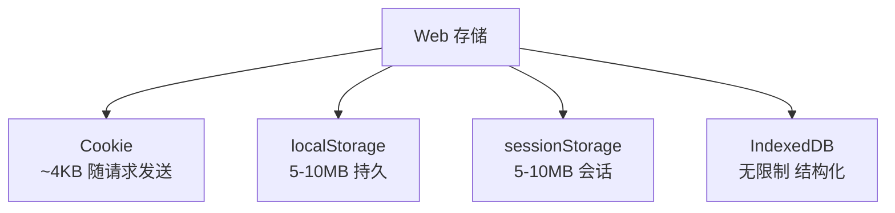

> Web 存储是指在浏览器客户端存储数据的技术统称，包括 Cookie（与服务端通信）、Web Storage API（localStorage/sessionStorage）和 IndexedDB。

**解决的核心痛点**：如何在客户端存储数据以提高性能、减少服务器请求、支持离线应用？

---

## 核心命题

- [[Cookie 用于服务端通信和会话状态管理]]
	- **原理**：Cookie 会随每次 HTTP 请求自动发送，用于服务端识别用户会话
- [[localStorage 用于长期存储简单键值对数据]]
	- **原理**：数据持久存储，除非手动删除，否则永不过期，同源共享
- [[sessionStorage 用于会话级临时存储]]
	- **原理**：数据仅在当前会话（标签页）有效，关闭页面后自动清除
- [[IndexedDB 用于存储大量结构化数据]]
	- **原理**：支持事务、索引、异步操作，适合离线应用和大数据存储

---

## 运行机制

---

## 关键区别

| 特性 | Cookie | localStorage | sessionStorage | IndexedDB |
|:--- |:--- |:--- |:--- |:--- |
| **容量** | ~4KB | ~5-10MB | ~5-10MB | 无限制 |
| **随请求发送** | ✅ 自动 | ❌ | ❌ | ❌ |
| **有效期** | 可设置 | 永久 | 会话级 | 永久 |
| **数据类型** | 字符串 | 字符串 | 字符串 | 结构化对象 |
| **API** | 简单 | 同步 | 同步 | 异步 |
| **事务** | 不支持 | 不支持 | 不支持 | 支持 |
| **用途** | 会话通信 | 客户端存储 | 客户端存储 | 大数据存储 |

---

## 应用场景

- ✅ **适用场景**
	- **会话管理**：用户登录状态（Cookie）
	- **用户偏好**：主题、语言设置（localStorage）
	- **临时状态**：表单草稿、会话数据（sessionStorage）
	- **离线应用**：缓存大量数据（IndexedDB）
- ⛔ **误用**
	- **客户端存储用 Cookie**：容量小、性能差
	- **存储敏感信息**：客户端存储可被查看和篡改

---

## 知识图谱

- **父级概念**：[[浏览器]] — Web 存储是浏览器的客户端存储能力
- **子级概念**：
	- [[Cookie]] — 服务端通信和会话管理
	- [[localStorage]] — 持久键值对存储
	- [[sessionStorage]] — 会话级键值对存储
	- [[IndexedDB]] — 结构化数据存储
- **相关概念**：
	- [[Cache API]] — 资源缓存（Service Worker）

---

## 参考延伸

- [MDN Web Storage API](https://developer.mozilla.org/en-US/docs/Web/API/Web_Storage_API)
- [MDN IndexedDB](https://developer.mozilla.org/en-US/docs/Web/API/IndexedDB_API)
- [MDN HTTP Cookies](https://developer.mozilla.org/en-US/docs/Web/HTTP/Cookies)
