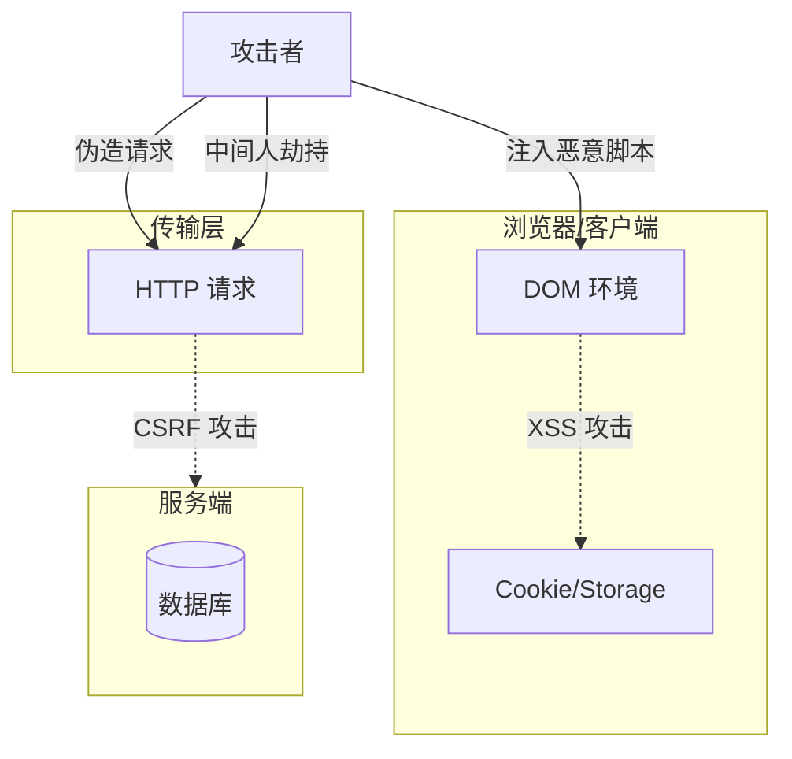

> Web 安全的本质是**处理不被信任的输入**。对于前端工程师而言，安全意味着守住浏览器这道大门，防止恶意代码在用户的客户端执行，并保护用户的敏感数据不被窃取。

**解决的核心痛点**：Web 应用暴露在开放的互联网中，攻击者可以利用浏览器的信任机制或解析漏洞发起攻击；如何建立多层防御体系保障用户数据安全？

---

## 核心命题

- [[XSS 和 CSRF 是前端最核心的安全威胁]]
	- **原理**：XSS 利用浏览器盲目信任并执行恶意脚本；CSRF 利用用户的登录态偷偷发送伪造请求，两者都是前端必须重点防御的攻击方式
- [[纵深防御是保障 Web 安全的最佳策略]]
	- **原理**：单一防御手段无法应对所有攻击，需要在编码层、浏览器层、传输层、存储层等多个层面建立防御

---

## 运行机制

---

## 关键区别

| 维度 | [[XSS]] | [[CSRF]] |
|:--- |:--- |:--- |
| **本质** | 浏览器执行恶意脚本 | 利用登录态发送伪造请求 |
| **攻击目标** | 窃取数据、执行操作 | 借用用户身份执行操作 |
| **防御关键** | 输出转义、CSP | SameSite Cookie、CSRF Token |

---

## 常见威胁与防御

| 威胁       | 类型   | 防御措施                     |
|:------- |:--- |:----------------------- |
| [[XSS]]  | 注入型  | 输出转义、CSP、避免 v-html       |
| [[CSRF]] | 请求伪造 | SameSite Cookie、Token 验证 |
| [[点击劫持]] | 界面劫持 | X-Frame-Options          |
| 中间人攻击    | 传输层  | HTTPS、HSTS               |
| 供应链攻击    | 依赖   | npm audit、Snyk           |

---

## 纵深防御体系

| 防御层级 | 关键技术 | 前端动作 |
|:--- |:--- |:--- |
| 编码层 | 输入验证、输出转义 | HTML Entity 编码 |
| 浏览器层 | [[CSP]] | 配置安全策略头 |
| 传输层 | [[HTTPS]] | 全站 HTTPS |
| 存储层 | Cookie 安全属性 | HttpOnly、Secure、SameSite |
| 通信层 | [[CORS]] | 合理配置跨域 |
| 依赖层 | 供应链审计 | 定期安全扫描 |

---

## 知识图谱

- **父级概念**：[[前端开发]] — Web 安全是前端开发的重要议题
- **子级概念**：
	- [[XSS]] — 跨站脚本攻击
	- [[CSRF]] — 跨站请求伪造
	- [[点击劫持]]
- **并列概念**：
	- [[浏览器安全机制]]
- **相关概念**：
	- [[HTTPS]]
	- [[CSP]]
	- [[CORS]]
	- [[同源策略]]

## FAQ

![[Web安全问题]]

---

## 参考延伸

- [[7]]
- [MDN Web Security](https://developer.mozilla.org/en-US/docs/Web/Security)
- [OWASP Top 10](https://owasp.org/www-project-top-ten/)
