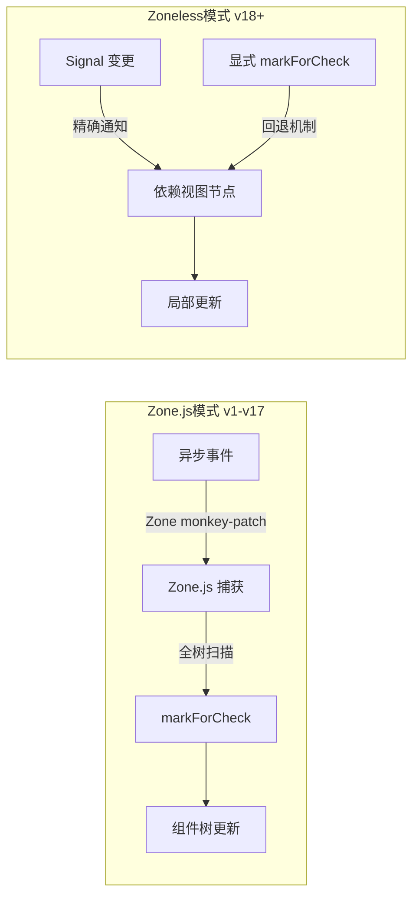

## 概念：Zoneless 变更检测

> Angular 的无 Zone.js 变更检测模式，通过 Signal 的细粒度响应式追踪替代 Zone.js 的全局打补丁策略，在 v18 作为实验特性引入，v19 稳定，v22 随 OnPush 默认策略成为 Angular 响应式体系的核心组成部分。

**解决的核心痛点**：Zone.js 在运行时对浏览器 API（`setTimeout`、`addEventListener`、`XMLHttpRequest` 等）进行全局打补丁，增加 bundle 体积（~25KB min+gzip）、造成跨微前端边界时的干扰、且无法感知数据流的具体路径，只能在组件树上执行 `markForCheck`。

---

### 核心命题

- Zoneless 变更检测消除了 Zone.js 的 bundle 开销和运行时性能损耗
	- **原理**：Zone.js 需要打包约 25KB 的 polyfill 代码，且在每次异步操作后执行全局变更检测；Zoneless 模式下 Angular 只追踪应用主动标记的 signal 依赖，无 Zone.js 的运行时开销和异步钩子损耗
- Zoneless 的核心前提是 Signal 驱动的细粒度响应式图
	- **原理**：Signal 的生产者-消费者图在编译时即可确定依赖链路，每个 signal 的变化精确通知到依赖它的视图节点，无需 Zone.js 的"扫描全树"策略；因此 Signal 全面成熟（v22）是 Zoneless 可用的前置条件
- Zoneless 并非彻底移除变更检测，而是将触发责任从框架层转移到开发者层
	- **原理**：`provideZonelessChangeDetection()` 标记应用不使用 Zone.js，Signal 驱动的组件自动追踪，但使用了 `markForCheck` 或 Zone.js 依赖的第三方库仍需显式触发变更检测

---

### 运行机制



### 启用方式

```typescript
// Angular 19+
import { provideZonelessChangeDetection } from '@angular/core';

bootstrapApplication(AppComponent, {
  providers: [
    provideZonelessChangeDetection(),
  ],
});
```

---

### 关键区别

| 维度 | Zone.js 模式 | Zoneless 模式 |
|:--- |:--- |:--- |
| **Bundle 体积** | +~25KB（Zone.js polyfill） | 无 Zone.js 开销 |
| **触发方式** | 异步操作自动触发 | Signal 变更自动触发 / 显式 `markForCheck` |
| **检测范围** | 全组件树扫描 | 仅 Signal 依赖的视图节点 |
| **跨微前端兼容** | Zone.js 在各微应用间互相干扰 | 无全局补丁，天然隔离 |
| **第三方库兼容** | 无需额外适配 | 依赖 Zone.js 的库需回退到 `markForCheck` |
| **首选变更检测策略** | `Default` | `OnPush`（v22 起为默认，重命名为 `Eager`） |

---

### 适用范围

- ✅ **适用场景**
	- **新项目（v19+）**：推荐启用 Zoneless + Signal-first 架构，以获得最小 bundle 和最佳性能
	- **微前端架构**：Zoneless 消除了 Zone.js 跨应用边界干扰，各微应用独立管理变更检测
	- **SSR 全栈应用**：减少服务端渲染的 Zone.js 适应层，简化水合流程
- ⛔ **误用**
	- **重度依赖 Zone.js 的遗留项目**：第三方库（如某些 UI 组件库）可能仍依赖 Zone.js 触发变更检测，强制 Zoneless 会导致视图不更新
- **失效边界**
	- Zoneless 模式下 `NgZone.onMicrotaskEmpty` 等 Zone.js 专属 API 不可用，依赖这些 API 的代码需要重构
	- `ChangeDetectorRef.detectChanges()` 和 `markForCheck()` 仍可使用，但失去了 Zoneless 的核心优势

---

### 批判

- **外部批判**
	- React 社区：Angular 的 Zoneless 方案本质上是在追赶 React 手动的 `setState` 模式，Signal 的自动追踪增加了隐式依赖的复杂度
	- Svelte 社区：编译时而非运行时才是无开销变更检测的正确方向——Angular 的 Zoneless 仍需运行时维护 signal 依赖图
- **内在张力**
	- Zoneless 与 Zone.js 并存的双模式下，开发者需要理解两套触发机制，容易在调试时混淆"为什么视图没有更新"和"为什么视图更新了"
	- Signal 响应式链路在 v22 中仍不支持跨异步边界的自动追踪，复杂场景（如 `httpClient` 请求后的信号流动）需要额外的 rxjs → Signal 桥接

---

### SOP

- [[SOP-Angular项目升级]] — 从 Zone.js 迁移到 Zoneless 的步骤和检查清单
- [[SOP-Angular迁移Zoneless]] — 项目启用 Zoneless 的具体配置与兼容性评估

---

### FAQ

- [[Q-Zoneless与NgZone兼容性]]
- [[Q-Signals能否完全替代RxJS]]

---

### 知识图谱

- **父级概念**：[[Angular]] — Angular 企业级前端框架
- **子级概念**：无
- **并列概念**：
	- [[Angular Signals]] — Zoneless 的前置依赖，提供细粒度响应式能力
	- [[变更检测机制]] — 变更检测的通用概念
- **相关概念**：
	- [[Zone.js]] — Zoneless 试图替代的运行时补丁库
	- [[SSR演进]] — Zoneless 在 SSR 场景下的优势
- **参考文章**
	- [Angular Zoneless Change Detection 官方文档](https://angular.dev/guide/experimental/zoneless)
	- [Angular Blog - Zoneless is Stable](https://blog.angular.dev/meet-angulars-new-approach-to-change-detection)
