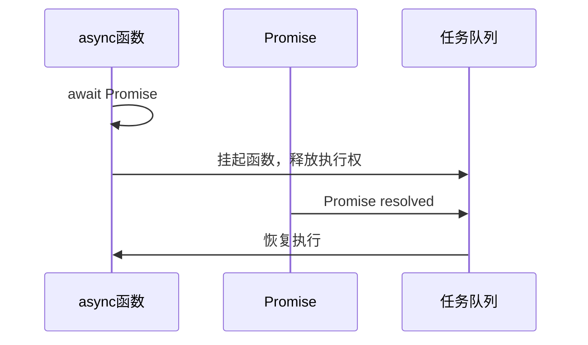

> async/await 是 JavaScript 中基于 Promise 的异步编程语法糖，它让异步代码看起来像同步代码，解决了回调地狱问题。

**解决的核心痛点**：传统的回调函数和 Promise 链式调用容易形成 " 回调地狱 "，async/await 用同步风格写异步代码，提升可读性。

---

## 核心命题

- [[async/await 本质上是 Promise 的语法糖]]
	- **原理**：`async` 函数自动返回 Promise，`await` 等待 Promise/thenable 对象 resolve/reject 后继续执行
- [[async/await 是同步写法，但本质是异步执行]]
	- **原理**：`await` 会暂停函数执行，等待 Promise 解决，但不会阻塞主线程

---

## 运行机制



1. `async` 函数自动返回 Promise
2. 遇到 `await` 暂停函数执行，等待 Promise
3. Promise resolve 后恢复函数执行
4. 抛出错误等同于 Promise reject

### 示例

```javascript
// 1. 基本用法
async function fetchData() {
  const response = await fetch('/api/data');
  const data = await response.json();
  return data;
}

// 2. 错误处理
async function fetchData() {
  try {
    const response = await fetch('/api/data');
    const data = await response.json();
    return data;
  } catch (error) {
    console.error('请求失败:', error);
  }
}

// 3. 并行执行（正确做法）
async function fetchAll() {
  const [users, posts] = await Promise.all([
    fetch('/api/users').then(r => r.json()),
    fetch('/api/posts').then(r => r.json())
  ]);
  return { users, posts };
}

// 4. 串行执行（循环中 await - 误用）
async function processItems(items) {
  // ❌ 错误：串行执行，效率低
  const results = [];
  for (const item of items) {
    results.push(await processItem(item));
  }

  // ✅ 正确：并行执行
  const results = await Promise.all(items.map(item => processItem(item)));
}
```

---

## 关键区别

| 维度 | async/await | Promise |
|:--- |:--- |:--- |
| **写法** | 同步风格 | 链式调用 `.then()` |
| **错误处理** | try/catch | `.catch()` |
| **调试** | 堆栈清晰 | 堆栈复杂 |
| **并发** | 需 Promise.all | 易于并行 |

---

## 应用场景

- ✅ **适用场景**
	- **顺序异步操作**：多个异步任务按顺序执行
	- **简化错误处理**：try/catch 统一处理
	- **提高可读性**：避免回调地狱
- ⛔ **误用**
	- **串行而非并行**：在循环中 await 应改为 Promise.all
	- **忘记 await**：没有 await 会得到 Promise 而非结果

---

## 知识图谱

- **父级概念**：[[异步编程]] — async/await 是异步编程的一种方式
- **子级概念**：
	- [[Promise]] — async/await 的基础
	- [[微任务]] — await 后的执行时机
- **并列概念**：
	- [[回调函数]] — 传统的异步方式
	- [[Generator]] — 另一种异步流程控制
- **相关概念**：
	- [[事件循环]]
	- [[宏任务]]

---

## 参考延伸

- [async function - JavaScript | MDN](https://developer.mozilla.org/zh-CN/docs/Web/JavaScript/Reference/Statements/async_function)
- 《你不知道的 JavaScript》下卷：异步
