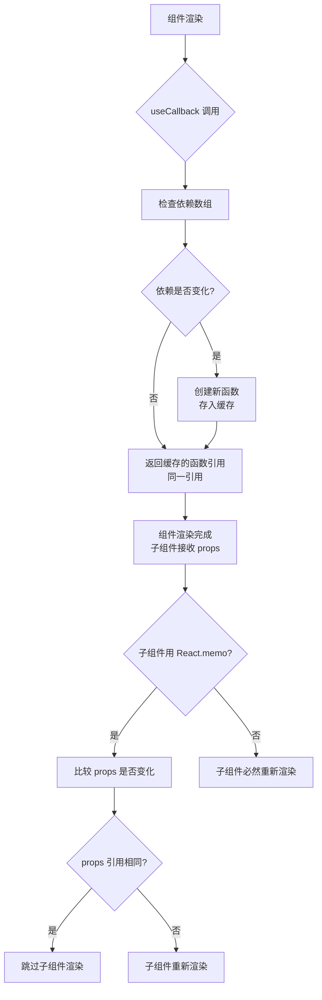

## 概念：useCallback

> 在渲染期间返回记忆化的函数引用，只有当依赖项变化时才返回新的函数引用。

**解决的核心痛点**：每次组件渲染都会重新创建函数，如果将这些函数作为 props 传递给子组件，会导致子组件不必要的重新渲染；useCallback 可以缓存函数引用，避免这种性能损耗。

---

### 核心命题

- [[useCallback只在依赖变化时返回新的函数引用]]
- [[useCallback配合React.memo进行性能优化]]
- [[useCallback只在确实存在性能问题时使用]]

---

### 运行机制



#### 源码核心逻辑（简化）

```javascript
// useCallback 简化实现原理
function useCallback(fn, deps) {
  const { current } = useRef();
  if (hasDepsChanged(deps, current.deps)) {
    current.fn = fn;
    current.deps = deps;
  }
  return current.fn;
}
```

---

### 关键区别

| 维度 | useCallback | useMemo | 不使用缓存 |
|:---|:---|:---|:---|
| **缓存内容** | 函数引用 | 计算值 | 每次渲染重新创建 |
| **触发更新条件** | 依赖变化 | 依赖变化 | 父组件渲染必然触发 |
| **适用场景** | 回调函数 props | 计算密集结果 | 简单组件或无性能问题 |
| **开销** | 缓存管理开销 | 缓存存储开销 | 无额外开销 |

| 维度 | useCallback | React.memo |
|:---|:---|:---|
| **作用对象** | 函数引用 | 组件本身 |
| **防止渲染** | 防止 props 引用变化 | 防止 props 值变化 |
| **配合使用** | 作为 props 传入 | 包装子组件 |

---

### 应用场景

- ✅ **适用场景**
	- **传递给 memo 包装的子组件**：作为 `React.memo` 包装的子组件的回调 props
	- **作为其他 Hook 的依赖**：如 `useEffect`、`useCallback` 本身依赖其他函数
	- **高频渲染的列表项**：列表中的回调函数（如 `onClick`）
- ⛔ **误用**
	- **简单组件**：组件本身渲染不频繁，缓存函数的开销可能大于收益
	- **没有配合 React.memo**：子组件没有用 `React.memo` 包装时，useCallback 无法阻止子组件渲染
	- **过度依赖**：依赖数组过于宽泛或空数组使用不当

---

### SOP

> useCallback 的标准操作流程，通过实践辅助理解

- [[SOP-useCallback使用示例]]
- [[SOP-React性能优化]] — 何时使用 useCallback 的判断流程
- [[SOP-避免不必要的重新渲染]] — useCallback 与 React.memo 配合使用

---

### FAQ

> 关于 useCallback 的常见问题，待进一步探索

- [[Q-useCallback 和 useMemo 的性能优化原理是什么？]]
- [[Q-为什么 useCallback 需要配合 React.memo 使用？]]
- [[Q-useCallback 的依赖数组应该如何设置？]]
- [[Q-什么情况下不应该使用 useCallback？]]

---

### 知识图谱

- **父级概念**：[[React]] — React Hooks 之一
- **父级 Hook**：
	- [[Hooks (React)]] — useCallback 所属的 Hooks 体系
- **相关概念**：
	- [[useMemo]] — 值缓存，与 useCallback 机制类似但缓存的是值
	- [[React.memo]] — 组件记忆化，需要配合 useCallback 使用
	- [[虚拟DOM(React)]] — useCallback 影响 Virtual DOM diff 结果
	- [[Fiber架构(React)]] — Hooks 依赖 Fiber 链表结构实现
