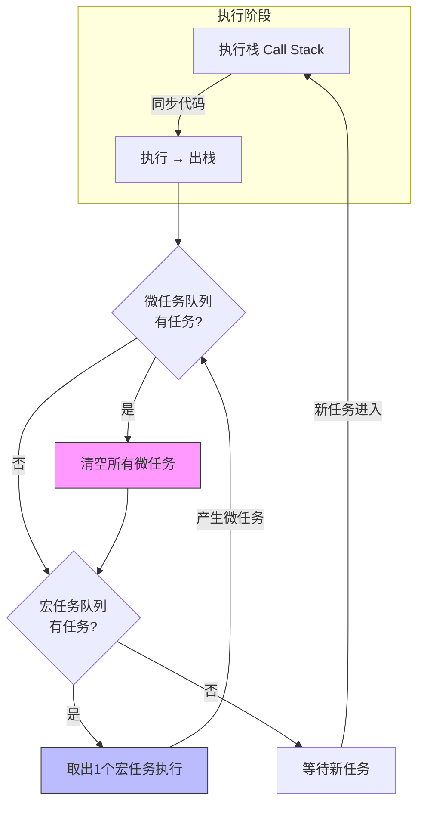
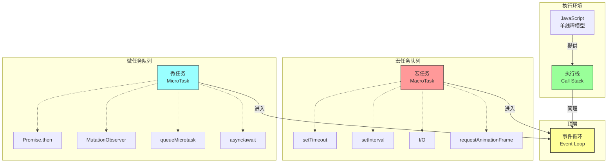

## 核心定义

事件循环 (Event Loop) 是 JavaScript 运行时环境中的一种机制，用于协调同步代码与异步任务的执行。由于 JavaScript 是单线程的，因此需要使用事件循环来处理异步任务，避免阻塞主线程。

## 核心命题

- **单线程模型**：JavaScript 一次只能执行一个任务，同步代码会阻塞后续执行
- **任务调度**：异步任务的回调通过任务队列管理，事件循环决定执行顺序
- **优先级差异**：微任务在每个宏任务后优先执行，确保 Promise 等异步操作的确定性
- **环境差异**：浏览器与 Node.js 的事件循环实现存在差异（各阶段顺序不同）

## 运行机制

### 执行模型

1. **[[执行栈]] (Call Stack)**：JavaScript 代码执行时的调用栈，同步任务依次入栈出栈
2. **堆 (Heap)**：对象分配内存的区域
3. **任务队列 (Task Queue)**：存储待执行的回调函数

### 执行流程

### 任务类型

#### [[宏任务]] (MacroTask)

| 来源 | 说明 |
|------|------|
| `setTimeout` / `setInterval` | 定时器任务 |
| `setImmediate` | Node.js 特有 |
| `requestAnimationFrame` | 浏览器渲染帧 |
| I/O | 文件/网络操作 |
| UI 渲染 | 浏览器更新 DOM |

#### [[微任务]] (MicroTask)

| 来源 | 说明 |
|------|------|
| `Promise.then/catch/finally` | Promise 回调 |
| `MutationObserver` | DOM 变化观察 |
| `process.nextTick` | Node.js 特有 |
| `queueMicrotask` | 通用微任务队列 |

### 事件循环执行顺序

1. 从宏任务队列取出**一个**任务执行
2. 执行期间产生的**所有**微任务加入微任务队列
3. 当前宏任务执行完毕后，**清空**微任务队列
4. 如需要，执行 `requestAnimationFrame` 和 UI 渲染
5. 重复以上步骤

## 关键区别

### 宏任务 vs 微任务

| 特征     | 宏任务 (MacroTask)              | 微任务 (MicroTask)                |
| ------ | ---------------------------- | ------------------------------ |
| 执行时机   | 每个事件循环阶段                     | 每个宏任务结束后                       |
| 执行数量   | 每次 1 个                       | 每次全部清空                         |
| 优先级    | 较低                           | 较高                             |
| 典型 API | setTimeout, setInterval, I/O | Promise,then, MutationObserver |
| 阻塞渲染   | 可能阻塞                         | 不阻塞渲染                          |

### 注意事项

- **微任务嵌套**：==微任务中产生的微任务会在当前阶段全部执行完毕==
- **async/await**：本质是 Promise + 微任务调度
- **setTimeout(0)**：至少 4ms 延迟（浏览器规范）
- **requestAnimationFrame**：在微任务后、渲染前执行

## 应用场景

- **异步操作**：网络请求、文件读写
- **定时任务**：轮询、倒计时
- **UI 更新**：确保 DOM 操作不阻塞渲染
- **性能优化**：将耗时任务拆分避免阻塞主线程

## 知识图谱

### 相关概念

- [[JavaScript]]：事件循环是 JavaScript 运行时环境中的一种机制
- [[异步]]：事件循环用于处理异步任务
- [[Promise]]：Promise 是一种用于处理异步操作的对象
- [[async/await]]：Promise 的语法糖，本质仍是微任务调度
- [[执行栈]]：函数调用形成的执行上下文栈
- [[宏任务]]：较大的任务单位，如 setTimeout、I/O
- [[微任务]]：较小的任务单位，如 Promise 回调
