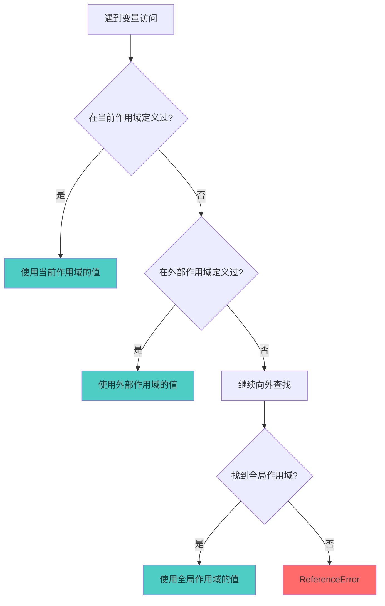

## 作用域 vs 作用域链

### 一句话对比

**作用域**是变量的 " 生存空间 "，定义了变量的可见性范围；**作用域链**是变量的 " 查找路径 "，由多个作用域串联而成，用于解析变量标识符。

---

### 核心对比

| 维度       | **[[作用域]]**      | **[[作用域链]]**   |
| :------- | :--------------- | :------------- |
| **定义**   | 变量和函数的可见性与生命周期范围 | 查找变量时向上追溯的链表结构 |
| **核心本质** | 空间概念（where）      | 查找机制（how）      |
| **组成**   | 全局、函数、块级作用域      | 多个作用域串联而成的链路   |
| **适用场景** | 变量归属判断           | 变量值解析          |

---

### 差异点

- **概念层次**：
	- 作用域：静态概念，代码写的时候就确定了
	- 作用域链：动态机制，运行时用于查找变量
- **结构形态**：
	- 作用域：一个个独立的 " 气泡 "，互不包含（块级作用域除外）
	- 作用域链：单向链表，从内向外链接
- **决定因素**：
	- 作用域：由函数声明位置决定（词法作用域）
	- 作用域链：由函数嵌套层级决定
- **作用对象**：
	- 作用域：约束变量的归属（属于哪个作用域）
	- 作用域链：约束变量的查找（沿链向上找值）

---

### 场景选择

- **关注变量的归属**时（如 " 这个变量属于哪里 "）→ 思考**作用域**
- **关注变量如何被解析**时（如 " 这个值从哪里来 "）→ 思考**作用域链**

---


### 决策树



---

### 示例

**作用域示例**：

```javascript
var globalVar = '全局';  // 全局作用域

function outer() {
    var outerVar = '外层';  // outer 函数作用域

    function inner() {
        var innerVar = '内层';  // inner 函数作用域
        console.log(innerVar);  // ✅ 可访问
        console.log(outerVar);  // ✅ 可访问
        console.log(globalVar); // ✅ 可访问
    }

    console.log(innerVar);  // ❌ ReferenceError: innerVar is not defined
}
```

**作用域链示例**：

```javascript
var x = '全局';

function a() {
    var x = 'a函数';

    function b() {
        var x = 'b函数';
        console.log(x);  // 输出 "b函数"（当前作用域）
    }

    b();  // 输出 "b函数"
    console.log(x);      // 输出 "a函数"（父作用域）
}

a();
console.log(x);  // 输出 "全局"（全局作用域）
```

---

### 知识图谱

- **父级概念**：[[执行栈]] — 执行上下文的管理机制
- **相关概念**：
	- [[执行上下文]] — 作用域链的载体
	- [[闭包]] — 跨越作用域链访问内部变量
- **相关对比**：暂无其他对比
