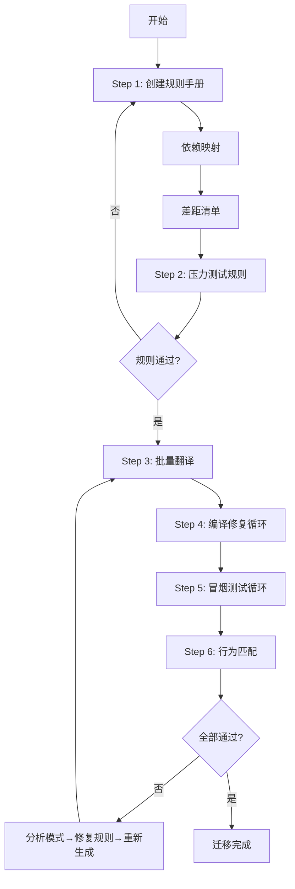

> **问题溯源**：本 SOP 是 Anthropic 在迁移 Bun（Zig→Rust，百万行）和内部 Python→TypeScript（16.5 万行）项目中的实践总结。核心洞察是：**不修复代码，修复产生代码的循环（loop）**。

---

## 适用场景

- 将大型代码库从一种语言迁移到另一种语言（如 Zig→Rust、Python→TypeScript）
- 框架升级或代码现代化改造（需较大结构调整的重构）
- 需要并行翻译数百到数千个文件的跨语言迁移项目

**不适合**：小型重构、单一文件修改、不需要编译器/测试套件验证的简单翻译

---

## 前置条件：构建 Judge（裁判系统）

在开始迁移之前，必须先有一个能对原始代码和目标代码**同等评估**的裁判：

1. **分类现有测试**：用 Claude 识别哪些测试可用外部调用表达，哪些依赖不会移植的内部函数
2. **改写测试为可移植断言**：将对外的测试改写为能在两个代码库运行的断言，用对抗性 agent 验证改写没有削弱断言
3. **验证裁判**：在原始代码上确认通过，在故意破坏的代码上确认失败

如果没有现成测试套件（如 Python→TypeScript），创建 7 个真实场景的 parity harness，任何行为差异视为待修复 bug。

---

## 流程图解

---

## 核心步骤

### Step 1 — 创建规则手册、依赖映射、差距清单

**顺序很重要**：规则手册必须先于差距清单，差距清单由规则手册默认覆盖不了的内容定义，两者在联合审计中测试。

1. **创建规则手册** — 决定新代码是否沿用相同结构
	 - 结构保留（如 Zig→Rust）：主要是类型和惯用语的查找表，指向差距清单
	 - 重新设计（如 Python→TypeScript）：作为设计文档
	 - 建议与 Claude 对话形成每个模糊区域的处理策略
2. **依赖映射** — 理解文件依赖关系以拆分并行工作流
	 - 用 Claude Code 部署 agent 创建并运行确定性脚本来产出映射
3. **差距清单 + 怀疑论审查** — 列出新语言与旧语言不同的要求
	 - 对于结构保留迁移：提前盘点差距
	 - 对于重新设计：可以先翻译再通过审计创建差距清单

### Step 2 — 压力测试规则

做一次"迷你迁移"来检验规则手册：

1. 一个 agent 用规则手册翻译 3 个文件
2. 一个 agent "像高级 Rust 工程师一样"翻译 3 个文件
3. 一个 agent 用 diff 创建新的翻译规则

> ⚠️ **仅适用于结构保留迁移**。对于重新设计，等价测试是用对抗性审查攻击设计文档，然后用可丢弃的端到端运行验证。

**丢弃所有翻译的文件**，目标是完善规则，而非取得增量进展。

### Step 3 — 翻译所有内容

运行多 agent 循环架构：实现 → 审查 → 修复

- 实现者用小模型（如 Claude Sonnet），审查者用大模型（如 Opus/Fable）
- 工作队列应该是机械的：批量脚本通过检查翻译文件是否存在来决定进度
- 翻译器无法自信执行的代码标记为 `// TODO(port): <reason>`
- 两名对抗性审查员用独立上下文评估，分歧由第三个 agent 裁决
- 当审查员跨文件捕获相同错误时，**不逐个修复**，而是给规则手册加一句话并重新生成受影响的批次

### Steps 4-6 — 编译、运行、匹配行为

这三个步骤共享相同的循环架构，逐步减少人工判断：

- **编译**：修复 agent 并行处理错误列表，配合对抗性审查。注意系统性问题的模式调整（如 Zig→Rust 时处理循环依赖）
- **冒烟测试**：按根因分组，由对抗性子 agent 审查
- **行为匹配**：分片运行测试套件，修复 agent 审查失败测试。使用 build daemon 序列化最昂贵的构建操作

> **没有测试套件？** 让 Claude 创建一个端到端测试套件，自动运行多个轮次直到全部通过。原始代码库本身就是 ground truth。

---

## 实践/示例

### Bun 迁移（Zig→Rust）— 结构保留模式

- 规模：百万行代码，两周内完成
- 消耗：59 亿 uncached input tokens + 6.9 亿 output tokens（约 $165,000）
- 结果：100% 现有测试通过，合并后 19 个回归已修复
- 编译策略：不把编译器放循环内（cargo 耗时数分钟），单独一步处理

### Python→TypeScript 迁移 — 重新设计模式

- 规模：16.5 万行，一个周末完成
- 循环策略：端到端运行完整迁移 → 修正规则 → 丢弃输出重新运行，第三次才保留
- 编译策略：TypeScript 编译器放循环内（秒级检查）
- 额外步骤：Claude 自主设计端到端测试套件，连续自动运行四晚

### 代码迁移工具包

官方 starter kit（通用模板）：https://github.com/anthropics/code-migration-kit-with-claude-code

---

## 常见坑点

- ⛔ **使用最大模型处理所有任务**：token 消耗集中在循环中，小模型处理高容量实现，大模型留给审查和规则编写
- ⛔ **逐文件手动修复**：跨文件的相同错误应升级到规则层面，不逐个修补
- ⛔ **关注单个失败**：单个失败是循环的工作，你的注意力应放在模式上
- 🔧 **编译步骤耗时过长**：考虑将编译器移出循环（如 Jarred 的 cargo），或使用 build daemon 序列化构建

---

## 最佳实践

1. **不要盲目跟随**：每个迁移都不同，用 Claude 规划具体的迁移策略
2. **审查对抗化，验证机械化**：对抗性审查值得 token 消耗；编译器、diff、测试套件做裁判
3. **前重后轻**：最多的人工小时花在规则手册和压力测试上，后续基本是队列消耗
4. **工作队列机械可恢复**："完成"意味着输出文件存在于磁盘上

---

## 知识图谱

- **相关概念**：
	- [[Agent工作流模式]]
	- [[代码库迁移策略]]
	- [[代码重构策略]]
- **问题来源**：
	- [[How Anthropic runs large-scale code migrations with Claude Code]] — 此 SOP 的来源文章
