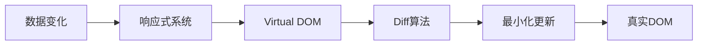

## 概念：前端框架

> 前端框架是用于构建用户界面的 JavaScript 库/框架，核心解决 DOM 操作繁琐、状态管理复杂、团队协作困难等问题。

**解决的问题**：提升开发效率、保证代码质量、降低维护成本

---

### 核心命题

- **框架核心特性**
	- 组件化：封装 UI 和逻辑
	- 响应式数据绑定：数据驱动视图
	- 虚拟 DOM：高效更新
	- 路由管理：单页应用
	- 状态管理：全局数据

---

### 运行机制

---

### 主流框架对比

| 框架 | 核心思想 | 学习曲线 | 适用场景 |
|:---|:---|:---|:---|
| [[Vue]] | 渐进式、约定优于配置 | 平缓 | 中小型项目 |
| [[React]] | 组件化、函数式编程 | 中等 | 大型项目 |
| Angular | 完整解决方案、依赖注入 | 陡峭 | 企业级应用 |

---

### 核心知识体系

| 知识         | 说明        |
|:--------- |:-------- |
| [[Virtual DOM]]  | 性能优化的基础   |
| [[Diff算法]] | 虚拟 DOM 对比算法 |
| [[响应式原理]]  | 数据驱动视图    |
| 组件化        | UI 封装与复用   |
| 路由管理       | SPA 路由     |
| 状态管理       | 全局状态      |

---

### 知识图谱

- **父级概念**：[[前端开发]]
- **关联概念**：
	- [[Vue]] — 渐进式框架
	- [[React]] — 函数式框架
	- [[JavaScript]] — 框架语言基础

---

### 参考延伸

- 前端框架官方文档
