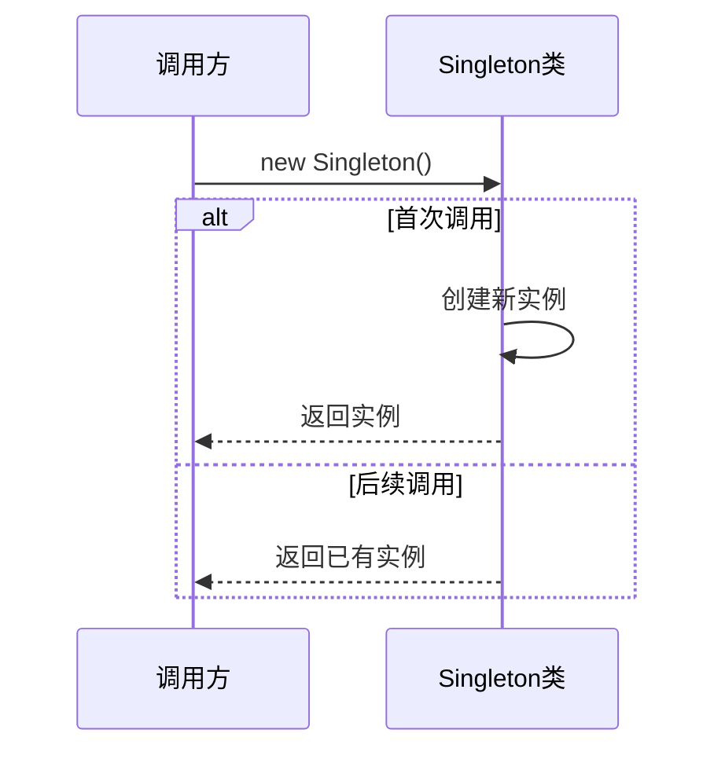

> 单例模式（Singleton Pattern）是一种创建型设计模式，确保一个类只有一个实例，并提供一个全局访问点。

**解决的核心痛点**：如何确保一个类在整个应用中只有一个实例，并能够全局访问？直接全局变量会造成命名空间污染，单例模式提供了受控的全局访问方式。

---

## 核心命题

- [[单例模式确保类只有一个实例]]
	- **原理**：通过私有构造函数和静态实例方法，控制实例的创建过程，首次访问时创建，之后返回同一实例
- [[单例模式提供受控的全局访问]]
	- **原理**：通过统一的访问点（静态方法或对象字面量）获取实例，避免全局变量污染

---

## 运行机制



1. **私有构造函数**：防止外部直接 `new` 创建实例
2. **静态实例持有**：类内部保存唯一实例引用
3. **静态访问方法**：通过 `getInstance()` 获取实例
4. **延迟初始化**：通常在首次访问时才创建实例

---

## 关键区别

| 维度 | 单例模式 | 全局变量 |
|:--- |:--- |:--- |
| **控制权** | 受控（类自行管理） | 不受控（可被覆盖） |
| **命名空间** | 不污染全局 | 污染全局 |
| **可测试性** | 可 mock | 难以测试 |
| **懒加载** | 支持 | 不支持 |

---

## 应用场景

- ✅ **适用场景**
	- **全局状态管理**：Redux store、Vuex store 等
	- **配置管理**：全局配置对象
	- **日志服务**：全局日志记录器
	- **缓存**：全局缓存实例
	- **模态框**：确保只有一个模态框实例
- ⛔ **误用**
	- **全局状态滥用**：滥用单例导致代码耦合
	- **忽视测试**：单例会增加测试难度
	- **多层单例**：单例嵌套导致难以追踪

---

## 前端实现

```javascript
// 1. 类实现（ES6）
class Singleton {
  constructor() {
    if (Singleton.instance) {
      return Singleton.instance;
    }
    Singleton.instance = this;
  }
}

// 2. 模块实现（推荐）
// singleton.js
let instance = null;
export function getInstance() {
  if (!instance) {
    instance = { /* 初始化 */ };
  }
  return instance;
}

// 3. ES Module 天生单例
// singleton.js
export const singleton = { /* ... */ };
```

---

## 知识图谱

- **父级概念**：[[设计模式]] — 单例是创建型设计模式之一
- **并列概念**：
	- [[工厂模式]] — 另一种创建型模式
	- [[模块模式]] — JS 模块化实现
- **相关概念**：
	- [[观察者模式]] — 常与单例结合使用
	- [[发布-订阅模式]]

---

## 参考延伸

- [Refactoring Guru: Singleton](https://refactoring.guru/design-patterns/singleton)
