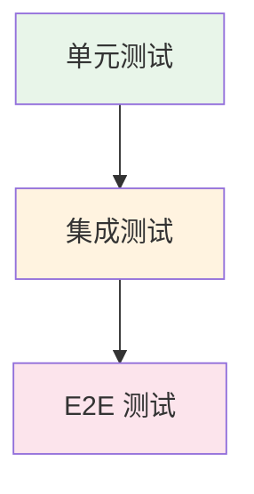

## 概念：单元测试

> 对软件最小可测试单元（如函数、方法、类）进行验证的测试方法，关注单个模块的正确性而非整体流程。

**解决的核心痛点**：快速验证代码变更是否破坏现有功能，提供即时反馈，而非等到 E2E 阶段才发现问题。

---

### 核心命题

- 单元测试的核心价值是「速度」——毫秒级反馈，快速定位问题
- 好的单元测试是「行为验证」而非「实现验证」
- 单元测试覆盖率不是目标，可维护的测试才是

---

### 测试金字塔

| 层级 | 范围 | 速度 | 数量 |
|:---|:---|:---:|:---:|
| **单元测试** | 单一函数/模块 | 毫秒级 | 大量 |
| **集成测试** | 模块间交互 | 秒级 | 中量 |
| **E2E 测试** | 完整用户路径 | 十秒级 | 少量 |

---

### 单元测试 vs E2E

| 维度 | 单元测试 | E2E 测试 |
|:---|:---|:---|
| **范围** | 单一函数/模块 | 整个应用 |
| **速度** | 毫秒级 | 秒级 |
| **维护成本** | 低 | 高 |
| **失败定位** | 精确 | 模糊 |
| **适用场景** | 逻辑验证、回归防护 | 关键路径验证 |

---

### 核心原则：FIRST

| 原则 | 说明 |
|:---|:---|
| **Fast** | 测试执行速度快 |
| **Independent** | 测试间相互独立 |
| **Repeatable** | 结果可重复 |
| **Self-Validating** | 自动判断通过/失败 |
| **Timely** | 与代码同步编写 |

---

### 常用工具

| 工具         | 框架       | 说明                 |
|:--------- |:------- |:----------------- |
| [[Vitest]] | Vite 原生  | 现代 JavaScript 测试框架 |
| [[Jest]]   | Facebook | 老牌测试框架             |
| Mocha      | -        | 灵活可扩展              |
| Jasmine    | -        | BDD 风格             |

---

### 常见问题

- ⛔ **过度 mock**：mock 过多导致测试无意义
- ⛔ **测试实现而非行为**：过度依赖内部实现细节
- ⛔ **追求 100% 覆盖率**：维护成本高，收益低

---

### 知识图谱

- **父级概念**：[[前端工程化]] — 属于质量保障领域
- **并列概念**：
	- [[集成测试]] — 模块间接口验证
	- [[E2E]] — 端到端用户路径验证
- **工具链**：
	- [[Vitest]]
	- [[Jest]]

---

### 参考延伸

- [Vitest 官方文档](https://vitest.dev/)
- [Jest 官方文档](https://jestjs.io/)
- [Testing Trophy](https://kentcdodds.com/blog/the-testing-trophy)
