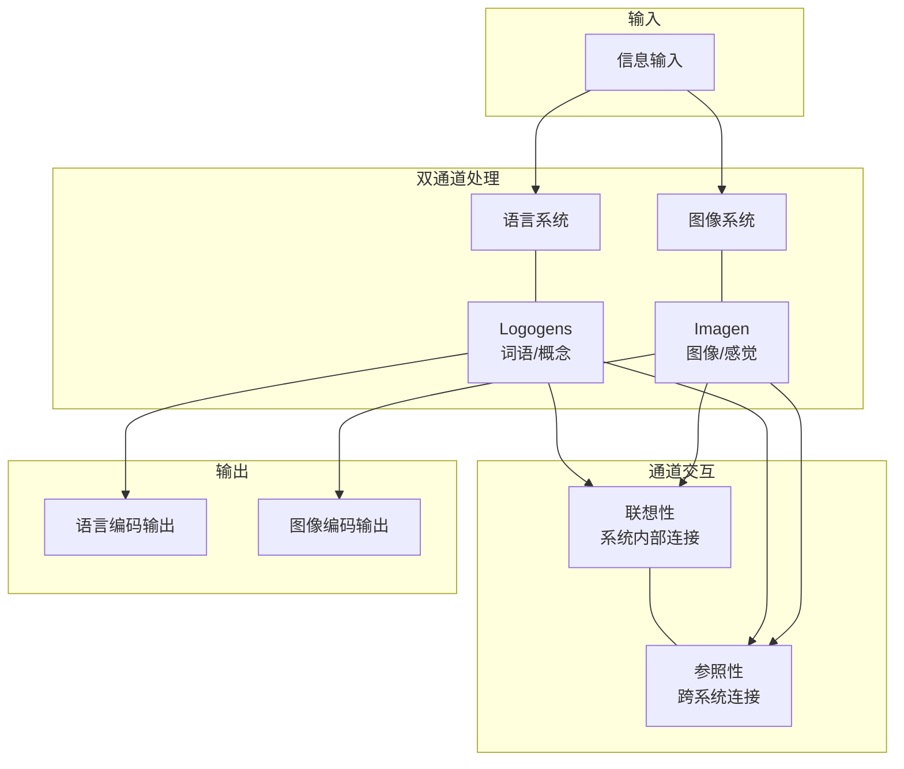

## 概念：双重编码理论 (Dual Coding Theory)

> 双重编码理论 (Dual Coding Theory, DCT) 是由 Allan Paivio 提出的认知心理学理论，认为人类使用两种不同的心理表征系统来处理信息：语言系统和图像系统。这两个系统相互独立，但又可以相互连接和影响。

**解决的核心痛点**：如何利用人脑的双通道特性，提高信息编码和检索的效率。

---

### 核心命题

> 核心命题引用 atomic 笔记（陈述句观点），每个命题是一句话洞见

- [[图文双重编码能建立双重检索线索]]
	- **原理**：语言系统和图像系统相互独立但可互相访问，提供双倍检索路径
- [[装饰性插图会增加认知负荷]]
	- **原理**：与内容无关的图像会占用认知资源，分散对核心信息的注意力
- [[纯图像笔记浪费了语言通道的处理能力]]
	- **原理**：只用图像意味着放弃了语言系统的处理能力，信息编码不完整

---

### 运行机制

---

### 关键区别

| 维度 | 双重编码理论 | [[认知负荷]] |
|:--- |:--- |:--- |
| **核心逻辑** | 利用双通道提高信息编码效率 | 限制工作记忆负荷，避免认知过载 |
| **关系** | 互补而非冲突 | 双重编码需注意避免负载过量 |
| **应用** | 图文结合、多媒体教学 | 去除冗余、分块信息 |

---

### 应用场景

- ✅ **适用场景**
	- **教育**：在教学中使用图像、图表等多媒体资源，提高学生学习效果
	- **笔记**：为复杂概念配图，建立双重检索线索
	- **广告**：使用生动的图像和简洁的文字，提高记忆度
- ⛔ **误用**
	- **装饰性插图**：与内容无关的图像会分散注意力，增加认知负荷
	- **纯图像思维导图**：只用图像浪费了语言通道的处理能力

---

### 知识图谱

> 知识图谱链接 term（术语定义）和相关 concept，建立概念关系网络

- **父级概念**：[[认知心理学]] — 双重编码理论的上位学科
- **子级概念**：
	- [[多媒体学习理论]] — 基于 DCT 的具体应用理论
- **并列概念**：
	- [[认知负荷]] — 需要与 DCT 平衡的因素
- **相关概念**：
	- [[视觉思维|视觉思维]] — DCT 的重要应用领域
	- [[主动回忆]] — 利用 DCT 提升记忆效果的技术

---

### FAQ

> 与本概念相关的开放性问题，待进一步探索

- [[Q-如何在笔记中平衡图文比例]]
- [[Q-视觉思维是否适合所有学习者]]

---

### 参考延伸

- Paivio, A. (1971). Imagery and verbal processes. New York: Holt, Rinehart, & Winston.
- Clark, J. M., & Paivio, A. (1991). Dual coding theory and education. Educational Psychology Review, 3(3), 149-210.
- Mayer, R. E. (2009). Multimedia learning (2nd ed.). Cambridge University Press.
