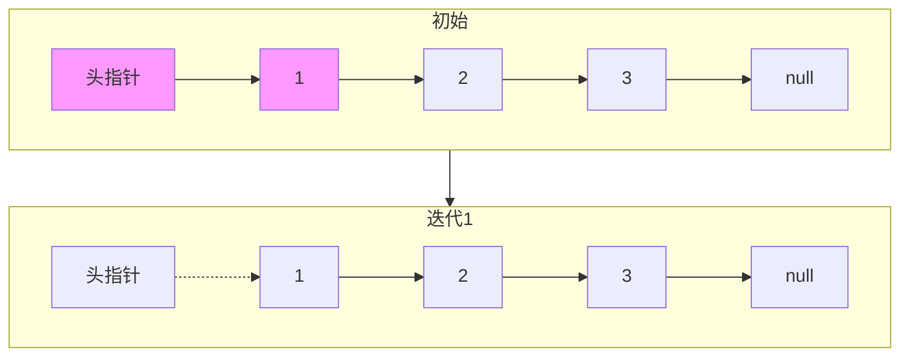

## SOP：翻转链表

> 翻转链表是将链表方向反向，是链表最基础的题型之一。

---

### 适用场景

- 场景 1：需要将链表方向反转
- 场景 2：局部翻转链表
- 场景 3：判断回文链表

---

### 核心步骤

#### 方法一：迭代（推荐）

```javascript
function reverseList(head) {
  let prev = null;
  let curr = head;

  while (curr) {
    const next = curr.next; // 1. 保存下一个节点
    curr.next = prev;       // 2. 反转指针
    prev = curr;            // 3. prev 前进
    curr = next;            // 4. curr 前进
  }

  return prev;
}
```

**图解**：



#### 方法二：递归

```javascript
function reverseList(head) {
  if (!head || !head.next) return head;

  const newHead = reverseList(head.next);
  head.next.next = head;
  head.next = null;

  return newHead;
}
```

---

### 常见坑点

- ⛔ **反转后丢失 head**：迭代结束时 `prev` 才是新 head，不是 `head`
- ⛔ **忘记保存 next**：`curr.next = prev` 前必须保存 `next`，否则链表断裂
- ⛔ **递归栈溢出**：链表过长时递归可能溢出，建议用迭代
- 🔧 **排查**：如果结果是 null，检查是否正确返回 `prev`

---

### 变形题

| 题目 | 解法要点 |
|:---|:---|
| 局部翻转 | 记录 m、n 位置，定位前后节点后翻转 |
| k 个一组翻转 | 每 k 个节点调用 reverse |
| 双向链表翻转 | 同时反转 prev 和 next |

---

### 知识图谱

- **父级概念**：[[链表]]
- **关联概念**：
	- [[环形链表]] — 快慢指针
	- [[合并有序链表]] — 链表操作

---

### 参考延伸

- LeetCode 206. 反转链表
- LeetCode 92. 反转链表 II
