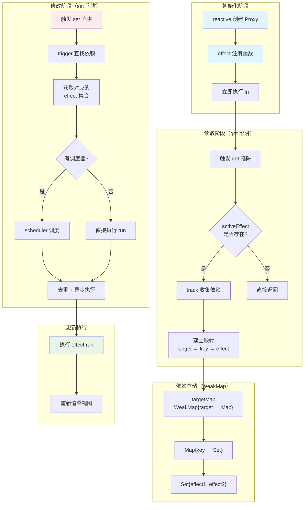

## 概念：响应式原理（Vue3）

> Vue3 的响应式系统是基于 ES6 Proxy 实现的，能够在数据变化时自动更新视图。

**解决的核心痛点**：自动追踪数据变化并更新 DOM，开发者无需手动操作 DOM

---

### 核心命题

- [[Vue3 使用 Proxy 实现响应式]]
	- **原理**：Proxy 可以监听对象的任何操作，包括新增属性、删除属性、数组索引变化
- [[Vue3 使用 Reflect 保证 Proxy 行为的正确性]]
	- **原理**：Reflect 提供了统一的 API 操作对象，确保 this 指向正确
- [[Vue3 响应式系统分为 effect 和 reactive 两部分]]
	- **effect** 负责收集依赖和触发更新
	- **reactive** 负责将普通对象转换为响应式对象

---

### 运行机制



#### 1. 收集依赖（track）

当读取响应式对象的属性时，`track` 函数被触发：

```javascript
// 简化伪代码
function track(target, key) {
  // 获取当前正在执行的 effect
  const effect = activeEffect;
  if (effect) {
    // 建立 target -> key -> effect 的映射关系
    // 存储在 WeakMap 中：targetMap.get(target).get(key).add(effect)
    effectStack.push(effect);
  }
}
```

**关键点**：
- 依赖收集发生在 `get` 陷阱中
- 需要有当前正在执行的 effect（通过全局变量 `activeEffect` 记录）
- 使用 `WeakMap` 存储：`targetMap → Map → Set`，避免内存泄漏

#### 2. 触发更新（trigger）

当修改响应式对象的属性时，`trigger` 函数被触发：

```javascript
// 简化伪代码
function trigger(target, key) {
  // 获取该属性对应的所有 effect
  const effects = targetMap.get(target).get(key);
  if (effects) {
    // 遍历执行所有依赖的 effect
    effects.forEach(effect => effect.run());
  }
}
```

**关键点**：
- 触发更新发生在 `set` 陷阱中
- 根据修改的 key 找到对应的 effect 集合
- 遍历执行所有依赖的 effect

#### 3. 副作用执行（effect）

`effect` 是响应式逻辑的载体：

```javascript
// 简化伪代码
function effect(fn) {
  const runner = () => {
    activeEffect = runner;
    try {
      fn(); // 执行用户传入的函数，同时触发 track
    } finally {
      activeEffect = null;
    }
  };
  runner(); // 立即执行一次进行依赖收集
  return runner;
}
```

**执行流程**：
1. 创建 runner 函数，包装用户传入的 fn
2. 立即执行 runner，触发 fn 内部对响应式属性的读取
3. 读取触发 track，建立属性与当前 effect 的依赖关系
4. 当属性变化时，trigger 找到对应的 effect 并执行 runner

#### 4. 调度执行

Vue3 使用 scheduler 调度 effect 的执行顺序：

```javascript
// 简化伪代码
function trigger(target, key) {
  const effects = targetMap.get(target).get(key);
  if (effects) {
    effects.forEach(effect => {
      // 如果有调度器，使用调度器；否则直接执行
      if (effect.options.scheduler) {
        effect.options.scheduler(effect.run);
      } else {
        effect.run();
      }
    });
  }
}
```

**调度器的作用**：
- **去重**：同一属性多次修改，只执行一次 effect
- **异步**：将 effect 放入微任务队列，避免同步执行多次
- **优先级**：支持 computed 的优先级调度

---

### 关键区别

| 维度 | Vue3 Proxy | Vue2 Object.defineProperty |
|:--- |:--- |:--- |
| **监听范围** | 整个对象 | 需遍历每个属性 |
| **新增属性** | 自动监听 | 需使用 Vue.set |
| **数组操作** | 自动监听 | 需重写数组方法 |
| **删除属性** | 自动监听 | 需使用 Vue.delete |
| **性能** | 更好 | 较差 |

---

### 应用场景

- **适用场景**
	- **响应式数据绑定**：自动更新 DOM
	- **computed 计算属性**：自动缓存计算结果
	- **watch 监听器**：监听数据变化执行副作用
- **误用**
	- **直接修改响应式对象的原始引用**：应创建副本
	- **在 computed 中修改响应式数据**：导致无限循环

---

### 知识图谱

- **父级概念**：[[前端开发]]
- **关联概念**：
	- [[Vue3 ref 和 reactive 的区别]]
	- [[Virtual DOM]] — 响应式数据变化后通过 render 函数生成新的 VNode
- **相关问题**：
	- [[为什么Vue3的响应式系统要使用WeakMap]]

---

### 参考延伸

- **源码文件**：
	- `packages/reactivity/src/reactive.ts`
	- `packages/reactivity/src/effect.ts`
- **参考文章**：
	- Vue3 官方响应式 API 文档
	- Vue3 源码解析系列
