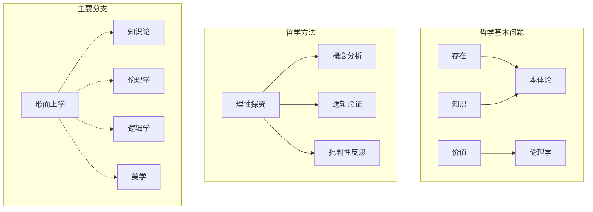

## 概念：哲学

> 哲学（Philosophy）源于希腊语 "philosophia"，意为 " 爱智慧 "。它是对存在、知识、价值、理性、心灵和语言等基本问题的理性探究，旨在追求智慧和真理。

**解决的核心痛点**：回答「世界是什么」「我们如何认识世界」「什么是好的生活」等根本性问题

---

### 核心命题

- [[哲学运用理性思维和逻辑论证探索基本问题]]
	- 区别于经验科学，哲学关注普遍性问题
- [[哲学通过对既有观念的质疑和反思深化理解]]
	- 批判性思考是哲学的核心方法
- [[哲学的主要分支回应不同的基本问题]]
	- 形而上学回答存在，知识论回答认识，伦理学回答价值

---

### 运行机制

---

### 关键区别

| 维度 | 哲学 | 科学 |
|:--- |:--- |:--- |
| **研究对象** | 普遍性问题、基础假设 | 特定经验现象 |
| **方法** | 理性思辨、概念分析 | 经验观察、实验验证 |
| **目标** | 智慧、真理 | 可检验的知识 |

---

### 知识图谱

- **子集概念**：
	- [[知识论]]
	- [[形而上学]]
	- [[伦理学]]
	- [[逻辑学]]
	- [[美学]]
- **相关概念**：
	- [[批判性思维]]
	- [[理性主义]]
	- [[经验主义]]

---

### 参考延伸

- **经典著作**：柏拉图《理想国》、亚里士多德《形而上学》、康德《纯粹理性批判》
- **代表人物**：苏格拉底、柏拉图、亚里士多德、笛卡尔、康德
- **分支领域**：政治哲学、心灵哲学、语言哲学
