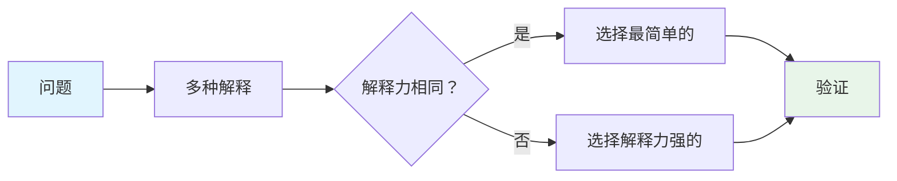

## 概念：奥卡姆剃刀

> **奥卡姆剃刀**（Occam's Razor）是一种解决问题和做决策的原则，其核心表述为 "**如无必要，勿增实体**"（Entities should not be multiplied unnecessarily）。在同等解释力下，选择最简单的解释。

**解决的核心痛点**：面对多种同样有效的解释时，避免过度复杂化，在简单与复杂之间做出高效选择。

---

### 核心命题

- 奥卡姆剃刀通过复杂度和解释度两个维度重塑决策
- 奥卡姆剃刀的本质是「认知效率」—— 复杂解释需要更多认知成本，简单解释更易于验证和传播
- 简约不等于简单——简约的解法可能实现复杂，但结构上更优雅
- 奥卡姆剃刀是决策工具而非真理标准——最简单的解释未必正确，但它是最高效的起点

---

### 运行机制

#### 剃刀模型

#### 判断标准

| 维度 | 简单解释 | 复杂解释 |
|:---|:---|:---|
| **假设数量** | 少 | 多 |
| **实体数量** | 少 | 多 |
| **验证难度** | 低 | 高 |
| **认知成本** | 低 | 高 |

---

### 关键区别

| 维度       | 奥卡姆剃刀     | 过度简化     |
|:------- |:-------- |:------- |
| **核心逻辑** | 剔除不必要的复杂性 | 忽略必要的复杂性 |
| **结果**   | ==保持解释力== | 丧失解释力    |
| **判断标准** | " 是否必要 "  | " 是否方便 " |

---

### 应用场景

- ✅ **适用场景**
	- **理论构建**：物理学中从地心说到日心说的演进
	- **代码设计**：重构时选择更简单的架构
	- **决策分析**：在多个可行方案中选择实现成本最低的
	- **问题诊断**：先假设最常见的原因，再排查复杂因素
- ⛔ **误用**
	- **忽略复杂性**：把复杂问题强行简化，导致误判
	- **混淆主观客观**：以 " 我觉得简单 " 代替客观的复杂度衡量
	- **滥用为教条**：把 " 简单 " 当成真理标准，排斥复杂但正确的解释

---

### 知识图谱

- **父级概念**：[[批判性思维]] — 奥卡姆剃刀是批判性思维在决策中的应用工具
- **子级概念**：
	- KISS 原则 — Keep It Simple, Stupid，工程领域的简约实践
	- YAGNI — You Aren't Gonna Need It，避免过度设计
- **并列概念**：
	- [[收敛思维]] — 奥卡姆剃刀是收敛思维的重要工具
	- 演绎推理 — 基于前提的逻辑推演
- **相关概念**：
	- [[线性思维]] — 简约思维与线性推理的关联
	- 简约设计 — 追求本质、去冗余的设计哲学

---

### FAQ

- [[Q-奥卡姆剃刀是否意味着最简单的解释就是正确的]]
- [[Q-何时应该忽略奥卡姆剃刀接受复杂性]]

---

### 参考延伸

- 《奥卡姆剃刀》— William H. Van Melsen，哲学史中的奥卡姆剃刀演变
- Stanford Encyclopedia of Philosophy - Ockham's Razor
