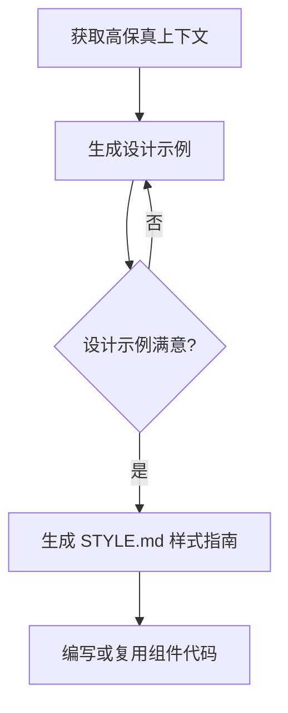

## SOP：使用 AI 高保真复刻网页设计

> 使用 AI 工具根据设计稿（Figma、Sketch 等）生成高保真、可交付的网页代码

---

### 适用场景

- 场景 1：从设计稿直接生成可复用的前端代码
- 场景 2：将现有网页逆向工程为结构良好的代码
- 场景 3：快速原型验证，AI 生成初始代码后人工微调

---

### 流程图解

---

### 核心步骤

1. **步骤 1：获取高保真上下文**
	 - 使用 Superdesign 浏览器插件提取设计稿的 CSS、布局、间距等完整信息
	 - 使用 AI 的 WebFetch 工具读取目标网站的样式信息
	 - 或者使用 Figma/Cursor 的 AI 模式直接读取设计文件
	 - 注意：不要直接给 AI 喂截图，截图只能保留部分样式信息

2. **步骤 2：生成并微调设计示例**
	 - 将高保真上下文提供给 AI（Claude Code、Cursor 等）
	 - 让 AI 生成一个设计示例页面，这个示例页面是一个参考实现，用于说明你期望的风格是什么样子
	 - 人工检查样式、布局、交互是否符合预期
	 - 循环微调直到满意

3. **步骤 3：生成 STYLE.md 样式指南**
	 - 让 AI 根据前两步生成一个可复用的样式指南
	 - 包含：色彩系统、Typography、间距、组件变量
	 - 用于指导后续样式设计和代码复用

4. **步骤 4：编写或复用组件代码**
	 - 基于样式指南编写可复用组件
	 - 使用现代前端框架（React/Vue）或 vanilla HTML/CSS
	 - 确保代码结构清晰、命名规范

---

### 常见坑点

- ⛔ **反模式**：不要给 AI 直接喂截图，截图只能保留部分样式信息
- ⛔ **反模式**：不要一次性让 AI 生成完整页面，先验证设计示例
- 🔧 **排查**：如果 AI 生成的样式与设计稿差异大，检查是否提供了完整的高保真上下文
- 🔧 **排查**：如果样式变量不统一，确保 STYLE.md 中已定义完整的设计 token

---

### 知识图谱

- **父级概念**：[[前端]]
- **关联概念**：[[AI辅助编程]], [[Figma]], [[CSS]]

### 参考文章

- [如何用Claude Code生成顶级 UI ?_哔哩哔哩_bilibili](https://www.bilibili.com/video/BV1Fx1kBvEFz/)
