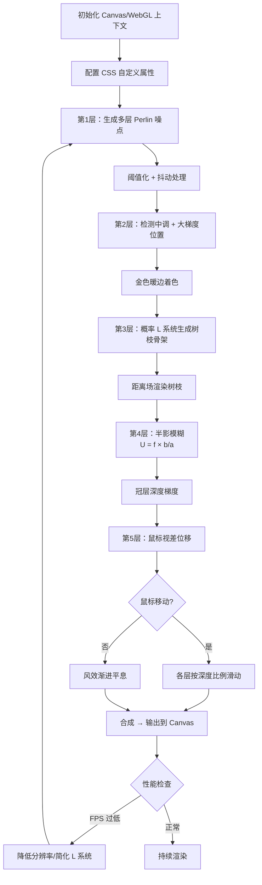

## SOP：实现网页斑驳光背景效果

> 在静态站点或 Quartz 数字花园中，通过程序化 Shader + CSS 集成，为页面添加模拟阳光透过树叶的斑驳光影（木漏れ日）背景效果。

**目标**：为网页背景添加一个持续运行的程序化斑驳光效果——树叶随风摇曳、阴影边缘带有金色光晕、不同深度的枝条有清晰与模糊的层次感。

**实现**：五层渲染流水线（噪点→着色→树枝→深度→视差），通过 Canvas/WebGL 渲染，与 CSS 自定义属性集成控制全局参数。

> **概念参考**：本 SOP 是 [[斑驳光]] 的具体实现指南。理论背景和设计原理见该概念笔记。

---

### 适用场景

- 场景 1：**个人网站/数字花园首页**——希望营造"数字家园"的氛围感
- 场景 2：**创意作品集/品牌页面**——用独特的光影质感建立视觉识别
- 场景 3：**博客文章页背景**——在不干扰阅读的前提下增加页面生命力

---

### 流程图解



---

### 核心步骤

#### 1. 初始化渲染上下文

- **选择渲染方式**：
- **Canvas 2D**：适合纯噪点+抖动方案，兼容性最好，性能开销低
- **WebGL / OffscreenCanvas**：适合需要 L 系统距离场计算和半影模糊的高精度场景
- **设置低渲染分辨率**（如 1/4 视口尺寸）以配合抖动产生像素艺术质感：

```js
const scale = 0.25
canvas.width = window.innerWidth * scale
canvas.height = window.innerHeight * scale
canvas.style.width = '100vw'
canvas.style.height = '100vh'
canvas.style.imageRendering = 'pixelated'
```

- 注意：Canvas 元素放在 `<body>` 最顶层，设置 `position: fixed; z-index: -1; pointer-events: none` 避免遮挡页面交互

#### 2. 创建 CSS 自定义属性面板

暴露关键参数为 CSS 自定义属性，方便主题切换和调试：

```css
:root {
--dapple-noise-scale: 0.002;       /* 噪点缩放 */
--dapple-threshold: 0.45;          /* 亮暗阈值 */
--dapple-gold-intensity: 0.3;      /* 金色光晕强度 */
--dapple-blur-radius: 4.0;         /* 半影模糊半径 */
--dapple-parallax-strength: 0.05;  /* 视差强度 */
--dapple-wind-speed: 0.1;          /* 风速 */
--dapple-opacity: 0.7;             /* 整体透明度 */
}
```

Shader 中通过 JavaScript 读取 `getComputedStyle` 同步参数。

#### 3. 第1层：噪点生成 + 阈值 + 抖动

- 使用 **3-4 个倍频（octave）的 Perlin/Simplex 噪点**叠加模拟树叶冠层
- 阈值化：噪点值 > threshold → 亮（阳光），< threshold → 暗（阴影）
- **低分辨率渲染 + 颜色抖动**：在亮暗交界处用 Floyd-Steinberg 或有序抖动（ordered dithering）产生渐变过渡，消除色带
- **风效**：为每个倍频添加按时间变化的平移偏移量（低频偏移大，高频偏移小），鼠标移动时乘以加速度系数

#### 4. 第2层：金色暖边着色

**核心判断逻辑**（在抖动之后执行）：

```bash
if (tone is mid-range) AND (gradient(local) is sharp):
	color = lerp(current, gold, intensity)
```

- 中调判定：亮度值在 0.35-0.65 之间
- 梯度判定：当前像素与邻域像素的亮度差超过阈值
- 结果：只在**阴影边缘**出现金色光晕，内部保持纯色

#### 5. 第3层：L 系统生成树枝骨架

- 使用**概率 L 系统**（见 [[L系统]]）在页面初始化时生成树枝线段列表
- 应用**达·芬奇分枝法则**：子枝宽度² 之和 = 父枝宽度²
- 应用**黄金角叶序**（137.5°）：每个分枝维护角度变量，分叉后增加黄金角，用 cos(角度) 决定左右
- 将线段列表传入 fragment shader，对每个像素计算到最近线段的距离 → 映射为颜色

```js
// 概率 L 系统规则示例
const rules = [
{ pattern: 'X', replacement: 'F',        prob: 0.30 },
{ pattern: 'X', replacement: 'F[+X]X',   prob: 0.245 },
{ pattern: 'X', replacement: 'F[-X]X',   prob: 0.245 },
{ pattern: 'X', replacement: 'F[+X][-X]X', prob: 0.21 },
]
```

#### 6. 第4层：半影模糊与深度

- **半影模糊公式**：`blurRadius = f * b / a`
- 为每个树枝段分配深度值（a=相机距离，b=到投影面距离，f=焦点大小）
- 在距离场渲染时按 blurRadius 做高斯模糊
- 结果：前景枝条锐利清晰，远景枝条柔和朦胧
- **冠层深度梯度**：将噪点阈值从固定值改为沿深度倾斜的函数——"近处稀疏、远处密集"
- **深度跟随**：叶片像素的深度向其最近树枝的深度微调，增强一体感

#### 7. 第5层：视差

- 监听 `mousemove`，计算鼠标在视口中的相对位置 (-1 ~ 1)
- 每层按其深度值乘以 `parallaxStrength` 水平偏移
- 使用 `requestAnimationFrame` 平滑过渡，避免跳跃

#### 8. 性能优化

- **OffscreenCanvas + Worker**：将渲染移至 Web Worker，避免阻塞主线程
- **降低渲染分辨率**：1/4 视口 + `image-rendering: pixelated` 不仅美观且大幅降低计算量
- **条件渲染**：页面不可见时暂停渲染（`document.visibilitychange`）
- **`prefers-reduced-motion`**：检测用户偏好，关闭动画/风效
- **GPU 加速**：Canvas 使用 `will-change: transform` 或设置 `translateZ(0)`

---

### 实践/示例

#### Quartz 站点集成示例

在本项目的 Quartz v5 站点中，斑驳光效果通过以下文件集成：

- **`quartz/components/renderPage.tsx`** — 在 `#quartz-root` 之前渲染 `<DappledLight>` 组件
- **`quartz/styles/custom.scss`** — CSS 自定义属性面板、fade-in 动画、响应式适配
- **Canvas 渲染组件** — 在客户端 `useEffect` 中初始化 Canvas，读取 CSS 变量同步参数

#### 最小化 HTML 示例

```html
<!DOCTYPE html>
<html>
<head>
<style>
#dapple-canvas {
	position: fixed; top: 0; left: 0;
	width: 100vw; height: 100vh;
	z-index: -1; pointer-events: none;
	image-rendering: pixelated;
}
:root {
	--dapple-parallax: 0.05;
	--dapple-opacity: 0.6;
}
@media (prefers-reduced-motion: reduce) {
	#dapple-canvas { display: none; }
}
</style>
</head>
<body>
<canvas id="dapple-canvas"></canvas>
<!-- 页面内容 -->
<script src="dapple-light.js"></script>
</body>
</html>
```

---

### 常见坑点

- ⛔ **Chrome 缩放时的 CSS 合成 bug**：部分 Chrome 版本在页面缩放时，Canvas + CSS 混合模式会产生黑色渐变覆盖。排查方向：
	- 检查 `mix-blend-mode` 和 `isolation` 设置
	- 尝试移除 Canvas 上的 CSS transform
	- 降级方案：缩放超过 110% 时暂停效果或切换到静态背景
- ⛔ **L 系统生成耗时过长**：高迭代次数（>6）的 L 系统展开产生的线段数量指数增长。限制迭代深度或使用 Web Worker 异步生成
- ⛔ **移动端耗电**：持续运行的 shader 消耗 GPU。降低渲染帧率（15fps）或检测电池状态后降级
	- 🔧 **排查 Canvas 空白**：检查 Canvas 尺寸是否 > 0、`getContext` 是否返回 null、z-index 是否正确
	- 🔧 **排查视差抖动**：确认使用了 `transform: translate3d()` 而非 `left/top`，且未触发 layout thrashing

---

### 知识图谱

- **相关概念**：
	- [[斑驳光]] — 本 SOP 的理论基础和设计原理
	- [[L系统]] — 树枝骨架生成的核心算法
	- [[CSS]] — 自定义属性面板和视觉效果集成
	- [[数字花园]] — 斑驳光效果的设计哲学来源
- **相关 SOP**：
	- [[Canvas实现无限滑动效果]] — Canvas 渲染技术前置参考
	- [[ThreeJS实现光影滤镜]] — 另一种网页光影效果的实现路径
