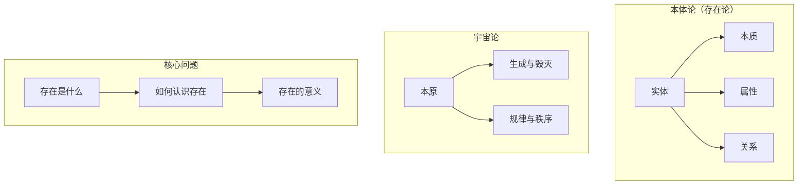

## 概念：形而上学

> 形而上学（Metaphysics），是哲学的一个分支，研究存在的本质、实体及其基本原理，探讨什么是真实存在、事物的本原是什么。

**解决的核心痛点**：回答「什么是真实存在的」「事物的本原是什么」的问题，为理解世界提供本体论基础

---

### 核心命题

- [[形而上学追问存在的本质]]
	- 区分「存在」与「现象」，追问表象背后的实在
- [[形而上学研究实体及其属性]]
	- 探讨实体的本质、属性、关系以及变化
- [[形而上学与认识论互补]]
	- 形而上学研究「什么是存在」，认识论研究「我们如何知道」

---

### 运行机制

---

### 关键区别

| 维度 | 形而上学 | 知识论 |
|:--- |:--- |:--- |
| **研究对象** | 存在的本质 | 知识的本质与可能性 |
| **核心问题** | 什么是真实存在的？ | 我们能知道什么？ |
| **方法** | 思辨、概念分析 | 分析、论证、反思 |

---

### 应用场景

- ✅ **适用场景**
	- **理解科学基础**：形而上学的本体论为科学理论提供哲学基础
	- **深化哲学思考**：理解西方哲学传统的重要部分
	- **AI 本体论设计**：知识表示需要回答「什么是存在」
- ⛔ **误用**
	- **过度抽象**：陷入纯粹的文字游戏而脱离实际
	- **轻率否定**：在充分理解前就否定形而上学的价值

---

### 知识图谱

- **父级概念**：[[哲学]]
- **子集概念**：
	- [[本体论]]
	- [[宇宙论]]
- **并列概念**：
	- [[知识论]]
	- [[逻辑学]]
- **相关概念**：
	- [[存在]]
	- [[实体]]

---

### 参考延伸

- **经典著作**：亚里士多德《形而上学》、康德《纯粹理性批判》
- **代表人物**：亚里士多德、柏拉图、康德、黑格尔、海德格尔
- **经典问题**：存在与变易、本体论证明、身心问题
