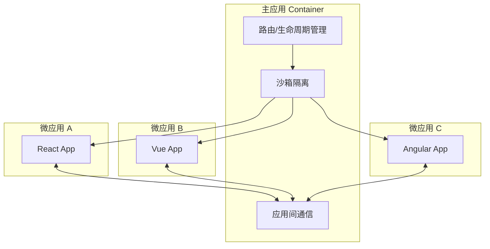

## 概念：微前端

> 微前端是将微服务思想应用于前端，将大型单体应用拆分为多个独立交付子应用的架构风格，每个子应用可以独立开发、测试、部署和运行。

**解决的核心痛点**：解决大型前端应用随着团队扩张和业务增长而面临的**巨石应用**问题——构建缓慢、依赖冲突、技术栈固化、发布相互阻塞。

---

### 核心命题

- [[微前端的本质是应用分治]]
	- **原理**：每个微前端应用拥有独立的技术栈、代码库和构建产物，主应用在运行时按需加载它们，实现物理级别的隔离
	- **详解**：微前端的 " 微 " 不是指代码量小，而是指**交付边界清晰**。每个微应用对应一个业务域，拥有独立的 Git 仓库、独立构建产物、独立部署流水线、独立域名或路由前缀。Monorepo 解决的是代码复用问题，微前端解决的是**团队自治**问题
- [[微前端的核心价值是独立部署而非技术无关]]
	- **原理**：技术无关只是表象，独立部署才是本质——解耦团队间的发布依赖，才能真正提升交付效率
	- **详解**：没有微前端时，App A 修改需要全量回归测试和全量发布，阻塞 App B 的发布计划；有微前端后，App A 独立测试和独立发布，App B 不受影响
- [[Module Federation 是构建时与运行时集成的折中方案]]
	- **原理**：Module Federation 允许在运行时共享依赖，既能独立部署，又能避免重复加载公共依赖

---

### 运行机制

---

### 关键区别

| 维度 | 微前端 | Monorepo |
|:---|:---|:---|
| **核心问题** | 应用解耦 / 独立交付 | 代码复用 / 统一规范 |
| **产物形态** | 多套独立构建产物 | 单一存储库 + 统一构建 |
| **部署方式** | 各应用独立部署 | 统一部署或独立部署均可 |
| **团队边界** | 跨团队协作 | 跨团队但代码强耦合 |
| **适用场景** | 多团队维护独立业务 | 单团队维护同一代码库 |

| 维度 | 微前端 | iframe |
|:---|:---|:---|
| **隔离级别** | JS 沙箱（弱隔离） | DOM 隔离（强隔离） |
| **通信方式** | 自定义事件 / postMessage | postMessage |
| **用户体验** | 页面无缝切换，体验一致 | 边框明显，体验割裂 |
| **性能** | 较好 | 较差（独立浏览器上下文） |
| **路由管理** | 主应用统一管理 | 各 iframe 独立管理 |

---

### 应用场景

- ✅ **适用场景**
	- **大型中台应用**：多团队并行开发，避免代码合并冲突和发布排队
	- **渐进式技术升级**：Vue 项目逐步迁移到 React，保留存量业务稳定运行
	- **多品牌 SaaS**：一套主应用加载多个品牌子应用，独立定制样式和功能
- ⛔ **误用**
	- **小型应用强行拆分**：2-3 人的团队拆成微前端，增加复杂度却无收益
	- **把微前端当成分模块开发**：每个应用仍然强依赖主应用的公共库，发布时仍然需要全量回归

---

### SOP

> 与本概念相关的标准操作流程，通过实践辅助理解

- [[SOP-微前端路由分发模式]] — 路由分发式微前端的标准实现流程
- [[SOP-微前端ModuleFederation方案]] — Webpack 5 Module Federation 配置流程
- [[SOP-微前端WebComponents封装]] — Web Components 封装微应用的标准流程
- [[SOP-微前端沙箱隔离]] — JS 沙箱与 CSS 隔离的实现方案

---

### FAQ

> 与本概念相关的开放性问题，待进一步探索

- [[Q-何时选微前端vsMonorepo]] — 独立交付 vs 代码复用的选型判断
- [[Q-微前端vsMonorepo性能对比]] — 性能差异的根源与场景分析
- [[Q-qiankun和ModuleFederation怎么选]] — 运行时隔离 vs 依赖共享的选型

---

### 知识图谱

- **父级概念**：[[软件架构]] — 上位架构思想
- **并列概念**：
	- [[Monorepo]] — 代码级复用 vs 交付级解耦
	- [微服务] — 后端对应概念，但隔离粒度不同
- **相关概念**：
	- [[前端工程化]] — 微前端是前端工程化的具体实践
	- [[跨端与跨框架工程实践]] — 技术异构是微前端的常见场景
- **技术栈关联**：
	- [qiankun] — 基于 Single SPA 的运行时方案
	- [Module Federation] — Webpack 5 内置的运行时共享方案
	- [Single SPA] — 最早的通用微前端框架
- **参考文章**
	- [Micro Frontends - Martin Fowler](https://martinfowler.com/articles/micro-frontends.html)
	- [Module Federation - Webpack 5](https://webpack.js.org/concepts/module-federation/)
	- [qiankun - 蚂蚁金服微前端方案](https://qiankun.umijs.org/)
