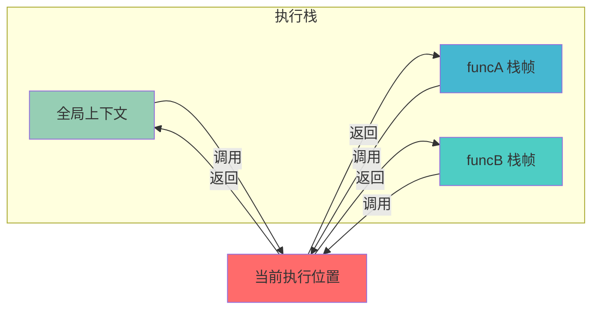

## 概念：执行栈

> 执行栈是管理函数调用顺序的 LIFO（后进先出）栈结构，用于跟踪代码执行上下文

**解决的核心痛点**：程序需要知道当前执行到哪个函数、函数的局部变量是什么、以及函数执行完毕后应该返回到哪里继续执行

---

### 核心命题

> 核心命题引用 atomic 笔记（陈述句观点），每个命题是一句话洞见

- [[函数的本质是执行环境的封装]]（待创建）
	- **原理**：每次函数调用都会在执行栈上创建一个栈帧，包含该函数的执行上下文
- [[作用域链决定了变量的查找顺序]]（待创建）
	- **原理**：执行栈中的每个栈帧都关联一个作用域，变量查找沿作用域链向上

---

### 运行机制

执行栈遵循 LIFO 原则：新函数调用入栈，函数执行完毕出栈。

**入栈过程**：
1. 调用函数时，创建新的栈帧
2. 栈帧包含：函数参数、局部变量、返回地址
3. 栈帧压入栈顶，成为当前执行上下文

**出栈过程**：
1. 函数执行完毕
2. 栈帧从栈顶弹出
3. 控制权返回到栈帧中的返回地址

---

### 关键区别

| 维度 | 执行栈 | 任务队列 |
|:--- |:--- |:--- |
| **数据结构** | LIFO 栈 | FIFO 队列 |
| **用途** | 管理同步函数调用顺序 | 管理异步回调执行顺序 |
| **存储内容** | 函数执行上下文（参数、变量、返回地址） | 待执行的回调函数 |
| **执行时机** | 同步执行，当前栈帧完成后立即出栈 | 等待主线程空闲时执行 |

---

### 应用场景

- ✅ **适用场景**
	- **函数调用追踪**：通过执行栈可以追踪函数调用链路
	- **递归调用**：每次递归都在栈上创建新帧，需注意栈溢出风险
	- **错误堆栈追踪**：catch 块中可访问 stack 属性查看调用链
- ⛔ **误用**
	- **深度递归**：超过栈容量（浏览器约 1 万 + 层）会导致栈溢出
	- **同步阻塞**：长时间同步操作会阻塞 UI 渲染

---

### SOP

> 与本概念相关的标准操作流程，通过实践辅助理解

- 暂无相关 SOP

---

### FAQ

> 与本概念相关的开放性问题，待进一步探索

- 暂无相关 Question

---

### 知识图谱

> 知识图谱链接 term（术语定义）和相关 concept，建立概念关系网络

- **父级概念**：[[JS执行机制]] — 新知识的概括性上位概念
- **子级概念**：
	- [[栈帧]]（待创建）— 执行栈的基本组成单元
	- [[作用域链]] — 与执行栈紧密相关的变量查找机制
	- [[执行上下文]] — 栈帧中执行的内容
- **并列概念**：
	- [[事件循环]] — 负责调度执行栈与任务队列的机制
- **相关概念**：
	- [[闭包]] — 闭包的实现依赖执行栈和作用域链的配合
	- [[递归]] — 递归调用深度受执行栈容量限制
- **参考文章**
	- [MDN - 调用栈](https://developer.mozilla.org/zh-CN/docs/Glossary/Call_stack)
