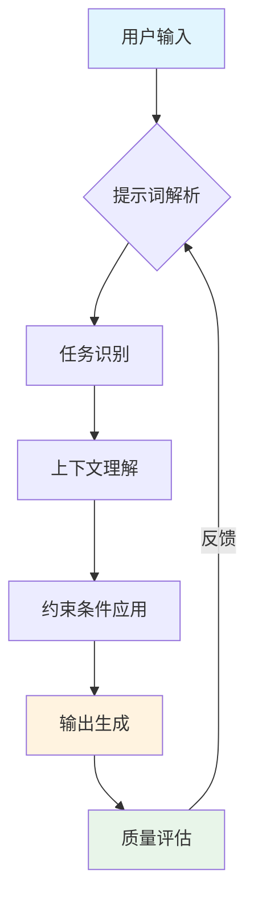

## 概念：提示词工程

> 提示词工程（Prompt Engineering）是一种设计和优化提示词的技术，用于引导大型语言模型（LLM）生成期望的输出。

**解决的核心痛点**：如何有效地与 LLM 沟通，让模型理解意图并生成高质量输出。

---

### 核心命题

> 核心命题引用 atomic 笔记（陈述句观点），每个命题是一句话洞见

- [[LLM 的本质是概率预测机器]]
	- **原理**：LLM 基于 Transformer 架构，通过预测下一个词的概率分布来生成文本，理解这一点有助于设计更有效的提示词
- [[明确指令比模糊指令更容易获得高质量输出]]
	- **原理**：清晰具体的描述能减少模型的推理歧义，降低幻觉风险

---

### 运行机制

提示词工程的核心原理是通过结构化的文本引导 LLM 的推理和生成过程。

**关键参数**：
- **温度（Temperature）**：控制输出的随机性，较低值更确定性，较高值更有创造性
- **Top-p / Top-k**：限制采样范围，平衡多样性和准确性
- **最大令牌数（Max Tokens）**：控制输出长度上限

---

### 关键区别

| 维度 | 提示词工程 | [[Agent]] |
|:---|:---|:---|
| **核心逻辑** | 通过文本引导模型 | 通过工具执行自主行动 |
| **交互方式** | 一次性输入 | 感知 - 决策 - 执行的循环 |
| **适用场景** | 单一任务、问答、内容生成 | 复杂多步骤任务、自动化工作流 |

---

### 应用场景

- ✅ **适用场景**
	- **文本生成**：文章、代码、邮件的创作与优化
	- **问答系统**：知识检索、解释说明
	- **代码辅助**：代码审查、重构、错误修复
	- **学习辅导**：概念解释、练习生成
- ⛔ **误用**
	- **过度依赖**：将所有任务都推给 AI，忽视人工判断
	- **忽视边界**：不理解 LLM 的能力边界，导致不切实际的期望

---

### 常用技巧

1. **角色扮演**：赋予 AI 特定身份（" 你是资深前端工程师 "）
2. **分步引导**：复杂任务拆解为多个步骤（Chain of Thought）
3. **Few-shot 示例**：提供 1-3 个示例让模型学习模式
4. **结构化输出**：指定输出格式（JSON、Markdown、表格）
5. **约束明确**：清晰定义禁止项和必要项

---

### 知识图谱

> 知识图谱链接 term（术语定义）和相关 concept，建立概念关系网络

- **父级概念**：[[LLM]] — 提示词工程作用于 LLM 的基础
- **子级概念**：
	- [[Agent]] — 基于提示词工程的自主行动系统
	- [[MCP]] — 扩展提示词工程能力的协议
- **并列概念**：
	- [[RAG]] — 通过检索增强提示词效果
- **相关概念**：
	- [[AI辅助编程]] — 提示词工程在前端开发的应用
	- [[前端开发者应知的AI概念]] — 综合应用指南

---

### FAQ

> 与本概念相关的开放性问题，待进一步探索

- [[Q-如何评估提示词的质量]]
- [[Q-提示词工程的边界在哪里]]

---

### 参考延伸

- [GPT-4.1 Prompting Guide](https://cookbook.openai.com/examples/gpt4-1_prompting_guide)
- [Google 提示词工程指南](https://ai.google.dev/gemini-api/docs/prompting-strategies?hl=zh-cn)

### 相关示例

- [[知识管理大师提示词v4 动态重构版本]]
- [[前端开发助手提示词 v2 1]]
- [[重构助手提示词]]
- [[优化助手提示词]]
- [[错误修复助手提示词]]
