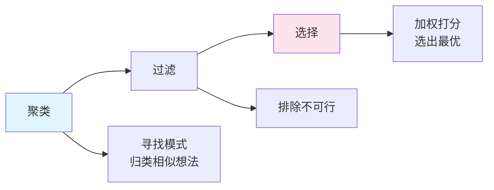

## 概念：收敛思维

> 收敛思维是一种基于**逻辑、规则和标准**的分析过程，旨在从发散思维产生的众多选项中，通过筛选、分类和评估，**收束**出最优解决方案。

**解决的核心痛点**：解决分析瘫痪，在信息过载和众多可能性中做出明确、可执行的决策。

---

### 核心命题

- 明确的筛选标准是收敛的前提
	- **原理**：如果没有标准，收敛就变成了 " 瞎蒙 " 或 " 看心情 "，标准必须前置
- [[奥卡姆剃刀]] 是最高效的收敛工具
	- **原理**：在同等解释力下，选择最简单的路径
- 收敛过程本质上是熵减过程
	- **原理**：通过引入逻辑秩序，将混乱的信息转化为有序的决策

---

### 运行机制

#### 双钻模型的下半场

#### 核心流程

| 阶段 | 动作 | 说明 |
|:---|:---|:---|
| **聚类** | 归类相似想法 | 寻找模式，亲和图 |
| **过滤** | 排除不可行选项 | 限制条件：预算、技术可行性、Deadline |
| **选择** | 选出最优 | 加权打分，MoSCoW 法则 |

---

### 关键区别

| 维度 | [[发散思维]] | [[收敛思维]] |
|:---|:---|:---|
| **思维形态** | 辐射状（☀） | 聚焦状（🔍） |
| **关键动作** | 联想、跳跃、生成 | 排序、评估、剔除 |
| **追求目标** | 新颖性 | 正确性/可行性 |
| **底层逻辑** | 概率论（量大出奇迹） | 逻辑学（推理出真理） |

---

### 应用场景

- ✅ **适用场景**
	- **Debug**：二分查找，不断排除一半的可能性，直到定位 Bug
	- **技术选型**：加权矩阵，列出维度（社区活跃度、性能、招聘难度），打分选出最高分
	- **MVP 定义**：MoSCoW 法则（必须做、应该做、可以做、不做），将无限需求收敛到有限版本
- ⛔ **误用**
	- **过早收敛**：没有充分探索可能性就匆忙决定，导致局部最优而非全局最优
	- **群体迷思**：为了表面一致性而收敛，最终结果平庸甚至灾难性
	- **基于直觉收敛**：没有建立评估矩阵，凭喜好做决定

---

### 知识图谱

- **父级概念**：[[批判性思维]] — 收敛思维是批判性思维在决策中的应用
- **子级概念**：
	- 决策矩阵 — 加权打分的选择工具
	- 四象限法则 — 优先级收敛工具
- **并列概念**：
	- [[发散思维]] — 收敛的原材料来源
- **相关概念**：
	- [[线性思维]] — 收敛思维常用直线推理
	- 演绎推理 — 收敛思维的底层逻辑

---

### FAQ

- [[Q-如何判断发散阶段已经充分，可以开始收敛]]
- [[Q-收敛思维中的加权打分如何避免主观偏差]]

---

### 参考延伸

- 《思考，快与慢》— Daniel Kahneman，系统 2（慢思考）是收敛思维的主力
- 《决策的艺术》— 阐述决策判断的系统方法
