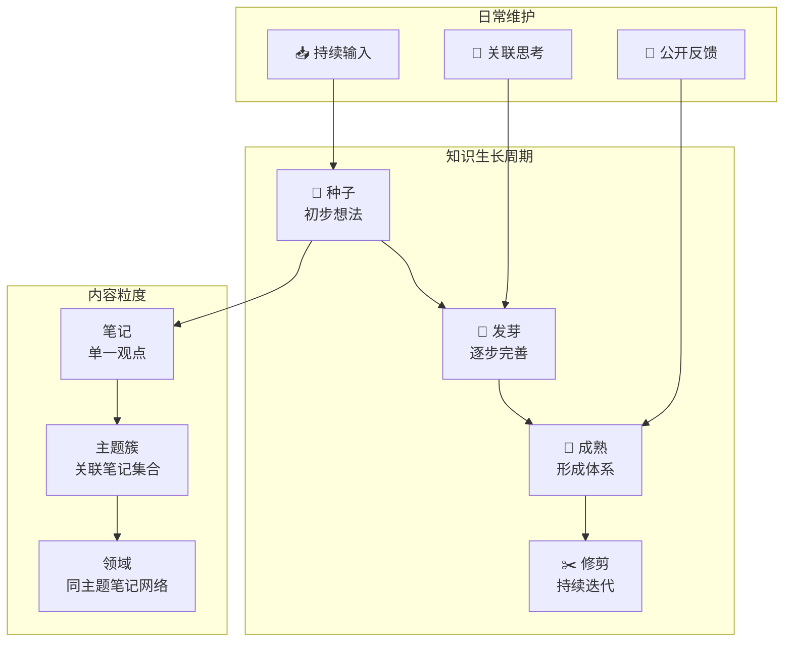

## 概念：数字花园

> 数字花园是一种公开的知识分享和生长哲学，强调观点像植物一样持续培育、迭代和连接，介于私密笔记和完整文章之间的光谱中间地带。

**解决的核心痛点**：破解博客的"写完即弃"和第二大脑的"只读私有"困境——让知识在公开分享中持续生长，且无需等到"完美"再发布。

---

### 核心命题

- [[数字花园是第二大脑和博客的中间态]]
	- **原理**：数字花园填补了私密笔记（只记不分享）和完整文章（写完不再改）之间的光谱空白
- [[数字花园强调观点间的紧密联系]]
	- **原理**：花园的价值不在于单篇内容，而在于观点间通过双向链接形成的知识网络密度
- [[数字花园的状态反映了知识的成熟度]]
	- **原理**：通过显式状态标记（种子→发芽→成熟），降低发布心理门槛，让读者自主判断可信度

---

### 运行机制

#### 生长阶段

- **🌱 种子**：一个初步想法或灵感，未经验证
- **🌿 发芽**：逐步完善，补充论据和关联
- **🌲 成熟**：形成较完整的知识体系
- **✂️ 修剪**：定期回顾，淘汰过时内容，合并重复

#### 关键特征

- **公开不完美**：种子阶段即可发布，让生长过程可见
- **状态标记**：每篇内容标注成熟度（seedling/budding/evergreen），管理读者期望
- **持续迭代**：从不"完成"，只有"当前状态"
- **链接为王**：笔记间的双向链接决定花园价值

---

### 关键区别

| 维度 | 数字花园 | [[第二大脑]] | 博客 |
|:--- |:--- |:--- |:--- |
| **内容粒度** | 笔记 → 主题簇 → 领域 | 原子笔记 → 概念 | 完整文章 |
| **公开程度** | 公开，允许不完美 | 私有 | 公开，要求完整 |
| **更新方式** | 持续迭代 | 持续积累 | 写完即弃 |
| **发布门槛** | 低（种子即可发布） | — | 高（需完稿） |
| **组织逻辑** | 双向链接 + 状态 | 双向链接 + 分类 | 时间线 + 标签 |
| **典型工具** | Obsidian + Quartz | Obsidian | WordPress |

---

### 应用场景

- ✅ **适用场景**
	- **公开学习**：在学习过程中公开思考轨迹，接受反馈
	- **个人品牌**：展示知识成长历程，而非最终成果
	- **知识连接**：让分散的观点通过双向链接形成网络
- ⛔ **误用**
	- **只建不养**：建了花园但不维护，成为内容废墟
	- **追求完美**：等到"成熟"才发布，违背了"公开不完美"的核心原则

---

### 知识图谱

- **父级概念**：[[A-知识管理]] — 数字花园是知识管理的一种实践哲学
- **并列概念**：[[第二大脑]] — 侧重私有知识积累，数字花园强调公开生长
- **相关概念**：
	- [[卡片盒笔记法]] — 双向链接和原子笔记是数字花园的基础设施
	- [[PARA笔记法]] — 行动导向的组织方法，与花园互补
	- [[本库指南]] — 本库本身就是数字花园实践（Quartz + Obsidian）
- **关键人物**
	- **Maggie Appleton** — 系统性阐述了现代数字花园的理念和特征
	- **Mark Bernstein (1998)** — 首次用花园隐喻描述超文本
	- **Tom Critchlow** — 提出"数字花园介于笔记和文章之间"的精确定义

### 参考延伸

- **源头**：Mark Bernstein, "Hypertext Gardens" (1998)
- **系统阐述**：Maggie Appleton, "A Brief History & Ethos of the Digital Garden" (2020)
- **本库实践**：基于 Obsidian + Quartz 搭建，见 [[本库指南]]
