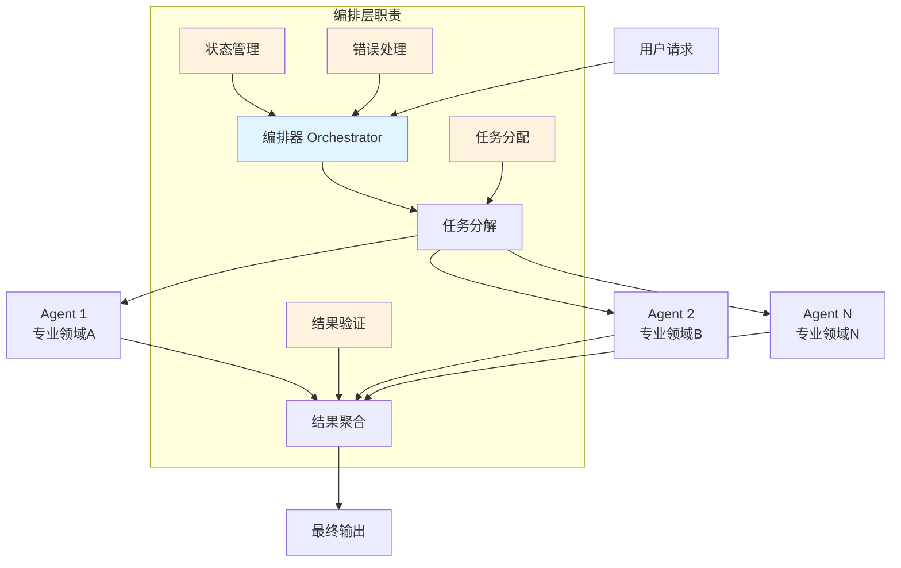

## 概念：智能体编排

> 智能体编排是对多个 AI Agent 进行协调、调度和管理，以完成复杂任务的系统性方法。

**解决的核心痛点**：单一 Agent 的能力有边界、专注点有限，无法独立完成需要多领域知识或并行处理的复杂任务。智能体编排通过将任务分解并分配给专业化的多个 Agent，实现 1+1>2 的协同效果。

---

### 核心命题

- 智能体编排的本质是「任务分解 + Agent 专业化 + 结果聚合」，而非简单串联多个 Agent
- 编排层负责维护 Agent 间的通信协议和数据流，使每个 Agent 专注于自己的子任务
- 好的编排设计需要在「并行效率」与「通信开销」之间找到平衡

---

### 运行机制

#### 核心流程

| 阶段 | 职责 | 关键挑战 |
|:---|:---|:---|
| **任务分解** | 将复杂任务拆分为可执行的子任务 | 粒度把控、依赖关系 |
| **Agent 分派** | 根据能力匹配分派到专业 Agent | 负载均衡、最优分配 |
| **并行/串行执行** | Agent 独立或协同执行子任务 | 同步机制、冲突处理 |
| **结果聚合** | 整合各 Agent 输出生成最终结果 | 一致性验证、冲突消解 |

---

### 关键区别

| 维度 | 智能体编排 | 单 Agent | Agent + 工具 |
|:---|:---|:---|:---|
| **执行模式** | 多 Agent 协同     | 单一自主决策    | Agent 调用外部工具  |
| **任务复杂度** | 复杂多领域任务    | 单一领域任务    | 需要外部能力的任务  |
| **核心逻辑** | 协调、分配、聚合   | 感知 - 推理 - 执行  | 工具调用扩展能力   |
| **通信开销** | 高（Agent 间通信） | 低            | 低                |
| **适用场景** | 系统级复杂任务    | 领域专注任务     | 能力边界扩展       |

---

### 编排模式

| 模式 | 结构 | 优点 | 缺点 | 适用场景 |
|:---|:---|:---|:---|:---|
| **层次化** | 编排器 → 执行 Agent | 结构清晰、易于控制 | 单点瓶颈 | 任务明确、流程固定 |
| **星型** | 中心 Agent 协调外围 | 简单直观 | 中心压力大 | 任务可完全分解 |
| **网状** | Agent 间自由通信 | 灵活、并行度高 | 复杂度高 | 动态协作场景 |
| **层次化 + 网状** | 编排器协调 + Agent 对等通信 | 平衡控制与灵活性 | 实现复杂 | 复杂企业场景 |

---

### 应用场景

- ✅ **适用场景**
	- **复杂软件开发生命周期**：需求分析 → 设计 → 编码 → 测试 → 部署，由不同专业 Agent 处理
	- **多领域研究任务**：信息检索 → 分析 → 综合 → 报告，各阶段由专家 Agent 负责
	- **企业自动化流程**：财务、人力、运营等跨系统任务协调
- ⛔ **误用**
	- **简单任务过度编排**：一个 Agent 能完成的任务无需多 Agent 协作
	- **忽视通信开销**：Agent 间频繁通信反而降低效率

---

### 知识图谱

- **父级概念**：[[Harness]] — 智能体编排是 实现 Harness 工程的必要能力
- **子级概念**：
	- 多智能体通信协议 — Agent 间协作的标准化接口
- **并列概念**：
	- 单 Agent 系统 — 单一智能体的感知 - 推理 - 执行
	- Agent + 工具 — 通过工具扩展单 Agent 能力边界
- **相关概念**：
	- [[Claude Code]] — 单 Agent 编排的具体实现
	- [[提示词工程|Prompt Engineering]] — Agent 能力表达的基础

---

### FAQ

- [[Q-多智能体系统中如何避免 Agent 之间的冲突]]
- [[Q-智能体编排的粒度应该如何设计]]

---

### 参考延伸

- [Anthropic - Building Effective Agents](https://docs.anthropic.com/)
- [Multi-Agent Systems: A Modern Approach](https://www.cs.kuleuven.be/~dtai/publications/MAS-book.pdf)
- [LangGraph - Multi-Agent Collaboration](https://langchain-ai.github.io/langgraph/)
