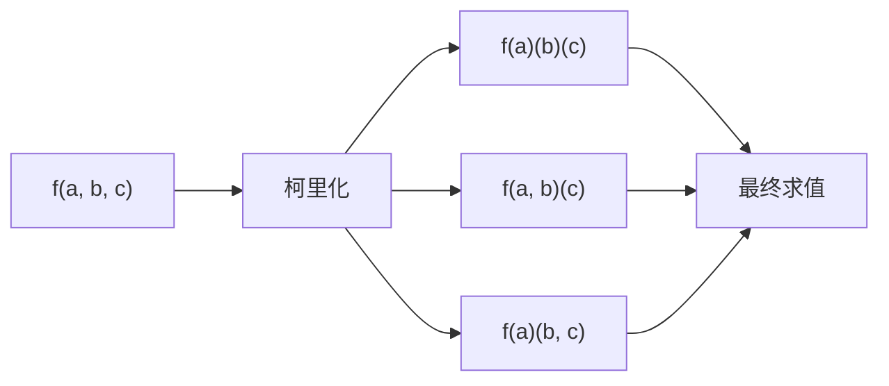

## 概念：柯里化

> 柯里化（Currying）是将接受多个参数的函数转换为一系列接受单个参数的函数的技术。

**解决的核心痛点**：将函数改造为更灵活的可复用单元，避免重复传递相同参数，实现函数组合。

---

### 核心命题

- 柯里化通过闭包保存已传入的参数，实现延迟执行
	- **原理**：每次调用返回一个新函数，通过闭包捕获已传入的参数，直到收集完所有参数后才执行原函数。
- 柯里化支持函数预配置（Partial Application），提高代码复用
	- **原理**：可以固定函数的部分参数，生成一个新的 " 特化 " 函数，用于特定场景。

---

### 运行机制



```javascript
// 原始函数
function add(a, b, c) {
    return a + b + c;
}

// 柯里化实现
function curry(fn) {
    return function curried(...args) { // 函数A
        if (args.length >= fn.length) {
            return fn.apply(this, args);
        }
        return function(...args2) { // 函数B
            return curried.apply(this, args.concat(args2));
        };
    };
}

const curriedAdd = curry(add);
curriedAdd(1)(2)(3);    // 6
curriedAdd(1, 2)(3);    // 6
curriedAdd(1)(2, 3);    // 6
```

> [!hint] 提示
> curriedAdd(1)：调用函数 A，args=[1]，返回函数 B
> curriedAdd(1)(2)：相当于 `函数B(2)`，args=[1]，args2=[2]

---

### 关键区别

| 维度 | **柯里化 (Currying)** | **偏函数 (Partial Application)** |
|:---|:---|:---|
| **定义** | 转换为 n 个一元函数 | 固定部分参数，返回剩余参数的函数 |
| **参数传递** | 每次传一个 | 可以一次传多个 |
| **返回值** | 总是返回新函数 | 可能直接返回结果 |
| **示例** | `f(a)(b)(c)` | `f(a, b)(c)` |

---

### 应用场景

- ✅ **适用场景**
	- **函数工厂**：创建特定配置的函数，如 `add(1)` 生成加 1 的函数
	- **函数组合**：将多个单元函数组合成复杂函数，如 `compose(f, g)(x)`
	- **参数复用**：避免在多次调用中重复传递相同参数
- ⛔ **误用**
	- **过度柯里化**：参数过多时（>5 个）代码可读性差
	- **不必要的柯里化**：简单函数无需柯里化，增加复杂度

---

### 知识图谱

- **父级概念**：[[JavaScript]] — 柯里化所在的语言环境
- **子级概念**：
- **并列概念**：[[偏函数]] — 与柯里化类似的参数固定技术
- **相关概念**：
	- [[闭包]] — 柯里化实现的基础

---

### 参考延伸

- 《JavaScript 高级程序设计》
- 《函数式编程指南》
