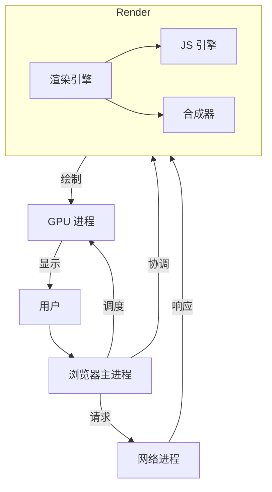

> 浏览器是用于检索和展示互联网资源的应用程序，对于前端开发者，它是代码（HTML/CSS/JS）的**宿主环境**，类似于一个微型操作系统。

**解决的核心痛点**：如何在用户端安全、高效地运行来自不同来源的 Web 代码？

---

## 核心命题

- [[浏览器采用多进程架构保证稳定性和流畅性|多进程架构]]
	- **原理**：主进程协调渲染进程、GPU 进程、网络进程、插件进程，一个页面崩溃不影响其他页面
- [[浏览器通过渲染引擎和JS引擎分工处理页面|双引擎分工]]
	- **原理**：渲染引擎（Blink/WebKit/Gecko）负责解析 HTML/CSS 和布局，JS 引擎（V8/SpiderMonkey）负责执行 JavaScript
- [[浏览器通过事件循环机制处理异步任务|事件循环]]
	- **原理**：宏任务（setTimeout/网络请求）和微任务（Promise）分开执行，微任务队列为空后才执行下一个宏任务
---

## 运行机制

---

## 关键区别

| 维度 | Chrome | Safari | Firefox |
|:--- |:--- |:--- |:--- |
| **渲染引擎** | Blink | WebKit | Gecko |
| **JS 引擎** | V8 | JavaScriptCore | SpiderMonkey |
| **进程模型** | 多进程 | 多进程 | 多进程 |
| **内存管理** | 标记清除 | 标记清除 | 标记清除 |

---

## 应用场景

- ✅ **适用场景**
	- **Web 应用开发**：浏览器是前端代码的运行环境
	- **调试与优化**：使用 DevTools 分析性能瓶颈
	- **安全沙箱**：隔离不可信代码，保护用户数据
- ⛔ **误用**
	- **忽略兼容性**：不同浏览器对标准支持不同
	- **内存泄漏**：未及时释放不再使用的对象

---

## 知识图谱

- **父级概念**：[[前端开发]] — 浏览器是前端开发的宿主环境
- **子级概念**：
	- [[浏览器核心架构]] — 浏览器的多进程架构
	- [[浏览器渲染流程]] — 页面从 HTML 到像素的过程
	- [[浏览器工作原理]] — 浏览器的整体工作机制
- **并列概念**：
	- [[Node.js]] — 服务端 JavaScript 运行时
- **相关概念**：
	- [[V8引擎工作原理]] — Chrome 的 JavaScript 引擎
	- [[事件循环]] — 浏览器的异步任务处理机制
	- [[同源策略]] — 浏览器的安全机制

---

## 参考延伸

- [Inside Browser (Google)](https://developer.chrome.com/blog/inside-browser-part1/)
- [MDN Web Docs](https://developer.mozilla.org/en-US/docs/Web/HTML)
