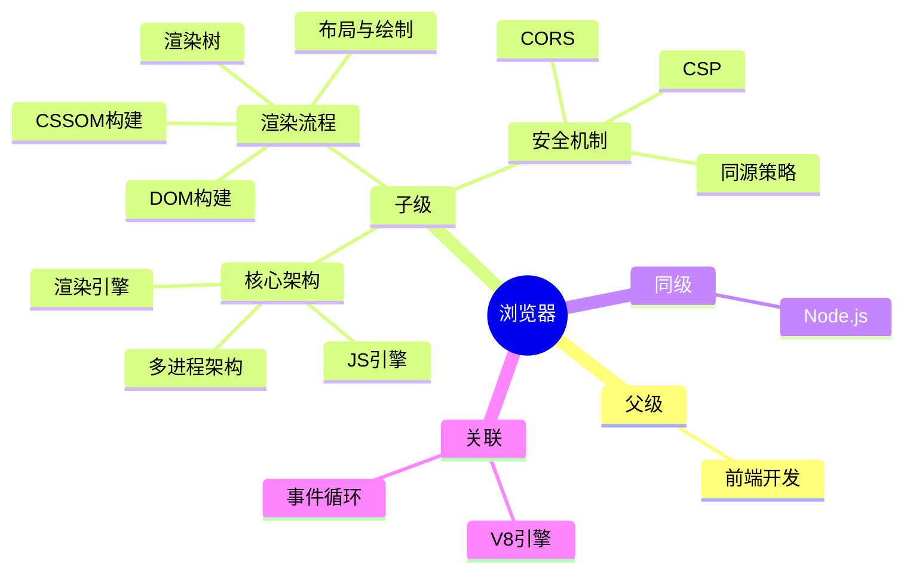

## Area: 浏览器

> 浏览器是用于检索和展示互联网资源的应用程序，对于前端开发者，它是代码（HTML/CSS/JS）的**宿主环境**，类似于一个微型操作系统。

---

### 领域知识图谱

---

### 领域定义

- **核心范畴**：为用户提供 Web 内容访问服务的前端运行时环境
- **不包括**：服务端运行时（Node.js）、桌面应用运行时（Electron）
- **与相关领域的区别**：
	- vs Node.js：浏览器是客户端沙箱环境，Node.js 是服务端运行时
	- vs Electron：Electron 基于浏览器内核，浏览器是原生应用

---

### 长期目标

- **愿景**：深入理解浏览器内部机制，能够编写高性能、安全的前端代码
- **里程碑**：
	- [x] 阶段 1：理解浏览器多进程架构和双引擎分工
	- [x] 阶段 2：掌握浏览器渲染流程（DOM/CSSOM → 渲染树 → 布局 → 绘制）
	- [ ] 阶段 3：精通浏览器安全机制（同源策略、CSP、CORS、CSRF/XSS 防护）
	- [ ] 阶段 4：掌握浏览器调试与性能优化技巧

---

### 关键领域

> 该领域的核心知识主题

- **架构与原理**
	- [[浏览器核心架构]] — 多进程架构、渲染进程、网络进程、GPU 进程
	- [[浏览器工作原理]] — 浏览器整体工作机制
	- [[事件循环]] — 宏任务与微任务的执行机制
- **渲染与绘制**
	- [[浏览器渲染流程]] — 从 HTML 到像素的完整过程
	- [[DOM]] — 文档对象模型
	- [[CSSOM]] — CSS 对象模型
- **安全机制**
	- [[浏览器安全机制]] — 同源策略、CSP、CORS
	- [[XSS]] — 跨站脚本攻击
	- [[CSRF]] — 跨站请求伪造
	- [[浏览器通过SameSiteCookie防止CSRF攻击]] — SameSite Cookie 机制
- **兼容性与工具**
	- [[浏览器兼容性]] — 跨浏览器兼容性处理
	- [[MOC-浏览器兼容性问题]] — 兼容性问题的索引
- **存储机制**
	- [[Cookie]] — 服务端与客户端传输的用户数据
	- [[localStorage vs sessionStorage]] — 浏览器本地存储对比
- **缓存与网络**
	- [[浏览器缓存机制]] — 强缓存与协商缓存
	- [[DNS解析]] — 域名到 IP 的解析过程
- **调试与性能优化**
	- [[Chrome DevTools]]
	- [[前端性能优化]]
	- [[回流和重绘]] — 回流（reflow）和重绘（repaint）的优化策略

---

### SOP

> 该领域的标准化操作流程

- [[SOP-使用浏览器DevTools调试性能]] — Chrome DevTools 性能分析流程
- [[SOP-前端性能优化]] — 浏览器端的性能优化标准流程

---

### FAQ

> 该领域的常见问题

- [[MOC-浏览器兼容性问题]]
- [[Q-浏览器如何解析HTML并构建DOM树]]
- [[Q-什么是浏览器的回流和重绘]]
- [[Q-浏览器的事件循环是如何工作的]]

---

### 领域健康度

| 维度 | 状态 | 说明 |
|:---:|:---:|:---|
| 目标进展 | 🟡 | 架构和渲染流程已完成，安全机制待深化 |
| 认知更新 | 🟢 | 有丰富的 atomic 笔记支撑 |
| 行动频率 | 🟢 | 作为前端开发核心领域，持续使用 |
