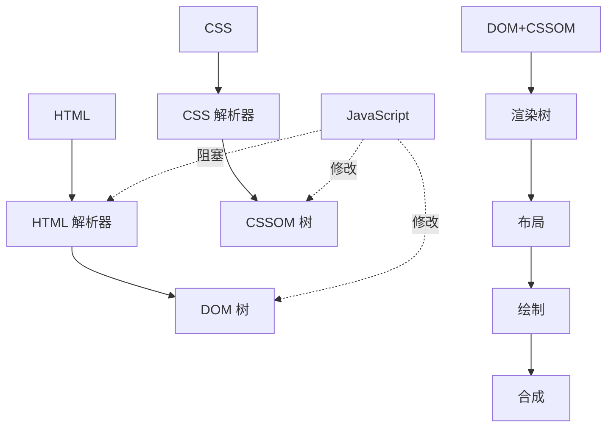

![[webkit-main-flow-b779d50c0cf28_856.png]]

> 浏览器渲染流程是将 HTML、CSS、JavaScript 转换为用户可见页面的过程，包括 DOM/CSSOM 构建、渲染树布局、绘制和合成。

**解决的核心痛点**：如何将 Web 代码高效地转换为用户可见的像素画面？

---

## 核心命题

- [[浏览器通过 DOM 和 CSSOM 树构建渲染基础]]
	- **原理**：HTML 解析器构建 DOM 树，CSS 解析器构建 CSSOM 树，两者独立构建
- [[浏览器合成渲染树后进行布局和绘制]]
	- **原理**：DOM + CSSOM = 渲染树，然后进行布局（计算位置）、绘制（填充像素）
- [[JavaScript 执行会阻塞 HTML 解析]]
	- **原理**：JS 可能修改 DOM 或 CSSOM，渲染引擎需要暂停解析等待 JS 执行完成

---

## 运行机制

---

## 关键区别

| 阶段 | 触发条件 | 性能影响 |
|:--- |:--- |:--- |
| **重排 (Reflow)** | 布局改变（位置、大小） | 高 |
| **重绘 (Repaint)** | 样式改变，布局不变 | 中 |
| **合成 (Composite)** | 仅合成层变化 | 低 |

---

## 应用场景

- ✅ **适用场景**
	- **首屏优化**：减少渲染阻塞，快速显示首屏内容
	- **动画性能**：使用 transform/opacity 实现 GPU 加速
- ⛔ **误用**
	- **频繁修改布局属性**：如 width、height、left
	- **忽略 JS 阻塞**：将 script 标签放在 head 中

---

## 知识图谱

- **父级概念**：[[浏览器]] — 浏览器渲染流程是浏览器的重要机制
- **子级概念**：
	- [[浏览器核心架构]] — 渲染进程负责渲染流程
- **相关概念**：
	- [[事件循环]] — JS 执行与渲染的协调机制
	- [[重绘与回流]] — 渲染性能优化主题

---

## 参考延伸

- [Inside Browser - Rendering (Google)](https://developer.chrome.com/blog/inside-browser-part3/)
- [MDN 渲染页面](https://developer.mozilla.org/en-US/docs/Web/Performance/How_browsers_work)
