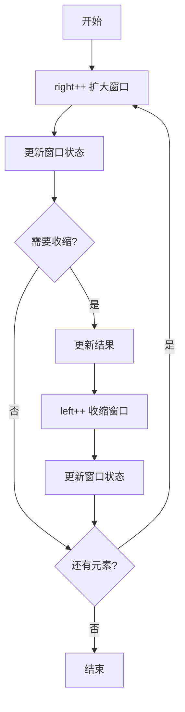

## SOP：滑动窗口

> 滑动窗口是双指针的一种特殊形式，通过维护一个动态窗口解决子串/子数组问题。

---

### 适用场景

- 场景 1：子串/子数组问题，需要找最长/最短/满足条件的子串
- 场景 2：连续区间问题，如定长子串统计
- 场景 3：字符串排列、最小覆盖子串等问题

---

### 流程图解



---

### 核心步骤

1. **初始化**：设置 left=0, right=0, 结果=0, 窗口状态为空
2. **扩大窗口**：right++，入窗口，更新状态
3. **收缩窗口**：while(条件满足)，出窗口，更新结果，left++
4. **更新结果**：根据题目要求取最大/最小值

#### 固定窗口模板

```javascript
// 例：求长度为 k 的子数组最大平均值
var findMaxAverage = function (nums, k) {
    let avg = 0;
    let max = -Infinity;
    for (let i = 0; i < nums.length; i++) {
        avg += nums[i] // 入
        
        let left = i - k + 1
        if (left < 0) continue;
        
        max = Math.max(avg, max) // 更新
        
        avg -= nums[left] // 出
    }
    return max / k
};
```

#### 可变窗口模板

```javascript
// 例：无重复字符的最长子串
function lengthOfLongestSubstring(s) {
  const window = new Set();
  let left = 0, maxLen = 0;
  for (let right = 0; right < s.length; right++) {
    while (window.has(s[right])) {
      window.delete(s[left]);  // 收缩
      left++;
    }
    window.add(s[right]);     // 扩大
    maxLen = Math.max(maxLen, right - left + 1);
  }
  return maxLen;
}
```

---

### 常见坑点

- ⛔ **反模式**：收缩窗口时忘记更新窗口状态，导致状态不一致
- ⛔ **反模式**：左右指针移动顺序错误，导致漏算或重复计算
- 🔧 **排查**：如果结果错误，检查 right-left 或 right-left+1 是否正确
- 🔧 **排查**：如果死循环，检查收缩条件是否可能永远为真

---

### 常见题型

| 题型 | 解法要点 |
|:---|:---|
| 最大/最小子串 | 可变窗口，收缩时更新结果 |
| 定长子串 | 固定窗口大小，滑动 |
| 字符串排列 | 固定窗口 + 字符计数比较 |
| 最小覆盖子串 | 双 Map + valid 计数 |
| 水果成篮 | 可变窗口 + 种类计数 |

---

### 时间复杂度

| 指标 | 复杂度 | 说明 |
|:---|:---:|:---|
| 时间 | O(n) | 每个元素最多访问 2 次 |
| 空间 | O(k) | k=字符集大小或窗口大小 |

---

### 知识图谱

- **父级概念**：[[算法与数据结构|算法]]
- **关联概念**：
	- [[双指针]] — 滑动窗口的基础
	- [[哈希表]] — 窗口状态记录

---

### 参考延伸

- https://leetcode.cn/problems/maximum-number-of-vowels-in-a-substring-of-given-length/solutions/2809359/tao-lu-jiao-ni-jie-jue-ding-chang-hua-ch-fzfo
- LeetCode 3. Longest Substring Without Repeating Characters
- LeetCode 76. Minimum Window Substring
